# Explanation of some points in ArchR-Guide


Quality Control (QC) in ArchR

In scATAC-seq, we don't just look at "how many reads" a cell has. We look at Signal vs. Noise.
Two Main Metrics:

    TSS Enrichment Score: This measures how many fragments fall near Transcription Start Sites (TSS) compared to the "background" genomic noise. High TSS enrichment = high-quality data.

    Fragment Size Distribution: Because DNA is wrapped around nucleosomes, a good ATAC-seq library should show a distinct "pattern" (peaks representing fragments that are sub-nucleosomal, mono-nucleosomal, etc.).


What exactly are Arrow files?

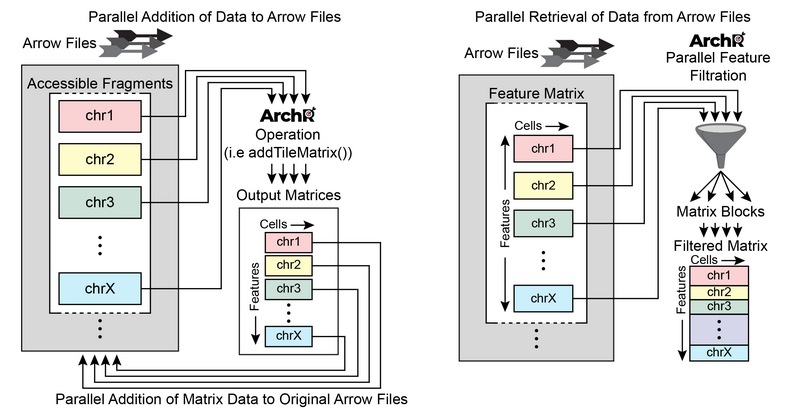

1. Left Side: Parallel Addition of Data (The "Writing" Process)
When you run a command like addTileMatrix() (which counts fragments in 500-bp windows across the genome), ArchR doesn't try to calculate everything at once.

Chromosome-wise Processing: ArchR looks at the Accessible Fragments already stored in the Arrow file. These fragments are physically organized by chromosome (chr1, chr2, etc.).

Multithreading: If you have 8 CPU cores, ArchR can process 8 chromosomes simultaneously. Each core calculates the matrix for its specific chromosome in isolation.

Direct-to-Disk: Once a chromosome's matrix is calculated, it is written directly back into the HDF5-based Arrow file on your hard drive.

The Benefit: You never have the full genome-wide matrix of all cells in your RAM at once. You only ever hold one or two chromosomes at a time, keeping your "memory footprint" very low.

2. Right Side: Parallel Retrieval of Data (The "Reading" Process)
Later in your analysis, you might want to extract specific data (e.g., marker genes or specific peaks) to create a plot or perform a statistical test.

Parallel Feature Filtration: ArchR reads the Feature Matrix from the Arrow file. Again, it does this in parallel across chromosomes.

The "Funnel" (Filtering): Not all data is needed for every step. ArchR filters the data at the chromosome level (e.g., "give me only the cells in Cluster 1" or "give me only these 500 specific genes").

Matrix Blocks: It extracts these small "blocks" of data from the disk.

Consolidation: These small, filtered blocks are finally merged into a single Filtered Matrix in your R session.

The Benefit: Because you've filtered the data before bringing it fully into R, the resulting object is small enough to work with comfortably for plotting and downstream analysis.

## Input File Types in ArchR

To build Arrow files, ArchR requires specific input formats. While it can handle several types, some are much more efficient than others.

1. Fragment Files (Highly Recommended)
The fragment file is the standard input for ArchR. It is typically produced by pipelines like CellRanger ATAC or SnapATAC.

Format: .tsv.gz (tab-separated, compressed) accompanied by a .tbi (index) file.

Content: A table where each row represents a single DNA fragment captured by the assay.

Columns: Usually Chromosome, Start, End, CellBarcode, and DuplicateCount.

Why it's preferred: It is much smaller than a BAM file and contains exactly what ArchR needs: the start and end positions of the Tn5 transposase insertion.

2. BAM Files
ArchR can also process aligned BAM files.

Format: .bam

Drawback: BAM files are much larger and contain more information than necessary for ATAC-seq (like the full sequence of the read).

Process: If you provide BAM files, ArchR will internally convert them into fragment data during the Arrow file creation. This takes more time and disk space.

3. Genome Annotations
Since ArchR needs to know where genes and transcription start sites (TSS) are, you must provide genomic coordinates.

BSgenome: ArchR uses Bioconductor BSgenome packages (e.g., BSgenome.Hsapiens.UCSC.hg38 for humans).

GeneAnnotation: Information about gene boundaries and exons.

GenomeAnnotation: Information about chromosome sizes.

4. Blacklist Regions
These are "problematic" areas of the genome where the signal is often artificially high (due to repetitive sequences or mapping errors).

Function: ArchR uses these coordinates to filter out "noise" that could lead to false-positive peaks.

Source: Usually provided by the ENCODE project.

### Summary of Input File Types

| File Type            | Extension          | Role                                                         |
| :------------------- | :----------------- | :----------------------------------------------------------- |
| **Fragment File**    | `.tsv.gz`          | Primary data; contains Tn5 insertion sites per cell.         |
| **Index File**       | `.tbi`             | Required for fast random access to the fragment file.        |
| **BAM File**         | `.bam`             | Alternative primary data (aligned reads); slower to process. |
| **Genome Reference** | `BSgenome`         | Maps coordinates to a specific species (e.g., hg38, mm10).   |
| **Blacklist**        | `.bed` / `GRanges` | Regions to ignore to reduce background noise.                |


## 3.5 Setting the Seed (Reproducibility)

ArchR uses randomized algorithms for tasks like **UMAP**, **Clustering**, and **Doublet Inference**. To ensure results are reproducible:

* **The Command:** `set.seed(1)`
* **Purpose:** Ensures that the "random" parts of the code always produce the same output.
* **Best Practice:** Always set the seed at the beginning of your script and keep it consistent throughout your project.

> **Thesis Tip:** In your "Materials and Methods" section, it is professional to mention: *"Analyses were performed using ArchR (vX.X) with a fixed random seed of 1 to ensure reproducibility."*

## 3.5.2 HDF5 File Locking (HPC Specifics)

When working on a University HPC, the file system (Lustre, GPFS) often conflicts with HDF5's default locking mechanism.

* **Problem:** Network-based storage may not support "File Locking," causing ArchR to crash during Arrow file creation.
* **Solution:** Use `addArchRFileLocking(locking = FALSE)` if the HPC throws HDF5-related errors.
* **Consequence:** Disabling locking allows for **subthreading** (increased performance) but requires caution to ensure only one process writes to an Arrow file at a time.

> **HPC Checklist:** > 1. Check if the filesystem is Lustre or GPFS.
> 2. Always include `addArchRFileLocking()` in the setup block of the R script.

## 3.5.3 Setting the Reference Genome

ArchR requires a biological "map" to interpret genomic coordinates. 

* **Command:** `addArchRGenome("hg38")` (or "mm10" for mouse).
* **What it provides:** 1. **Chromosome sizes:** Essential for tiling the genome.
    2. **Gene locations:** Required to link ATAC-seq peaks to specific genes.
    3. **TSS locations:** Critical for Quality Control (QC) metrics.

> **HPC Tip:** If your cluster has no internet access, ensure the corresponding `BSgenome` R-package is pre-installed in your library before running this command.

## 3.5.4 Organizing Input Files

To process your own data, you need to create a named character vector in R. This vector tells ArchR two things:

* Where the data is located (the file path).

* What each sample should be called (the sample name).

Before creating Arrow files, you must create a named vector in R that points to your raw fragment files.

* **Variable:** `inputFiles`
* **Structure:** A character vector where the **value** is the path and the **name** is the Sample ID.
* **Impact:** The names used here will become the filenames for your `.arrow` files (e.g., `Sample1.arrow`).

### Example Code for Thesis Data:
```r
# Point to your actual fragment files on the HPC storage
inputFiles <- c(
  "Control_Rep1" = "/path/to/control_fragments.tsv.gz",
  "Stimulated_Rep1" = "/path/to/stimulated_fragments.tsv.gz"
) 
``` 

HPC Best Practice: Always use Absolute Paths (starting with /) to ensure your script finds the data when submitted as a batch job (SLURM/LSF).

## 3.5.5 Environment Setup: Genome & Parallelization

Every ArchR session must begin by defining the reference genome and the number of threads for parallel processing.

### 1. Reference Genome
* **Command:** `addArchRGenome("hg19")`
* **Purpose:** Provides gene coordinates and TSS locations. 
* **Note:** Ensure this matches the genome used for initial read alignment.

### 2. Parallel Threads
* **Command:** `addArchRThreads(threads = 16)`
* **Purpose:** Speeds up "per-chromosome" operations (e.g., TileMatrix creation).
* **HPC Rule:** The number of threads in R **must match** the number of cores requested in your HPC batch script (e.g., `--cpus-per-task`).

```r
# Example Setup for HPC
addArchRGenome("hg19")           # Matches tutorial data
addArchRThreads(threads = 16)    # Matches requested HPC cores
```

Warning: If you set threads = 32 in R but only requested cpus-per-task=1 from the HPC, your job will be extremely slow (due to "context switching") or might even be killed by the HPC for resource violation.

Thesis Tip: In your Methods section, always report the genome version (e.g., GRCh37/hg19) and mention that parallel processing was used to handle the large data scale. 
For your own actual thesis data, you will likely use hg38 (the current standard). Always ensure your reference genome matches the one used during the alignment step (e.g., by CellRanger).

## 3.6 Processing Raw Data: createArrowFiles()

This step converts raw fragment files into `.arrow` files. It is the "Quality Control" gatekeeper of the pipeline.

### Function Parameters:
| Parameter         | Value | Description                                                                    |
| :---------------- | :---- | :----------------------------------------------------------------------------- |
| `minTSS`          | 4     | Min. Transcription Start Site enrichment. Ensures high signal-to-noise ratio.  |
| `minFrags`        | 1000  | Min. unique fragments per cell. Filters out "empty" or poorly sequenced cells. |
| `addTileMat`      | TRUE  | Generates a 500-bp bin matrix for genome-wide accessibility.                   |
| `addGeneScoreMat` | TRUE  | Predicts gene expression based on local chromatin accessibility.               |

### Why 500-bp bins?
ArchR uses a **"Base-pair Resolution"** approach but stores data in 500-bp tiles for computational efficiency. This provides a good balance between detail and speed for dimensionality reduction.

> **HPC Performance Note:** This step will take longer on your HPC if you have many samples. Ensure you have requested enough **time** in your SLURM script (e.g., 2–4 hours for a large dataset) even though the tutorial only takes 15 minutes.

## 3.6.1 The ArrowFiles Object (The Pointer)

A key concept in ArchR is that the data stays on the disk, not in the RAM.

* **Definition:** The `ArrowFiles` object is a **named character vector** containing the file paths to the physical `.arrow` files.
* **Mechanism:** ArchR uses this vector to know where to read/write data during downstream steps.
* **Memory Efficiency:** This allows the user to handle massive datasets because R only "points" to the data rather than "loading" it.

> **Note:** If you move your `.arrow` files to a different folder, this vector will break. You would need to update the paths in the vector for ArchR to find them again.

## 3.7 Per-cell Quality Control (QC)

Quality control is the most critical step in scATAC-seq analysis. It ensures that the biological signals we observe are not driven by technical noise, dead cells, or sequencing artifacts. ArchR evaluates every cell based on three main pillars.

---

### 3.7.1 Unique Nuclear Fragments
Instead of looking at total sequencing reads, ArchR focuses on **Unique Nuclear Fragments** to measure the usable data per cell.

* **Mitochondrial Filtering:** Fragments mapping to the mitochondrial genome (mtDNA) are removed. Since mtDNA is not wrapped in histones, it is highly accessible and can overwhelm the signal without providing info on nuclear regulation.
* **Deduplication:** Identical fragments (starting and ending at the same position) are collapsed into a single count to remove PCR bias.
* **Thresholds:** A standard minimum is **> 1,000 unique fragments**. Cells below this are too "sparse" to be accurately assigned to a cell type.


---

### 3.7.2 TSS Enrichment Score (Signal-to-Background)
The Transcription Start Site (TSS) Enrichment Score is the gold-standard metric for scATAC-seq quality. It measures how "concentrated" the Tn5 cuts are at known promoters compared to the genomic background.

* **The Biology:** Healthy cells have open, accessible chromatin at TSS regions. In dead or dying cells, chromatin collapses (de-chromatinization), leading to random Tn5 cutting across the entire genome.
* **The Calculation:**
  ArchR calculates the ratio of fragments at the center of the TSS vs. the "flanks" (background noise).
  
  $$\text{TSS Enrichment Score} = \frac{\text{Mean signal in the TSS center (+/- 50 bp)}}{\text{Mean signal in the flanking background regions}}$$

* **Interpretation:**
  * **Score > 10:** Excellent signal.
  * **Score 4 - 10:** Typical/Acceptable quality.
  * **Score < 4:** High background noise (likely dead cells).


---

### 3.7.3 Fragment Size Distribution (Nucleosomal Periodicity)
Because genomic DNA is wrapped around **nucleosomes** (~147 bp of DNA per wrap), the lengths of the fragments generated by Tn5 follow a specific pattern.

* **The Pattern:** You should see clear "peaks" in your distribution plot:
    * **Sub-nucleosomal (< 100 bp):** Cuts made between nucleosomes.
    * **Mono-nucleosomal (~200 bp):** Fragments spanning one nucleosome.
    * **Multi-nucleosomal (> 400 bp):** Fragments spanning two or more nucleosomes.
* **Why it matters:** This "staircase" pattern (periodicity) proves that the Tn5 enzyme successfully captured the natural chromatin architecture of the cell.


---

### 3.7.4 QC Summary Table 

| Metric                      | Threshold       | Indication of Quality                               |
| :-------------------------- | :-------------- | :-------------------------------------------------- |
| **Unique Fragments**        | > 1,000 - 2,500 | Sufficient data depth for dimensionality reduction. |
| **TSS Score**               | > 4 (Ideal > 7) | High signal-to-noise ratio; healthy cells.          |
| **Nucleosomal Periodicity** | Visible Peaks   | Integrity of chromatin structure is preserved.      |
| **Mitochondrial Rate**      | < 10%           | Effective cell lysis and high nuclear purity.       |

> **Thesis Tip:** In your Methods section, explicitly state the thresholds used for `minTSS` and `minFrags`. These are often the first parameters a reviewer will check to validate your cell-filtering strategy.

### 3.7.5 Visualizing Quality Control (QC) Results

ArchR automatically generates a `QualityControl` folder. Each sample is evaluated by two primary visualizations to ensure biological signal exceeds technical noise.

View plots here: https://www.archrproject.com/bookdown/per-cell-quality-control.html

#### 1. TSS Enrichment vs. Fragments
This plot identifies high-quality cells. We look for a high density of cells above our TSS threshold (Y-axis) and fragment threshold (X-axis).

For the purpose of this guide, we will look at the data for `PBMC` 

* **TSS Threshold:** Indicated by the horizontal dashed line.
* **Frag Threshold:** Indicated by the vertical dashed line.
* **Observation:** Our tutorial samples show exceptional quality, with median TSS scores ranging from ~15 to ~20.

#### 2. Fragment Size Distribution
This plot confirms that the library preparation successfully captured the nucleosomal structure of the DNA.


* **Sub-nucleosomal Peak:** Highest signal at <100 bp.
* **Mono-nucleosomal Peak:** Clear shoulder/peak at ~200 bp.
* **Interpretation:** The presence of these discrete peaks (periodicity) is a hallmark of a successful scATAC-seq experiment.

> **Thesis Note:** These plots are the "ID card" for your data. Always include the median TSS enrichment and the total number of cells passing filter for every sample in your manuscript.

## 3.8 Using BAM Files for Arrow File Creation

Although **Fragment Files** are the gold standard, ArchR supports **BAM files** if necessary.

### 1. Identifying the Cell Barcode
Unlike fragment files, where the barcode is a plain column, BAM files store barcodes in metadata tags.
* **10x Genomics:** Usually the `CB` tag (e.g., `CB:Z:GCGGGTTAGAACGTCG-1`).
* **Command Parameter:** Use `bcTag = "CB"` in `createArrowFiles()`.

### 2. Filtering with bamFlag
You must define which alignments are "high quality" using the `bamFlag` list.
```r
# Example for high-quality paired-end reads
bamFlag <- list(
  isMinusStrand = FALSE, 
  isProperPair = TRUE, 
  isDuplicate = FALSE
)
```
### Tip for Thesis:
If you are forced to use BAM files, always specify in your **Methods** which BAM tag you used for cell identification (e.g., "Cell barcodes were extracted from the CB tag of the position-sorted BAM files"). This ensures your analysis can be perfectly replicated by others. 

HPC Note: Converting BAM files to Arrow format is much more CPU and I/O intensive than using fragment files. If using BAMs on the HPC, ensure you request sufficient wall-time for your job.


### 3.8.1 Anatomy of a scATAC-seq BAM Record

Before running ArchR on BAM files, you should inspect the first few lines using `samtools view` to identify the barcode tag.

**Example Record:**
`A00519... chr1 9997 ... CB:Z:GCGGGTTAGAACGTCG-1 ...`

* **Target Tag:** `CB:Z:GCGGGTTAGAACGTCG-1` 
* **ArchR Setting:** `bcTag = "CB"` 

#### Key Troubleshooting Parameters:
* **`bcTag`**: Tells ArchR which tag contains the cell barcode (e.g., "CB" or "CR").
* **`gsubExpression`**: If your barcodes have extra characters you don't want (like the `-1` at the end), you can use this parameter to "clean" the string as it is read.
* **`bamFlag`**: Filters the reads based on their bitwise flags (e.g., keeping only "properly paired" reads or removing duplicates).


> **Thesis Tip:** If your data comes from a non-standard pipeline (anything other than CellRanger), always verify the `bcTag` manually. Using the wrong tag will result in 0 cells passing the filter.

# 4. Doublet Inference

Doublets are a primary source of technical noise where one droplet contains multiple nuclei, leading to "average" cellular profiles. ArchR identifies and removes these computationally to prevent the formation of artifactual clusters.

## 4.1 The Mechanism of Doublet Identification

https://www.archrproject.com/bookdown/how-does-doublet-identification-work-in-archr.html

ArchR utilizes a "Synthetic Doublet" approach to identify artifacts without requiring external genotype data.

### The Core Process:


1. **Simulation:** ArchR creates **synthetic doublets** by mixing reads from thousands of combinations of your real cells. 
If Cell A has open peaks at Region 1, and Cell B has open peaks at Region 2, the synthetic doublet will have signal at both regions. This is done for thousands of combinations to ensure that every possible pairing of cell types (e.g., T-cell + B-cell, Monocyte + T-cell) is represented in the simulation.

\
2. **Projection:** These simulated cells are projected into the project's embedding (e.g., UMAP). So this is the same UMAP, where my real cells are located.

Predictable Location: Because a synthetic doublet is a 50/50 mix of two cells, the dimensionality reduction algorithm (UMAP) will naturally place that synthetic point in the "no man's land" between the two parent cell clusters.

\
3. **Neighbor Analysis:** Real cells that cluster closely with synthetic doublets are identified.  For every real cell, ArchR identifies its $k$ nearest neighbors (usually $k=10$ or $15$).
It counts how many of those neighbors are synthetic doublets vs. real cells.

\
4. **Scoring:** To make the results statistically robust, ArchR doesn't just do this once.

Iteration: By repeating this "synthesis and neighbor-check" thousands of times, ArchR builds a distribution.

Enrichment Score: A cell that is consistently surrounded by synthetic doublets across many iterations receives a high Doublet Enrichment Score. This indicates that the cell's accessibility profile is indistinguishable from a known hybrid simulation.

\
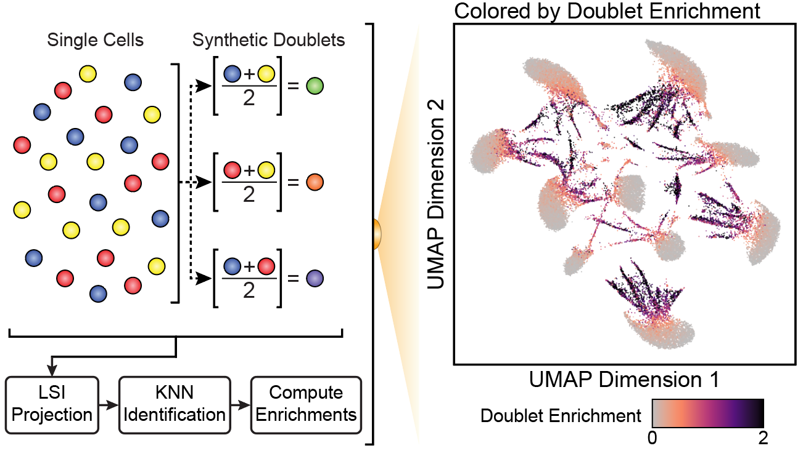

#### How to read a Doublet UMAP:
* **High Enrichment (Purple/Dark):** These cells are likely doublets. They often form "bridges" or "tendrils" connecting two distinct clusters.


\
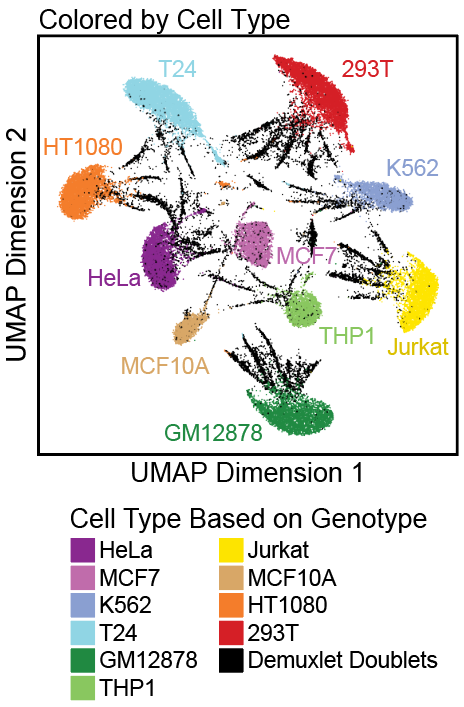

#### Validation of Doublet Detection using Genotyped Cell Lines

* Colored Clusters: Each color represents a distinct, known cell line (e.g., HeLa, Jurkat, K562) identified by its unique genetic SNPs (genotype).

* Black Dots (Demuxlet Doublets): These are "true" doublets identified by demuxlet, a tool that uses genotype information to find droplets containing more than one cell type.

* The "Bridge" Phenomenon: The black doublet points are not randomly scattered; instead, they form clear bridges or "strings" that connect the distinct colored clusters.

\
Predictability: The plot demonstrates that doublets have a predictable mathematical profile—they always appear as a mathematical average of two parent cells, placing them between clusters in low-dimensional space.

Ground Truth: Because we can see the black dots exactly where the "bridges" are, we have high confidence that ArchR's simulation method (which creates synthetic bridges) is looking in the right place.

### 4.1.3 Quantifying Accuracy: ROC Curves and AUC

To prove the reliability of the doublet scoring, ArchR's performance was measured using an ROC curve against known "ground truth" doublets.

* **ArchR Prediction Accuracy:** Reaches an **AUC of ~0.92**. In statistics, an AUC above 0.9 is considered "excellent" for a classification task.
* **ArchR vs. Fragment Counts:** A common mistake is assuming that doublets are simply cells with the highest number of fragments. This plot shows that using fragment counts is a poor predictor (**AUC ~0.64**).
* **Conclusion:** ArchR’s simulation method effectively distinguishes between "deeply sequenced single cells" and "true doublets," which a simple fragment cutoff would fail to do.

\
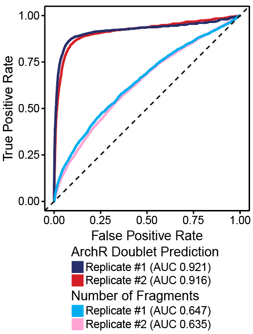
* **True Positive Rate (Y-axis)**: The percentage of "real" doublets correctly identified.
* **False Positive Rate (X-axis)**: The percentage of single cells mistakenly flagged as doublets.
* **AUC (Area Under the Curve)**: A single number representing total accuracy. A score of 1.0 is a perfect test, while 0.5 (the dashed diagonal line) is no better than a random guess.

### 4.1.4 The "Cleaned" Dataset: Post-Doublet Removal

Following the computational removal of doublets, the data structure shifts from a connected "web" to distinct, isolated clusters.

* **Visual Impact:** The "bridges" of black dots that previously connected unrelated cell types have been eliminated.
* **Biological Accuracy:** The resulting UMAP now accurately reflects the expected biological composition: 10 distinct, non-overlapping cell lines.
* **Significance for Analysis:** Removing these "hybrid" cells is essential before performing clustering or trajectory analysis. Without this step, doublets could be misinterpreted as transitional cell states or rare progenitor populations.

* **Residual Black Dots**: 
These are likely homotypic doublets (e.g., two Jurkat cells in one droplet). Because they have the same profile as a single Jurkat cell, they do not form "bridges" and are nearly impossible to remove computationally—but they also do not cause "phantom clusters," so they are less harmful to your analysis.

\
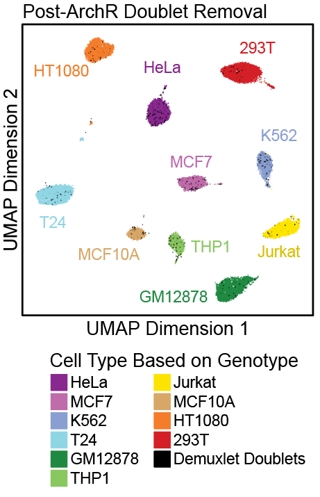
> **Thesis Note:** Use this "Before and After" comparison to demonstrate the effectiveness of your QC pipeline. It proves that ArchR effectively identifies heterotypic doublets (those between different cell types) which are the most damaging to cluster identity.

## 4.2 Inferring scATAC-seq Doublets

After creating the `ArchRProject`, we must identify potential doublets. This process uses the "Synthetic Doublet" simulation to assign a probability score to every cell.

### 4.2.1 The Code
```r
proj <- addDoubletScores(
  input = proj,
  k = 10, 
  knnMethod = "UMAP", 
  LSIMethod = 1
)
```


#### Configuration Parameters
| Parameter   | Setting | Description                                |
| :---------- | :------ | :----------------------------------------- |
| `k`         | 10      | Number of neighbors for score calculation. |
| `knnMethod` | "UMAP"  | Embedding space used for neighbor search.  |
| `LSIMethod` | 1       | LSI projection version.                    |

#### HPC Log Interpretation
* **Reading Fragments:** ArchR is pulling data from disk.
* **In Silico Synthesis:** Creating thousands of synthetic doublet profiles in RAM.
* **Success Message:** Metadata columns (`DoubletScore` and `DoubletEnrichment`) successfully added to Arrow files.

#### Validation Metrics
* **ArchR Accuracy:** AUC ~0.92 (Excellent).
* **Naive Frag Count Accuracy:** AUC ~0.64 (Poor).

> **Thesis Note:** Emphasize that ArchR's simulation approach outperforms simple fragment cutoffs by nearly 30% in accuracy (AUC 0.92 vs 0.64), ensuring that high-depth single cells are not accidentally discarded.

### 4.2.3 Troubleshooting: Low $R^2$ and Homotypic Doublets

During processing, ArchR reports an $R^2$ value for each sample's projection. This metric is a "health check" for the doublet simulation.

#### 1. Understanding $R^2$ Thresholds
* **$R^2 > 0.9$:** Reliable projection; the sample has enough heterogeneity to identify "bridge" doublets.
* **$R^2 < 0.9$:** Low heterogeneity; cells are too similar, meaning most doublets are **homotypic** (two similar cells in one droplet).

#### 2. Why ArchR Skips Samples
If $R^2$ is low, ArchR will skip doublet prediction because the results would likely be inaccurate. In a uniform population, a doublet's signal is indistinguishable from a single cell's signal.

#### 3. The LSI Workaround
If you must run doublet detection on a low-heterogeneity sample, you can force the calculation in the LSI subspace:

```r
proj <- addDoubletScores(
  input = proj,
  k = 10, 
  knnMethod = "LSI", 
  force = TRUE 
)
```

### 4.2.4 Interpreting Doublet QC Plots

After running `addDoubletScores()`, ArchR populates the `QualityControl` folder with three key visualizations per sample. These plots confirm whether the "Synthetic Doublet" bridges align with the intermediate cells in your actual data.

| Plot Type              | Metric                        | Primary Use                                                       |
| :--------------------- | :---------------------------- | :---------------------------------------------------------------- |
| **Doublet Enrichment** | Relative density vs. expected | **Primary metric** used for doublet identification and filtering. |
| **Doublet Scores**     | $-\log_{10}(\text{p-adj})$    | Statistical significance; used as a secondary validation.         |
| **Doublet Density**    | Projection density            | Visualizes where the "synthetic" artifacts are located.           |

#### Representative Visualizations (BMMC Sample)

**A. Doublet Enrichment**
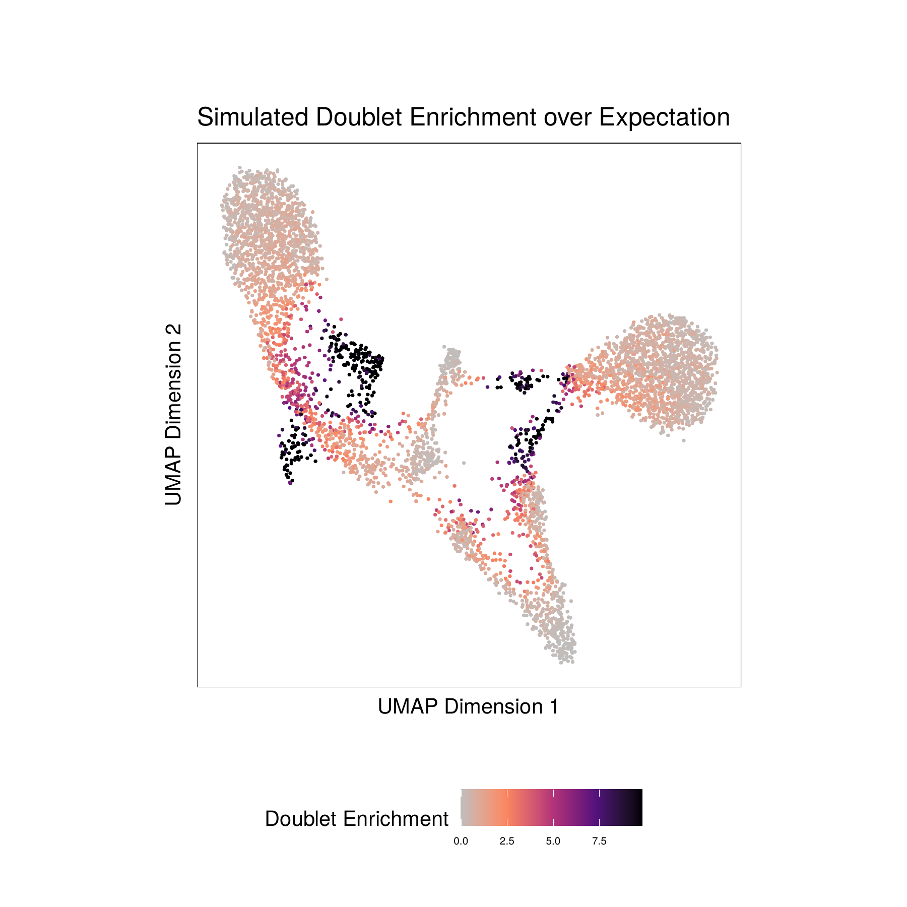
*High enrichment (darker colors) indicates cells that likely represent a mixture of two distinct cell types.*

**B. Doublet Scores**
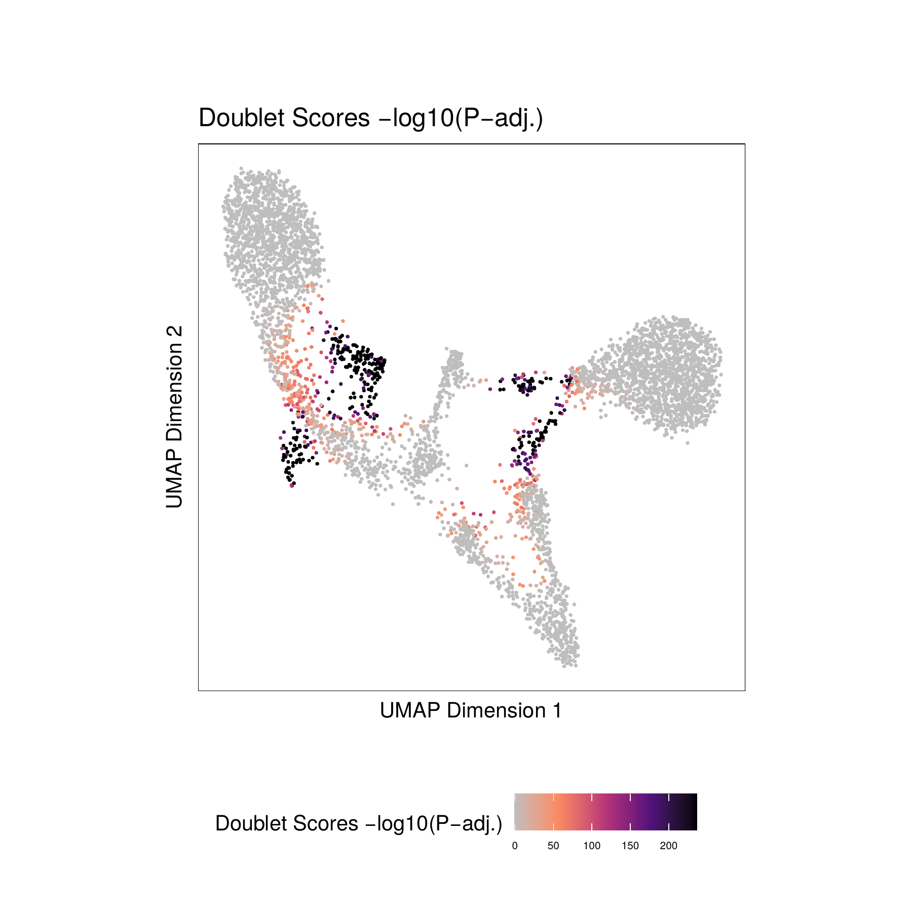
*Shows the statistical probability of a cell being a doublet; used to ensure filtering is not arbitrary.*

**C. Doublet Density**
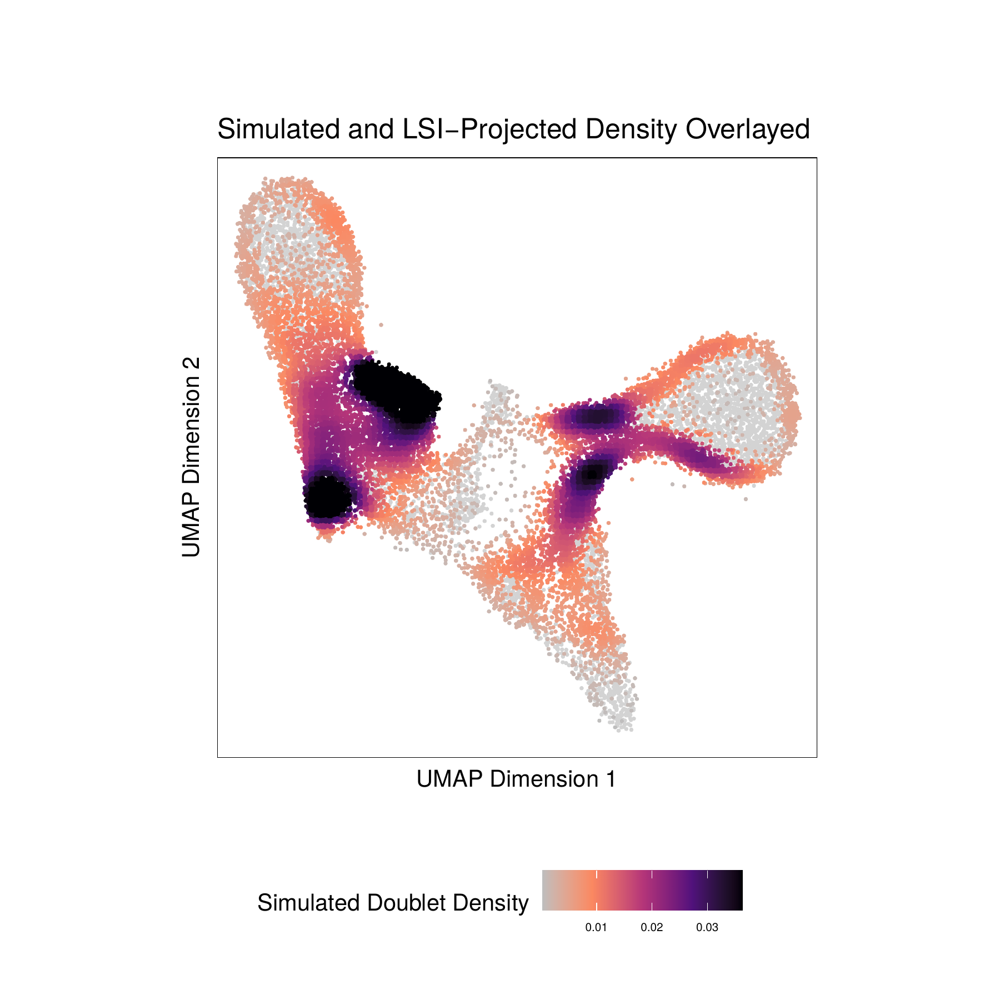
*This "underlay" plot shows where the simulation placed the synthetic doublets. Note how the density is highest in the "bridges" between biological clusters.*

> **Thesis Tip:** Always check the **Doublet Density** plot first. If the synthetic density is overlapping heavily with your main clusters (rather than the bridges), it may indicate that your sample has low heterogeneity, and you should be careful not to over-filter your data.

## 4.3 Using demuxlet with ArchR (Genotype Validation)

If your dataset contains a pool of multiple donors, you can use **demuxlet** to provide a "Ground Truth" for doublet detection.

### 4.3.1 What is demuxlet?
Demuxlet is a tool that utilizes genetic polymorphisms (SNPs) to assign each barcode to a specific donor. It identifies:
* **Singlets:** Barcodes matching a single donor.
* **Doublets:** Barcodes containing a mixture of SNPs from two different donors.
* **Ambiguous:** Barcodes with insufficient SNP coverage.

### 4.3.2 Why integrate with ArchR?
Integrating `demuxlet` allows you to validate ArchR's computational `DoubletEnrichment` scores. In the ArchR "Mixology" study, computational scores matched demuxlet's physical assignments with an **AUC > 0.90**.

### 4.3.3 Integration Workflow
1. **Run demuxlet:** Perform genotype-based demultiplexing on your alignment (BAM) files outside of ArchR.
2. **Import results:** Use `addCellColData()` to add the assignments to your `ArchRProject`.
3. **Compare:** Plot the `DoubletEnrichment` scores and color them by the `Demuxlet` assignment to see if the "bridges" align with the known doublets.

| Feature          | ArchR Simulation               | demuxlet                             |
| :--------------- | :----------------------------- | :----------------------------------- |
| **Requirements** | scATAC-seq data only           | Genotype (VCF) files + Mixed Donors  |
| **Primary Use**  | Standard QC for any sample     | Gold standard validation             |
| **Detects...**   | Heterotypic doublets (bridges) | Doublets between different genotypes |

> **Thesis Tip:** If your research uses donor pooling, showing a correlation between ArchR’s Doublet Scores and demuxlet’s assignments is a powerful way to prove your data's technical rigor.


# 5. Creating an ArchRProject

The `ArchRProject` is the central object used for all downstream analysis. It links multiple Arrow files into a single project, allowing for cross-sample comparisons and unified clustering.

## 5.0 Overview
The `ArchRProject` is unique because it is a **small, memory-resident object** that manages **large, disk-resident data** (Arrow files). By interacting with this object, you can rapidly perform complex calculations without crashing your R session due to memory limits.

### Why use an ArchRProject?
1. **Unified Workflow:** It is the foundation for almost every ArchR function.
2. **Reproducibility:** Projects can be saved and re-loaded later to maintain analysis continuity.
3. **Collaboration:** Makes it easy to zip and share an entire project with a collaborator.

## 5.1 Initialization

```r
proj <- ArchRProject(
  ArrowFiles = ArrowFiles, 
  outputDirectory = "HPC_ArchR_Project",
  copyArrows = TRUE
)
```

#### Parameter Deep Dive

**ArrowFiles**: A character vector of paths to the .arrow files you want to include in the analysis.

**outputDirectory**: The name of the folder where ArchR will save your project object, plots, and intermediate data.

**copyArrows**: If TRUE (Recommended), ArchR creates a copy of your Arrow files inside the outputDirectory. This makes the project self-contained.

If FALSE, it only creates links to the original files. If you move or delete those original files, your project will break.


We can examine the contents of our ArchRProject using `proj(name)`


#### What the Project Object Contains
Once created, the `proj object` is a lightweight container for the following:

**Cell Metadata** (cellColData): Stores information for every cell (e.g., sample name, TSS scores, total fragments).

**Sample Statistics**: Summary metrics for each sample.

**Analysis State**: Tracks which matrices have been added (Tile, GeneScore, Peak) and what clustering/UMAP parameters were used.

### Saving an ArchRProject

```r
### Corrected save function with quotes and proper parameter naming
saveArchRProject(
    ArchRProj = projHeme1,
    outputDirectory = "/usr/people/BZEDVZ/18perkov/ArchR_Tutorial", # Must be in quotes!
    overwrite = TRUE,
    load = TRUE,
    dropCells = FALSE,
    logFile = createLogFile("saveArchRProject"),
    threads = 16 # Usually set as an integer
)
```
__Very important!__ The load parameter determines whether or not the saveArchRProject() function will return the saved ArchRProject object which you would assign to overwrite the original ArchRProject object or provide a new ArchRProject name using <-. This effectively saves and loads the ArchRProject from its new location. If load = FALSE, then this process does NOT update the ArchRProject object that is active in your current R session. Specifically, the object named projHeme1 in the current R session will still point to the original location of the Arrow files, not the copied Arrow files that reside in the specified outputDirectory. You might use this behavior if you were saving your ArchRProject and shutting down your R session so that the project can be reloaded at a later time.

__Also important!__ The term ArchRProject can be confusing to some users because we use this both to refer to the object that is actively loaded within the R environment and to the file that has been saved on disk as part of the saveArchRProject() process. However, it is extremely important to understand that these are not equivalent. Manipulations that you perform on an ArchRProject that is actively loaded within the R environment do not automatically propagate to the on-disk file. You must run the saveArchRProject() function to store those changes.
### Loading an existing ArchRProject
Once a project has been saved to the HPC disk, you do not need to re-run the Arrow file creation or initial QC. You can simply "point" R to the directory where the project lives.

#### The Implementation
To load your project, provide the path to the **folder** containing your data. You do not need to point to a specific file; ArchR will automatically look for the `.rds` state file within that folder.

```r
### Load the project from your specific HPC directory
projHeme1 <- loadArchRProject(path = "/usr/people/BZEDVZ/18perkov/ArchR_Tutorial")

### Verify the project loaded correctly
projHeme1
### Loading an ArchRProject
```


## 5.2 Inspecting Cell Metadata (cellColData)

The `cellColData` stores all metadata associated with individual cells. This includes the QC metrics generated during Arrow file creation and the scores from doublet inference.

### 5.2.1 How to Access Metadata in R
You can interact with this data like a standard R DataFrame or by using the `$` accessor on the project object:

```r
# View the first few rows
head(proj@cellColData)

# Access a specific metric for all cells
tss_scores <- proj$TSSEnrichment

# Summary of fragment counts
summary(proj$nFrags)
```


### 5.2.4 Detailed cellColData Definitions

The `cellColData` object stores critical metadata for every individual cell in the project. The following table defines the columns calculated during Arrow file creation:

| Column Name          | Description                                                                                                                  |
| :------------------- | :--------------------------------------------------------------------------------------------------------------------------- |
| **TSSEnrichment**    | The per-cell Transcription Start Site (TSS) enrichment score.                                                                |
| **ReadsInTSS**       | The number of reads that fall within TSS regions (default is 100 bp around TSS).                                             |
| **ReadsInPromoter**  | The number of reads that fall in promoter regions (default is -2000 to +100 from the TSS).                                   |
| **PromoterRatio**    | The ratio of reads in promoters to reads outside of promoters.                                                               |
| **ReadsInBlacklist** | The number of reads that fall in defined genomic blacklist regions.                                                          |
| **BlacklistRatio**   | The ratio of reads in blacklist regions to reads outside of blacklist regions.                                               |
| **NucleosomeRatio**  | Represents the ratio of reads mapping to nucleosome-sized fragments, calculated as: $(nDiFrags + nMultiFrags) / nMonoFrags$. |
| **nFrags**           | The total number of unique nuclear fragments recovered per cell.                                                             |
| **nMonoFrags**       | The number of fragments with a length less than $2 \times \text{nucLength}$ (where `nucLength` is 147 bp by default).        |
| **nDiFrags**         | The number of fragments with a length $\geq 2 \times \text{nucLength}$ but $< 3 \times \text{nucLength}$.                    |
| **nMultiFrags**      | The number of fragments with a length $\geq 3 \times \text{nucLength}$.                                                      |
| **PassQC**           | Equal to $1$ if the cell passed initial QC filters or $0$ if it did not.                                                     |

---

### Technical Reference
In ArchR, fragment sizes are categorized based on **nucLength**, which is the length of DNA wrapped around a single nucleosome (147 bp by default). This allows the calculation of the **NucleosomeRatio** to assess chromatin state:

$$\text{NucleosomeRatio} = \frac{nDiFrags + nMultiFrags}{nMonoFrags}$$

### Deep Dive: Understanding cellColData Metrics

The `cellColData` object is the "biopsy report" for every individual cell in your project. These metrics, calculated during Arrow file creation, allow us to distinguish high-quality biological signals from technical noise.

---

### 1. Signal-to-Noise & Purity Metrics
These metrics measure how well the Tn5 enzyme targeted open, active regions of the genome compared to random background noise.

* **TSSEnrichment**
    * **Definition:** The ratio of fragments centered at Transcription Start Sites (TSS) vs. the surrounding genomic background.
    * **Biological Context:** Active promoters are depleted of nucleosomes and are "wide open." A high score (typically > 4) indicates a high-quality cell with a clear signal.
* **ReadsInTSS**
    * **Definition:** The raw number of reads falling within a 100 bp window around known TSS coordinates.
* **ReadsInPromoter & PromoterRatio**
    * **Definition:** Measures fragments in the broader promoter neighborhood (default: -2000 to +100 bp from TSS).
    * **Importance:** A high **PromoterRatio** indicates an efficient library prep where sequencing depth was spent on regulatory regions rather than "genomic dark matter."


---

### 2. Artifact & Background Metrics
These metrics identify fragments coming from "sticky" or problematic areas of the genome.

* **ReadsInBlacklist & BlacklistRatio**
    * **Definition:** The count and proportion of fragments falling into the **ENCODE Blacklist** (genomic regions that consistently show high, non-specific background noise).
    * **Importance:** High ratios suggest the cell may have been dying or the DNA was degraded, leading to "sticky" non-specific noise that can interfere with clustering.

---

### 3. Structural & Fragment Size Metrics
ATAC-seq leverages the fact that DNA wraps around histones (nucleosomes) in 147 bp increments. Tn5 cuts only in the "linker" DNA between these beads, creating a characteristic "staircase" pattern.


* **nFrags**
    * **Definition:** The total unique nuclear fragments recovered. This is your primary measure of **sequencing depth** per cell.
* **nMonoFrags**
    * **Definition:** Fragments shorter than two nucleosomes (~147-294 bp). These are usually the most informative "open chromatin" fragments.
* **nDiFrags & nMultiFrags**
    * **Definition:** Fragments spanning two or three+ nucleosomes. These represent more compact or "closed" chromatin states.
* **NucleosomeRatio**
    * **Formula:** 
  $$\text{NucleosomeRatio} = \frac{nDiFrags + nMultiFrags}{nMonoFrags}$$
    * **Importance:** A high ratio indicates poor Tn5 penetration or DNA clumping, while a low ratio indicates high-quality, accessible chromatin.


---

### 4. The Analysis Gatekeeper

* **PassQC**
    * **Definition:** A binary flag (**1** for Pass, **0** for Fail).
    * **Importance:** ArchR labels low-quality cells but doesn't delete them immediately. When you run clustering or UMAP, ArchR automatically filters the project to include only cells where `PassQC = 1`.

---

## Technical Summary Table

| Metric Category        | Key Metric        | High Value Interpretation                     |
| :--------------------- | :---------------- | :-------------------------------------------- |
| **Purity**             | `TSSEnrichment`   | Strong biological signal; real cell.          |
| **Efficiency**         | `PromoterRatio`   | Targeted sequencing; high-quality library.    |
| **Technical Noise**    | `BlacklistRatio`  | Potential artifact or dying cell.             |
| **Physical Integrity** | `NucleosomeRatio` | Poor enzyme access or DNA degradation.        |
| **Depth**              | `nFrags`          | Highly sequenced cell with rich data density. |

> **Note:** ArchR uses a default **nucLength** of **147 bp** (the length of DNA wrapped around a human nucleosome) to categorize all fragment sizes.

## 5.3 Manipulating an ArchR Project

### 5.3.1 Interacting with Metadata using the `$` Accessor

The `$` operator is a convenient shorthand in ArchR that allows you to bypass the `@cellColData` slot and access metadata columns directly from the project object. This is identical to how you would access columns in a standard R data frame.

#### Example 1: Accessing Cell Names
Every cell in ArchR is uniquely identified by its sample name and barcode. You can retrieve these using `$cellNames`:

```r
head(proj$cellNames)
``` 

We can access the sample names associated with each cell:

```r
head(proj$Sample)
```
We can access the TSS Enrichment Scores for each cell:
```r
quantile(proj$TSSEnrichment)
##       0%      25%      50%      75%     100% 
##  4.10900 13.92550 16.81500 19.93025 41.98000
``` 


When we run `quantile(proj$TSSEnrichment)`, we are looking at the statistical "spread" of our data quality. This tells us how consistent the signal is across our entire cell population.

| Quantile         | Score      | Interpretation                                                                                                                                          |
| :--------------- | :--------- | :------------------------------------------------------------------------------------------------------------------------------------------------------ |
| **0% (Min)**     | **4.109**  | **Filter Check:** Confirms every cell in the project successfully passed the minimum QC threshold (TSS > 4).                                            |
| **25%**          | **13.925** | **Lower Quartile:** Even the lower-performing cells in this dataset have excellent signal-to-noise ratios.                                              |
| **50% (Median)** | **16.815** | **Core Quality:** This is your primary "Health Metric." A median of ~17 indicates an exceptionally clean library with very high promoter accessibility. |
| **75%**          | **19.930** | **Upper Quartile:** 25% of your cells have a signal-to-noise ratio of 20:1 or better.                                                                   |
| **100% (Max)**   | **41.980** | **Upper Limit:** The highest quality single-cell capture in the sample.                                                                                 |

---

#### Why these numbers matter for the Thesis:
In scATAC-seq, the median TSS enrichment score is the most cited metric for data quality.
* **TSS < 4:** Generally considered "failing" or background noise.
* **TSS 4–10:** Standard/Acceptable quality.
* **TSS > 10:** High-quality data.
* **TSS ~17 (Our Result):** Represents state-of-the-art library prep with very high biological signal.
  
### 5.3.2 Example 2: Subsetting an ArchRProject by Cells

Subsetting is a powerful feature that allows you to create a new, smaller `ArchRProject` containing only a specific group of cells. This is essential if you want to analyze a single sample in isolation or remove specific clusters.

#### 1. The Subsetting Syntax
The `ArchRProject` behaves like a standard R matrix. You can subset it using the bracket notation: `proj[rows, columns]`.

* **Rows:** Represent individual cells.
* **Columns:** Represent different data types (rarely used in basic subsetting).

#### 2. Practical Examples

**A. Subsetting by Cell Names**
If you have a specific list of cell names (barcodes), you can filter the project to keep only those cells:

```r
# Create a list of the first 100 cell names
cells_to_keep <- head(proj$cellNames, 100)

# Subset the project
subset_proj <- proj[cells_to_keep, ]
```

**B. Subsetting by Metadata Condition**

Keep only cells where the 'Sample' metadata matches BMMC
```r
projBMMC <- proj[proj$Sample == "scATAC_BMMC_R1", ]
``` 

#### 3. What happens to the data?

When you subset an ArchRProject, ArchR does not create new Arrow files on your disk. Instead, it creates a new, lightweight project object in memory that "points" only to the subset of cells in the original Arrow files.

Why this is useful for your Thesis:
Speed: You can quickly test a hypothesis on a single sample without re-processing the entire dataset.

Clarity: You can remove "junk" clusters or doublets from your project to make your final UMAP plots cleaner.

Comparison: You can create two separate projects (e.g., proj_Control and proj_Treated) to run specific differential accessibility tests.

Technical Note: After subsetting, your cell counts and metadata distributions (like those seen in quantile()) will automatically update to reflect only the remaining cells.

It is important to note that some operations will need to be re-run after project subsetting. Much of this is dictated by common sense. For example, if you want to look at only the subsetted cells on a new UMAP embedding, you need to create that new embedding first. Similarly, if you want to perform sub-clustering, you should almost certainly re-run dimensionality reduction (LSI) first.

The primary disadvantage of subsetArchRProject() is that it makes copies of the Arrow files which can be quite large for bigger data sets. Nevertheless, this is the absolute most stable way to subset a project and is the only way that we recommend.

### Physical Subsetting with `subsetArchRProject()`
---

#### R Implementation Example
In this example, we identify all cells belonging to the "BMMC" sample and save them as a separate project.

```r
# Step 1: Identify the cell indices for the BMMC sample
idxSample <- BiocGenerics::which(projHeme1$Sample %in% "scATAC_BMMC_R1")

# Step 2: Create the physical subset
projSubset <- subsetArchRProject(
  ArchRProj = projHeme1,               # The original project
  cells = projHeme1$cellNames[idxSample], # Barcodes to keep
  outputDirectory = "BMMC_Only_Subset",   # New directory on the HPC
  dropCells = TRUE,                    # Physically remove non-selected cells
  force = TRUE                         # Overwrite if the folder exists
)

``` 
For further options, visit: https://www.archrproject.com/bookdown/manipulating-an-archrproject.html


### Example 3: Adding Data to an ArchRProject

**1) Creating Custom Metadata**

Often, the original sample names (e.g., scATAC_BMMC_R1) are too long for plotting. You can use R functions like `gsub()` to clean them up:
```r
### Create "bioNames" by removing "scATAC_" and "_R1"
bioNames <- gsub("_R2|_R1|scATAC_","", proj$Sample)

### Look at the first few cleaned names
head(bioNames)
### Output: [1] "BMMC" "BMMC" "BMMC" ...
```
**2) Method A: The $ Accessor (Quick & Dirty)**

If you have a vector that is exactly the same length as the number of cells in your project, you can assign it directly:
```r
proj$bioNames <- bioNames
``` 

**3) Method B: `addCellColData()` (Precise & Robust):**
   
This function is more powerful because it allows you to add data to only a subset of cells. ArchR will automatically fill in the missing entries with NA.
```r
# Example: Adding data only to the first 10 cells
proj <- addCellColData(
  ArchRProj = proj, 
  data = bioNames[1:10], 
  cells = proj$cellNames[1:10], 
  name = "bioNames_Subset"
)
```

**4) Verifying the Addition:**
You can use `getCellColData()` to retrieve specific columns and compare them:
```r
# Retrieve both the full and subsetted columns
metadata_check <- getCellColData(proj, select = c("bioNames", "bioNames_Subset"))
head(metadata_check)
```
**Thesis Tip:** Always create a "Clean_Sample_Name" column early in your workflow. Using short names like "Control" and "Mutant" instead of long file names will make your downstream UMAP legends and heatmaps much more professional and readable.

### Example 4: Obtaining Columns from cellColData

While the `$` accessor is convenient for quick checks, the `getCellColData()` function is the specialized tool for retrieving metadata. It is more flexible because it allows you to select multiple columns at once, perform mathematical operations during retrieval, and always returns a clean `S4 Vectors DataFrame`.

**1) Retrieving a Single Column by Name**

You can easily pull out specific metrics, such as the total unique fragments (`nFrags`), to use in external plotting or statistical tests:
```r
### Retrieve a single column
df <- getCellColData(projHeme1, select = "nFrags")

### View the resulting DataFrame
head(df)
### Output: DataFrame with barcodes as row names and "nFrags" as the column.
```
**2) Performing Operations "On the Fly"**

One of the most powerful features of `getCellColData()` is the ability to perform calculations directly within the `select` parameter. This avoids creating unnecessary permanent columns in your project:
```r
### Perform log10 transformation and basic arithmetic during retrieval
df <- getCellColData(projHeme1, select = c("log10(nFrags)", "nFrags - 1"))

### View the transformed data
head(df)
### Output: A DataFrame with two columns: "log10(nFrags)" and "nFrags - 1"
```

**3) Selecting Multiple Metrics**

If you need to compare two different quality control metrics (like Sequencing Depth vs. TSS Enrichment), you can request them together in a single vector:
```r
### Retrieve multiple QC metrics simultaneously
qc_metrics <- getCellColData(projHeme1, select = c("nFrags", "TSSEnrichment"))

### Check the summary stats for the retrieved data
summary(qc_metrics)
```

**4) Why use `getCellColData()` instead of `$`?**
   
Calculations: It supports inline math (e.g., log10, sqrt, addition/subtraction).

Format: It consistently returns a DataFrame object which preserves cell barcodes as row names, ensuring your data never gets un-synced.

Multi-selection: It can handle a list of many columns at once, which is much cleaner than calling proj$Column five separate times.

**Thesis Tip**: When reporting Sequencing Depth in your thesis, it is standard practice to use the log10-transformed fragment count. Instead of permanently cluttering your project with a "log10_nFrags" column, use getCellColData(proj, select = "log10(nFrags)") to generate your plots and tables on the fly. This keeps your ArchRProject file size smaller and your workspace cleaner.

### Example 5: Plotting QC metrics - log10(Unique Fragments) vs TSS enrichment score

**Selecting the Two Most Robust Metrics** 

While `cellColData` contains 15+ columns, these two are considered the most reliable indicators of technical success:

  * **log10(nFrags)**: Represents the number of unique nuclear fragments (sequencing depth). We use the log10 transformation because fragment counts can vary from 1,000 to 100,000; the log scale makes this range linear and easier to visualize.

  * __TSSEnrichment:__ Measures the signal-to-background ratio. Cells with high signal at Transcription Start Sites are "true" cells, while low scores represent random genomic noise.

\
We use getCellColData() to pull both metrics at once. Notice that we perform the log10 operation directly inside the function call:
```r
### Extract depth and signal quality simultaneously
df <- getCellColData(projHeme1, select = c("log10(nFrags)", "TSSEnrichment"))

### View the first few rows of your new QC dataframe
head(df)
```
__What does the Output tell us?__

The resulting df (DataFrame) links every cell barcode to its specific QC values. This is the raw data used to generate the "cloud" plot seen in Section 5.2.8.

  * __High log10(nFrags) + High TSSEnrichment:__ These are your "Healthy Cells" (Top-Right of the cloud).

  * __Low log10(nFrags):__ These are "Under-sequenced" cells that lack enough data to be analyzed reliably.

  * __Low TSSEnrichment:__ These are "Noisy" cells (background noise or dying cells) that will likely fail to cluster correctly.

  * __Why we do this before Clustering:__ By looking at these metrics together, we can verify if the QC Cutoffs we set during Arrow file creation (e.g., filterTSS = 4 and filterFrags = 1000) were appropriate. If the "cloud" of cells is too close to the dashed lines, it may indicate that we need to be more stringent with our filters to ensure high-quality downstream results.

### Plotting
```r
p <- ggPoint(
    x = df[,1], # Log10 Unique Fragments
    y = df[,2], # TSS Enrichment
    colorDensity = TRUE, # Colors points by how crowded the area is
    continuousSet = "sambaNight",  # High-contrast color palette
    xlabel = "Log10 Unique Fragments",
    ylabel = "TSS Enrichment",
    xlim = c(log10(500), quantile(df[,1], probs = 0.99)),
    ylim = c(0, quantile(df[,2], probs = 0.99))
) + geom_hline(yintercept = 4, lty = "dashed") + geom_vline(xintercept = 3, lty = "dashed")

p
``` 

#### Parameter Breakdown: Customizing the QC Plot

The `ggPoint()` function is a highly optimized plotting utility. Understanding its parameters allows you to fine-tune your Quality Control visualizations to ensure they are both mathematically accurate and publication-ready.

#### Detailed Parameter Reference

| Parameter           | Value / Function     | Purpose                                                                                                                                                                       |
| :------------------ | :------------------- | :---------------------------------------------------------------------------------------------------------------------------------------------------------------------------- |
| **`x`**             | `df[,1]`             | Maps the **Log10(Unique Fragments)** to the horizontal axis.                                                                                                                  |
| **`y`**             | `df[,2]`             | Maps the **TSS Enrichment Score** to the vertical axis.                                                                                                                       |
| **`colorDensity`**  | `TRUE`               | Calculates local point density. This highlights the "core" of your cell population by coloring the most crowded areas differently.                                            |
| **`continuousSet`** | `"sambaNight"`       | Specifies the color palette. "sambaNight" is a high-contrast theme (dark blue to bright yellow) that makes density variations easy to see.                                    |
| **`xlim`**          | `c(log10(500), ...)` | Sets the x-axis range. Starting at 500 fragments provides visual context for the 1,000 fragment cutoff.                                                                       |
| **`ylim`**          | `c(0, ...)`          | Sets the y-axis range. Starting at 0 allows you to see the full "floor" of the signal-to-noise ratio.                                                                         |
| **`quantile`**      | `probs = 0.99`       | **Outlier Control:** By setting the upper limit to the 99th percentile, ArchR prevents a few extreme "super-cells" from compressing the rest of your data into a tiny corner. |

---

#### The Significance of the "Dashed Lines"

To finalize the plot, we add standard `ggplot2` layers to represent our biological and technical filters:

1. **`geom_hline(yintercept = 4)`**:
   * **The TSS Filter:** This horizontal dashed line represents the minimum acceptable signal-to-background ratio. Cells below this line are likely background noise (genomic "soup").
2. **`geom_vline(xintercept = 3)`**:
   * **The Depth Filter:** Since we are on a log10 scale, $10^3 = 1,000$. This vertical line marks the cutoff for sequencing depth. Cells to the left of this line do not have enough data for confident analysis.

---

### Why the 99th Percentile Matters
In almost every scATAC-seq run, you will have a few "outlier" droplets with massive fragment counts (e.g., 500,000+ fragments). If your plot scales to accommodate those few dots, your actual cell population (usually between 2,000 and 10,000 fragments) will appear as a microscopic smudge on the far left. 

Using `quantile(df[,1], probs = 0.99)` tells ArchR: *"Ignore the top 1% of extreme values when deciding how wide to make the plot."* This ensures the "orange core" of your data is always front and center.

* **Thesis Tip:** If you notice that your "density core" (the brightest yellow/orange part) is very close to or overlapping with the dashed lines, it is a sign that your filters are too lenient. You may need to increase your TSS threshold to 6 or 8 for your final analysis to ensure you are only looking at the highest-quality nuclei.

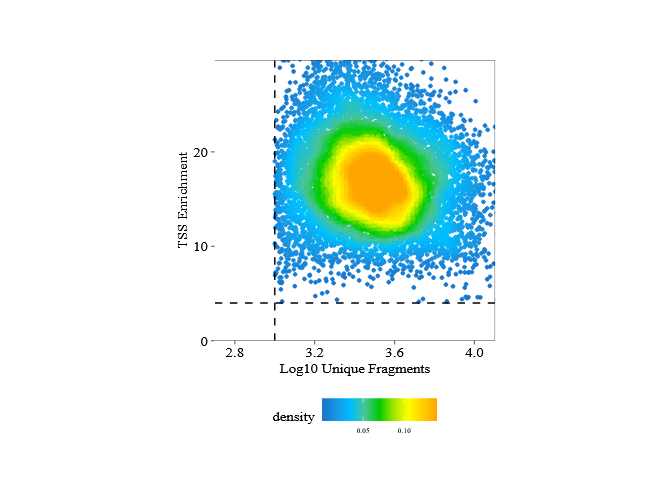

To save an editable vectorized version of this plot, we use `plotPDF()`. This saves the plot within the “Plots” sub-directory of our ArchRProject directory (defined by `getOutputDirectory(projHeme1)`).

```r
plotPDF(p, name = "TSS-vs-Frags.pdf", ArchRProj = projHeme1, addDOC = FALSE)
## Plotting Ggplot!
```

# 5.3 Plotting Sample Statistics

Once multiple samples are integrated into an `ArchRProject`, it is vital to compare their quality metrics side-by-side. This ensures that downstream results (like clustering) are driven by biology rather than technical differences between samples.

### 5.3.1 Introduction to `plotGroups()`
The `plotGroups()` function is the universal tool in ArchR for visualizing distributions across categories. It primarily produces:
* **Ridge Plots (`ridges`)**: Ideal for comparing the "shape" of distributions across many groups.
* **Violin Plots (`violin`)**: Ideal for seeing the density and specific percentiles (when paired with boxplots).

---

### 5.3.2 Example 1: Ridge Plots for TSS Enrichment

In this example, we visualize the **TSS Enrichment** distribution for every sample in the project. This allows us to see if the "signal-to-noise" is consistent across our experiment.

#### Code Breakdown

```r
p1 <- plotGroups(
    ArchRProj = proj,         # Your project object
    groupBy = "Sample",       # The metadata column to group by
    colorBy = "cellColData",  # Tells ArchR the data is in the metadata table
    name = "TSSEnrichment",   # The specific metric to plot
    plotAs = "ridges",        # The type of plot
    baseSize = 10             # Adjusts the global font size for the plot
)
```
The `plotGroups()` function is highly flexible. Below is a breakdown of the key parameters used to customize your sample statistic plots:

| Parameter        | Definition                         | Purpose                                                                                                                 |
| :--------------- | :--------------------------------- | :---------------------------------------------------------------------------------------------------------------------- |
| **`ArchRProj`**  | The ArchRProject object.           | Tells the function which project to pull metadata and data from.                                                        |
| **`groupBy`**    | A string (e.g., `"Sample"`)        | Defines how to categorize the cells on the Y-axis. You can group by samples, clusters, or any custom metadata column.   |
| **`colorBy`**    | A string (usually `"cellColData"`) | Specifies the "slot" in the ArchRProject where the data is stored. For QC metrics, this is always `cellColData`.        |
| **`name`**       | A string (e.g., `"TSSEnrichment"`) | The exact name of the column you want to plot. This can also include math like `"log10(nFrags)"`.                       |
| **`plotAs`**     | `"ridges"` or `"violin"`           | Sets the visual style. **Ridges** show overlapping density curves; **Violin** shows the density "envelope" of the data. |
| **`baseSize`**   | Numeric (default is often 10-12)   | A global multiplier for text size. Increasing this makes axis labels and titles larger for presentations or posters.    |
| **`alpha`**      | Numeric (0 to 1)                   | Sets the transparency of the plot. Especially useful for violin plots to see the internal boxplots more clearly.        |
| **`addBoxPlot`** | Logical (`TRUE`/`FALSE`)           | (Violin only) If `TRUE`, adds a box-and-whisker plot inside the violin to show the median and quartiles.                |

---

### Understanding the Logic
When you call `plotGroups()`, you are essentially telling ArchR:
> "Go into my **`ArchRProj`**, look into the **`colorBy`** table, find the column named **`name`**, and group that data by the categories found in **`groupBy`**. Finally, render the results as **`plotAs`**."

* **Thesis Tip:** Consistency is key for your final figures. Once you find a `baseSize` and `alpha` value that looks good, use those same values for every ridge and violin plot in your thesis to give your document a cohesive, professional look.

### Saving Plots with `plotPDF()`

Unlike standard R saving functions, `plotPDF()` is "Project Aware." It automatically handles the file pathing to keep your HPC workspace organized.

#### 1. How the Path is Determined
When you run `plotPDF()`, ArchR looks at the `outputDirectory` stored inside your `ArchRProject` object. It then:
1. Navigates to that directory.
2. Creates a sub-folder called **"Plots"** (if it doesn't already exist).
3. Saves your PDF there using the provided `name`.

```r
# Save multiple plots (p1, p2, p3, p4) into one vectorized PDF
plotPDF(
    p1, p2, p3, p4, 
    name = "QC-Sample-Statistics.pdf", 
    ArchRProj = projHeme1, 
    addDOC = FALSE, 
    width = 4, 
    height = 4
)  
```

## 5.4 Plotting Sample Fragment Size Distributions

The fragment size distribution is a direct reflection of the "beads on a string" structure of your chromatin. High-quality scATAC-seq data should always show a clear periodicity (peaks and valleys) corresponding to nucleosome spacing. Fragment size distributions in ATAC-seq can be quite variable across samples, cell types, and batches. Slight differences like those shown below are common and do not necessarily correlate with differences in data quality.

#### 1. The `plotFragmentSizes()` Function
ArchR accesses the pre-computed fragment lengths in the Arrow files to visualize these distributions across all samples simultaneously.

```r
# Generate the fragment size distribution plot
p1 <- plotFragmentSizes(ArchRProj = projHeme1)

# Display the plot
p1
```

#### 2. Parameter Definitions

`ArchRProj` = The project object containing the links to your Arrow files.

`maxSize`	(Optional) = The maximum fragment size to plot. Default is usually 750 bp.

`groupBy`	(Optional) = Allows you to group the distribution by Sample (default) or Cluster.

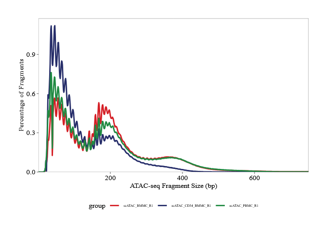

#### 3. How to Interpret the Plot

  Sub-nucleosomal Peak: The largest peak on the left (<150 bp). Represents open, accessible regions.

  Nucleosomal Periodicity: You should see smaller, diminishing peaks at ~200 bp, ~400 bp, and ~600 bp.

  Quality Check: If your plot is just a flat line or a single smooth "hump" without distinct peaks/valleys, your library likely has poor chromatin structure (potentially due to over-fragmentation or cell death).

    Thesis Tip: Include this plot to demonstrate that your library has the expected nucleosomal periodicity. Even if the heights of the peaks vary slightly between your experimental groups, the presence of the "staircase" proves that the Tn5 enzyme was acting on healthy, protein-bound chromatin rather than naked, degraded DNA.

### 5.4.2 Plotting TSS Enrichment Profiles

The TSS enrichment profile provides a visual "fingerprint" of your library's signal-to-noise ratio. A high-quality profile should show a sharp, symmetric peak at the center of the TSS.

#### 1. The `plotTSSEnrichment()` Function
This function aggregates the signal across thousands of known transcription start sites to show the average accessibility "landscape" of your samples.

```r
# Generate the TSS enrichment profile plot
p2 <- plotTSSEnrichment(ArchRProj = projHeme1)

# Display the plot
p2
``` 
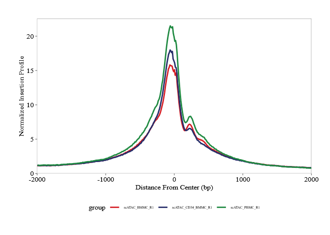

#### 2. Visual Breakdown of the Plot:

* **The Center Peak (Distance = 0):** This represents the **Nucleosome-Free Region (NFR)**. High-quality libraries show a sharp, tall spike here, indicating that the Tn5 enzyme successfully targeted open promoters.
* **The +1 Nucleosome Shoulder:** The distinct "bump" observed to the right of the central peak (roughly at +150 to +200 bp) is caused by the **+1 nucleosome**. The presence of this shoulder is a strong indicator of biological integrity and high-resolution data.
* **The Enrichment Score:** The Y-axis represents the fold-enrichment over the background. In this plot, the PBMC sample (green) shows a maximum enrichment of >20, which is considered exceptional.

#### Comparison Across Samples:
In the provided plot, we see three distinct lines:
1.  **scATAC_PBMC_R1 (Green)**: Highest signal-to-noise.
2.  **scATAC_CD34_BMMC_R1 (Blue)**: Intermediate signal.
3.  **scATAC_BMMC_R1 (Red)**: Lowest signal of the three, though still far above the standard QC threshold of 4.

> **Thesis Tip:** When discussing this plot, emphasize the **symmetry** and the **+1 nucleosome shoulder**. A messy or "jagged" plot usually indicates low cell numbers or high background noise. The smooth, distinct peaks shown here justify the use of these samples for high-resolution regulatory analysis.

# 5.6 Filtering Doublets from an ArchRProject

Doublets occur when two nuclei are captured in a single droplet. In scATAC-seq, these artifacts can lead to "ghost clusters" or false transitions in trajectory analysis. `filterDoublets()` removes these cells based on the scores calculated during the initial QC phase.

More on this topic here: https://www.archrproject.com/bookdown/filtering-doublets-from-an-archrproject.html


# 6. Dimensionality reduction with ArchR


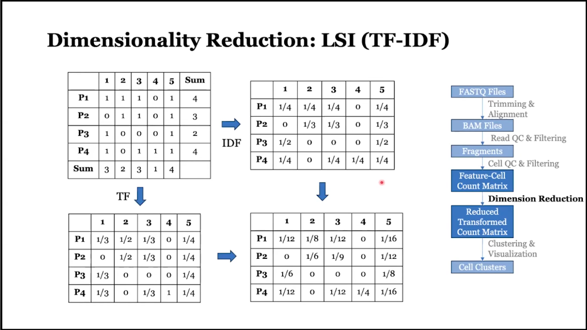

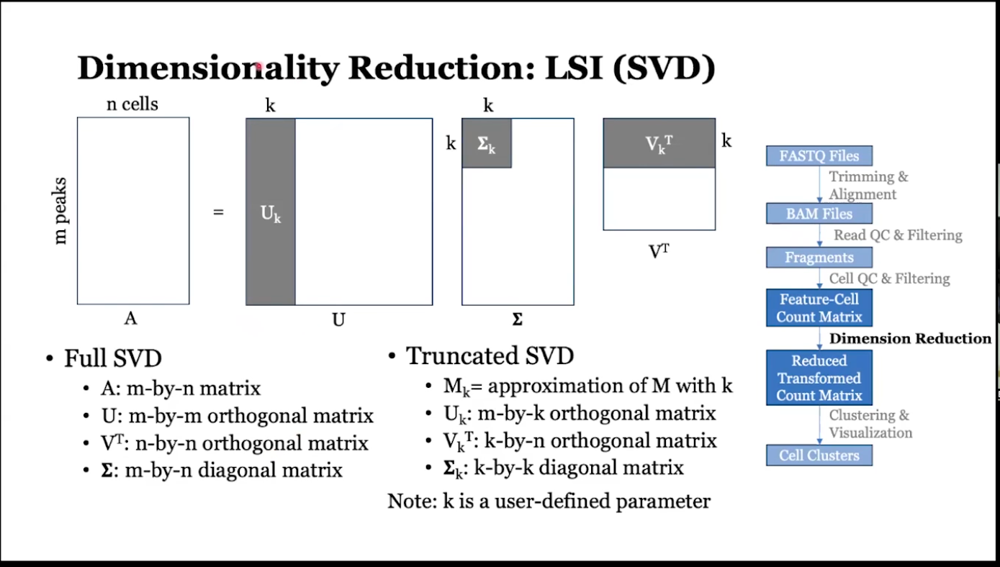

## 6.2. Iterative Latent Semantic Indexing (LSI)


In single-cell analysis, "Dimensionality Reduction" is the process of compressing thousands of genomic features into a few coordinates (like a UMAP) that we can actually visualize and cluster.

### 1. The Comparison: scRNA-seq vs. scATAC-seq

| Feature                 | scRNA-seq (Gene Expression)                                                  | scATAC-seq (Chromatin)                                                                                                          |
| :---------------------- | :--------------------------------------------------------------------------- | :------------------------------------------------------------------------------------------------------------------------------ |
| **Data Type**           | **Continuous/Counts:** You can have 0, 1, 10, or 100 transcripts.            | **Binary:** A region is either open (1) or closed (0).                                                                          |
| **Selection Strategy**  | **Highly Variable Genes (HVGs):** Easy to find genes that vary across cells. | **Highly Accessible Peaks:** Selecting the "most open" regions fails.                                                           |
| **The "Noise" Problem** | Noise is usually technical (dropout).                                        | "Most accessible" regions are often "housekeeping" sites (open in all cells), which adds noise and masks cell-type differences. |

---

## 2. The Solution: The "Iterative LSI" Approach
Because we cannot identify "variable" peaks in a binary matrix effectively, ArchR uses a multi-step refinement process.

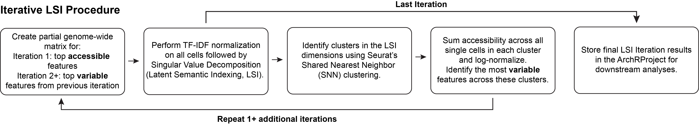


### Phase 1: The "Rough Sketch"
ArchR starts by looking at the **most accessible tiles** (usually 500bp windows). 
* **Action:** It runs an initial Latent Semantic Indexing (LSI) transformation.
* **Goal:** To get a "low-resolution" look at the data. 
* **Result:** This identifies major cell lineages (e.g., separating all T-cells from all B-cells) without getting bogged down in technical "batch" differences.

### Phase 2: Feature Refinement
Once these "rough" clusters are identified, ArchR calculates the average accessibility for each group.
* **Action:** It asks, *"Which peaks are actually different between Cluster A and Cluster B?"*
* **Goal:** To find the **Variable Peaks**.
* **Result:** This filters out the "housekeeping" noise and focuses on biologically informative regions.

### Phase 3: The "High-Definition" Map
ArchR runs LSI **a second time** (or more), but this time it only uses the variable features found in Phase 2.
* **Result:** A much cleaner dimensionality reduction that minimizes batch effects and provides a more accurate biological "fingerprint" of each cell.

---

## 3. Implementation in ArchR
The `addIterativeLSI()` function automates this entire process.

```R
projHeme2 <- addIterativeLSI(
    ArchRProj = projHeme2,
    useMatrix = "TileMatrix", 
    name = "IterativeLSI", 
    iterations = 2, 
    clusterParams = list( #See Seurat::FindClusters
        resolution = c(0.2), 
        sampleCells = 10000, 
        n.start = 10
    ), 
    varFeatures = 25000, 
    dimsToUse = 1:30
)
```

## Parameter Breakdown: `addIterativeLSI()`

The `addIterativeLSI()` function is the primary tool in ArchR for dimensionality reduction. It uses a multi-pass approach to distinguish biological signal from technical noise.

### Configuration Table

| Parameter           | Value            | Description                                                                                                                                                                                                                                                                                                                                                                                                                                                             |
| :------------------ | :--------------- | :---------------------------------------------------------------------------------------------------------------------------------------------------------------------------------------------------------------------------------------------------------------------------------------------------------------------------------------------------------------------------------------------------------------------------------------------------------------------- |
| **`ArchRProj`**     | `projHeme2`      | The **ArchRProject** object to which the dimensionality reduction will be added.                                                                                                                                                                                                                                                                                                                                                                                        |
| **`useMatrix`**     | `"TileMatrix"`   | The input data matrix. Using the `TileMatrix` (500bp windows) allows for an unbiased initial pass before peaks are even called.                                                                                                                                                                                                                                                                                                                                         |
| **`name`**          | `"IterativeLSI"` | The name given to this specific reduction. This allows you to store multiple runs (e.g., with different parameters) in the same project.                                                                                                                                                                                                                                                                                                                                |
| **`iterations`**    | `2`              | The number of times the LSI process is repeated. The first pass finds broad clusters; subsequent passes use features variable across those clusters to refine the results.                                                                                                                                                                                                                                                                                              |
| **`clusterParams`** | `list(...)`      | A list of parameters passed to the clustering algorithm (uses `Seurat::FindClusters`). These "internal" clusters are used to identify variable features between LSI rounds.                                                                                                                                                                                                                                                                                             |
| **`resolution`**    | `0.2`            | The granularity of the internal clustering. Higher values lead to more clusters. For the first iteration, a low resolution is preferred to capture major cell lineages.                                                                                                                                                                                                                                                                                                 |
| **`sampleCells`**   | `10000`          | The number of cells sampled to perform the "Estimated LSI" procedure. This allows the function to scale to millions of cells without crashing your RAM.                                                                                                                                                                                                                                                                                                                 |
| **`n.start`**       | `10`             | The number of random starting points for the K-means clustering step, ensuring the identified clusters are stable.                                                                                                                                                                                                                                                                                                                                                      |
| **`varFeatures`**   | `25000`          | The number of top "variable features" (tiles or peaks) used for the final LSI. These features drive the separation in your UMAP.                                                                                                                                                                                                                                                                                                                                        |
| **`dimsToUse`**     | `1:30`           | The LSI dimensions (components) to be retained. Typically, the first 30 dimensions capture the majority of biological variance. __Biological Intuition:__ If your clusters don't make sense (e.g., they don't match known markers), you can manually override the algorithm. __Action:__ Change dimsToUse = 1:30 to dimsToUse = 2:30. This completely ignores the first dimension and forces the UMAP/Clustering to rely on the remaining, usually cleaner, dimensions. |

---


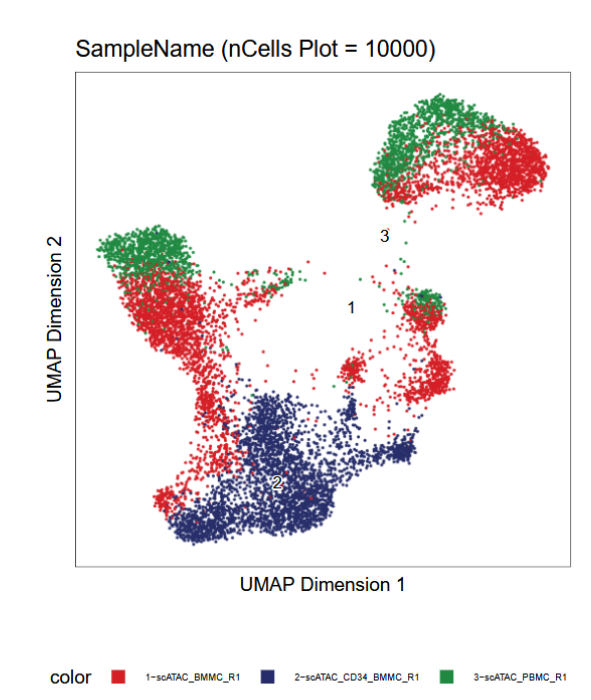 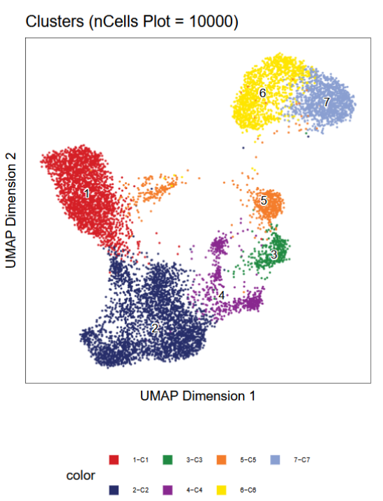

## Version 1 Interpretation: Broad Lineage Identification

Version 1 represents the baseline "QC pass" for dimensionality reduction. Using **2 iterations**, a fixed **resolution of 0.2**, and **25,000 variable features**, this run provides a broad, low-resolution view of the major cell lineages in the dataset.

---

### 1. Global Topology and Structure
The UMAP in Version 1 shows cells forming a largely **continuous and singular mass**.
* **Connectivity:** The different biological groups are not yet clearly separated into distinct "islands".
* **Feature Impact:** By using 25,000 features, the model retains a high amount of genomic information, including "housekeeping" accessibility common to many cells.
* **Biological Signal:** This results in a "cloud-like" structure where broad differences are visible, but subtle transition states between closely related cell types remain blurred.


### 2. Cluster Granularity
The algorithm identifies **7 distinct clusters** (C1 through C7).
* **Major Lineages:** These clusters capture the primary biological "continents" of the data, such as mature vs. progenitor populations.
* **Cluster 2 (Dark Blue):** This group is positioned at the bottom of the mass, clearly separating a specific lineage (CD34+ progenitors) from the rest of the cells.
* **Resolution Limits:** Because only two iterations were performed with a 0.2 resolution, the algorithm misses smaller sub-populations that only become distinct when background noise is further filtered.

### 3. Sample Integration and Batch Effects
The `SampleName` plot confirms that the dimensionality reduction successfully handled technical variation between samples.
* **Successful Mixing:** Samples **1-scATAC_BMMC_R1** (red) and **3-scATAC_PBMC_R1** (green) are well-integrated and overlap extensively.
* **Biological Isolation:** Sample **2-scATAC_CD34_BMMC_R1** (blue) remains relatively isolated in Cluster 2.
* **Interpretation:** This confirms that the separation seen is driven by **biology** (progenitor status) rather than **technical batch**, which would have caused the samples to group separately by name.

---

### Summary Table for Version 1

| Metric                 | Observation          | Interpretation                                                                |
| :--------------------- | :------------------- | :---------------------------------------------------------------------------- |
| **Cluster Count**      | 7 Clusters           | Identifies major cell populations; lacks sub-type resolution.                 |
| **Topology**           | Connected "Mass"     | High feature count (25k) preserves common signals, keeping clusters close.    |
| **Integration**        | Well-mixed Red/Green | Strong batch correction between BMMC and PBMC samples[cite: 6, 8, 21].        |
| **Lineage Definition** | Broad Lineages       | Ideal for a first-pass analysis to verify data quality and major cell groups. |


**Conclusion:** Version 1 serves as an essential check to ensure that different samples are integrating properly before moving to higher-resolution runs like Version 4.

## Version 4

We used this function for another dimensionality reduction, just to visualize differences:

```r
projHeme2 <- addIterativeLSI(
    ArchRProj = projHeme2,
    useMatrix = "TileMatrix", 
    name = "IterativeLSI2", 
    iterations = 4, 
    clusterParams = list( #See Seurat::FindClusters
        resolution = c(0.1, 0.2, 0.4), 
        sampleCells = 10000, 
        n.start = 10
    ), 
    varFeatures = 15000, 
    dimsToUse = 1:30
)
```

The output of the 4th iteration is as follows:

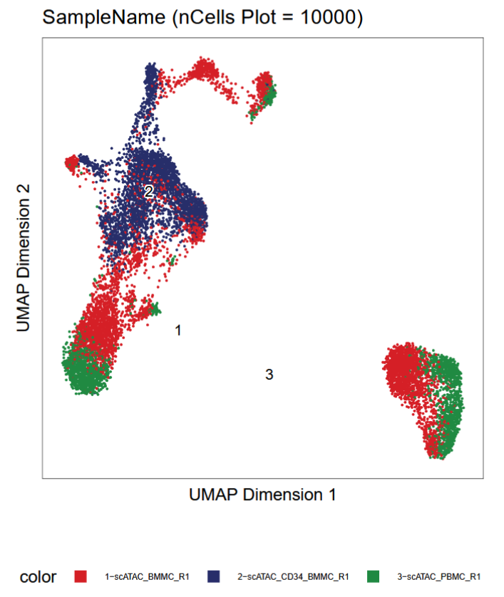, 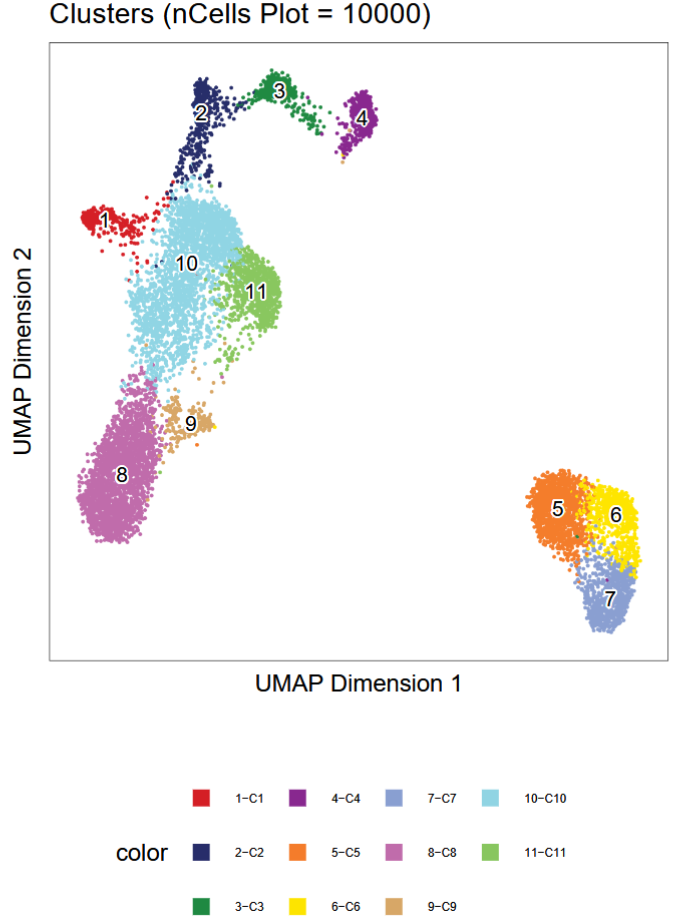

---

### 1. Global Topology: The "Two-Island" Structure
The most significant change in Version 4 is the shift in topology; the continuous mass from Version 1 has split into two distinct "islands".
* **Lineage Separation:** This clear physical separation on the UMAP indicates that the algorithm has successfully isolated the primary biological lineages (likely Lymphoid vs. Myeloid/Progenitor).
* **Reduced Background:** Lowering the `varFeatures` to 15,000 removed thousands of "housekeeping" peaks that previously blurred these groups together, allowing for a cleaner mathematical separation.
* **Distinct States:** The distance between these islands suggests that the chromatin accessibility profiles of these groups are fundamentally different, providing a superior starting point for cell-type identification.


### 2. Cluster Granularity (11 Clusters)
Version 4 identifies **11 clusters** (C1 through C11), a significant increase from the 7 clusters found in Version 1.
* **Sub-type Discovery:** The high final resolution (0.4) allows for the identification of subtle sub-populations. For example, the smaller island on the right is now divided into three distinct groups (Clusters 5, 6, and 7).
* **Stable Grouping:** On the larger left island, clusters 8, 9, 10, and 11 show a clear "flow" or transition, which likely represents different stages of cell differentiation or maturation.

### 3. Advanced Integration & Batch Correction
The `SampleName` plot for Version 4 shows excellent integration, confirming that the refinement is biological, not technical.
* **Seamless Mixing:** Samples **1-scATAC_BMMC_R1** (red) and **3-scATAC_PBMC_R1** (green) are perfectly blended within the same clusters on both islands.
* **The "Anchor" Effect:** By starting at a very low resolution (0.1), ArchR first identified the major biological groups across all samples. This ensured that the subsequent higher-resolution passes refined the biological signal rather than separating cells by their original sample batch.
* **Progenitor Status:** The **2-scATAC_CD34_BMMC_R1** sample (blue) remains a distinct population (concentrated in Clusters 2, 3, and 4), confirming that these progenitor cells have a unique and recognizable chromatin landscape.

---

### Comparison Summary: Version 1 vs. Version 4

| Metric       | Version 1 (The Rough Draft)          | Version 4 (The Final Map)                 |
| :----------- | :----------------------------------- | :---------------------------------------- |
| **Topology** | Single, connected "cloud".           | Two distinct, lineage-specific islands.   |
| **Clusters** | 7 Clusters (Broad) .                 | 11 Clusters (High-resolution)].           |
| **Noise**    | Higher (25k features).               | Lower (15k features); more specific.      |
| **Use Case** | Quick verification of sample mixing. | Deep discovery of sub-types and lineages. |


### Understanding the "Iterative" Logic

ArchR doesn't just run a single PCA-like transformation. It follows a "Zoom-In" logic:

1. **Iteration 1 (The Wide Lens):** Uses the most accessible tiles to find the "big" differences (e.g., Lymphocytes vs. Myeloid cells).
2. **Feature Selection:** It identifies which peaks are actually different *between* those big groups.
3. **Iteration 2 (The Macro Lens):** Re-runs the LSI using only those specific, biologically informative peaks. 


### Important Note: Dimension 1 Correlation
In scATAC-seq, **LSI Dimension 1** is often highly correlated with **Sequencing Depth** (how many fragments a cell has). 
* **Action:** After running this command, check the correlation. 
* **Adjustment:** If LSI1 is purely technical noise, you should change `dimsToUse` to `2:30` in your downstream UMAP and Clustering functions.


## 6.3 Estimated LSI: Scaling to Massive Datasets

When working with "atlas-scale" datasets (hundreds of thousands to millions of cells), computing a full LSI matrix is often impossible due to RAM (memory) limitations. **Estimated LSI** is ArchR's optimization for these massive projects.

---

### 1. The Core Concept: "Landmarks & Projection"
Instead of calculating the mathematical relationship between every single cell at once, ArchR uses a representative subset to build the coordinate system.

* **Landmark Cells:** ArchR selects a random subset of cells to define the "rules" of the LSI space.
* **Projection:** The remaining cells are then "projected" into that pre-defined space.
* **Disk-Backed Processing:** Because ArchR reads the non-landmark cells from the Arrow files on your disk one by one, it never needs to load the entire dataset into your RAM at once.


---

### 2. The Step-by-Step Workflow
1.  **Selection:** A specific number of "landmark" cells is randomly sampled from the project.
2.  **LSI on Landmarks:** ArchR performs standard LSI (TF-IDF and SVD) on only these landmarks.
3.  **IDF Transfer:** The **Inverse Document Frequency (IDF)** values—the weights that tell us which peaks are most informative—are saved from the landmark set.
4.  **Projection:** All other cells are normalized using those landmark weights and moved into the landmark-defined space.

---

### 3. Key Parameters in `addIterativeLSI()`
You trigger Estimated LSI by adding these two parameters to your function call:

| Parameter              | Function                                                                               |
| :--------------------- | :------------------------------------------------------------------------------------- |
| **`sampleCellsFinal`** | The number of cells to be used as the "landmark" set (e.g., 50,000).                   |
| **`projectCellsPre`**  | A logical (`TRUE`/`FALSE`) that tells ArchR to use the landmark subset for projection. |

---

### 4. Important Considerations
* **Landmark Diversity:** The landmark set must be large enough to capture rare cell types. If a cell type makes up only 0.1% of your data and you only pick 1,000 landmarks, you might miss that population entirely in your initial map.
* **Memory vs. Accuracy:** While estimated LSI is slightly less precise than a full LSI calculation, the difference is negligible for large datasets and is often the only way to process them on standard hardware.

Estimated LSI allows you to analyze **millions of cells** without needing a supercomputer. It builds a high-quality "anchor" map using a subset of your data and then fits the rest of the cells into that map efficiently.

## 6.4 Batch Effect Correction with Harmony

While ArchR's **Iterative LSI** is designed to minimize technical noise, some datasets exhibit "strong" batch effects where cells group by sample or processing date rather than biology. In these cases, ArchR uses **Harmony**, a popular batch-correction algorithm originally developed for scRNA-seq.

---

### 1. What is Harmony?
Harmony is an algorithm that "aligns" clusters across different batches. It projects cells into a shared space and then iteratively moves them until the clusters from different samples overlap, provided they share the same biological identity.

* **Input:** An existing dimensionality reduction (e.g., your `IterativeLSI` object).
* **Output:** A new, corrected dimensionality reduction object (e.g., `Harmony`).
* **The Goal:** To ensure that a "T-cell" from Sample A and a "T-cell" from Sample B are located at the same coordinates in your UMAP.


---

### 2. Parameter Breakdown: `addHarmony()`

| Parameter         | Value            | Description                                                                                   |
| :---------------- | :--------------- | :-------------------------------------------------------------------------------------------- |
| **`ArchRProj`**   | `projHeme2`      | Your active ArchRProject.                                                                     |
| **`reducedDims`** | `"IterativeLSI"` | The name of the input dimensionality reduction you want to correct.                           |
| **`name`**        | `"Harmony"`      | The name you want to give to the new, corrected reducedDims object.                           |
| **`groupBy`**     | `"Sample"`       | The column in your metadata that defines the batches (e.g., "Sample", "Replicate", or "Day"). |

---

### 3. Implementation Code

```R
# Correcting for batch effects using Harmony
projHeme2 <- addHarmony(
    ArchRProj = projHeme2,
    reducedDims = "IterativeLSI",
    name = "Harmony",
    groupBy = "Sample"
)

# Note: Harmony typically converges quickly (e.g., 3-10 iterations)
```

# Chapter 7: Clustering with ArchR - Basics & Biological Background

Clustering is a fundamental step in single-cell analysis that allows us to organize thousands of individual cells into meaningful groups based on their molecular profiles.

### 1. Biological Significance: Why Cluster?
In a complex tissue sample, different cells perform different functions. These functions are driven by which parts of the DNA are "open" (accessible) and available for transcription. 
* **Identifying Cell Identity:** By grouping cells with similar chromatin accessibility patterns, we can identify distinct cell types (e.g., T-cells vs. B-cells) and cell states (e.g., resting vs. activated).
* **Unbiased Discovery:** Clustering is an "unsupervised" process. We don't tell the computer what cell types exist; instead, the computer finds groups that naturally exist in the data based on their shared epigenetic fingerprints.


---

### 2. The Logic: From LSI to Clusters
Clustering is rarely performed on the raw, sparse data matrix. Instead, it happens in the "Reduced Dimension" space created by LSI or Harmony.

1.  **Reduced Dimensions:** We use the coordinates from LSI (e.g., 30 dimensions) as the input.
2.  **Nearest Neighbor Graph:** The algorithm looks at every cell and identifies its closest "neighbors" in that 30D space.
3.  **Community Detection:** The computer then finds "communities" (clusters) of cells that are more densely connected to each other than to the rest of the graph.

---

### 3. Core Algorithmic Concepts
ArchR leverages state-of-the-art tools from the scRNA-seq world (like **Seurat**) to perform these calculations because they are robust and highly scaleable.

* **Graph-Based Clustering:** This is the industry standard. It treats cells like nodes in a social network and finds the "friend groups".
* **Louvain/Leiden Algorithms:** These are the specific mathematical formulas used to find these communities. In ArchR, this process is **deterministic**, meaning that if you run the same data twice with the same settings, you will get the exact same clusters.

---


| Concept       | Explanation                                                          |
| :------------ | :------------------------------------------------------------------- |
| **Input**     | Reduced dimensions (e.g., `IterativeLSI` or `Harmony`).              |
| **Goal**      | Discover distinct cell types/states without prior labeling.          |
| **Technique** | Nearest-Neighbor graph construction followed by community detection. |
| **Tools**     | ArchR wraps standard scRNA-seq methods (Seurat, scran).              |


**Next Steps:** Once clusters are identified, we can calculate **Marker Peaks** and **Gene Scores** to determine what those clusters actually represent (e.g., Cluster 1 = Monocytes).

## 7.1 Clustering using Seurat's FindClusters() function

In ArchR, the most common and successful method for identifying cell groups is the **graph-based clustering** approach implemented by the `Seurat` package. This method is deterministic and highly effective for high-dimensional single-cell data.

---

### 1. The Method: Graph-Based Community Detection
Instead of calculating the distance between every pair of cells (which is slow), this method builds a "web" of connections:
1.  **Nearest Neighbor Graph:** It identifies the $k$ most similar cells (neighbors) for every cell in the LSI/Harmony space.
2.  **SNN (Shared Nearest Neighbor):** It weights the edges between cells based on how many neighbors they share.
3.  **Louvain Algorithm:** It uses the Louvain community detection algorithm to find groups of cells that are more tightly knit than others.


---

### 2. Implementation: `addClusters()`
The `addClusters()` function acts as a wrapper that passes your dimensionality reduction coordinates directly to Seurat's clustering engine.

```R
projHeme2 <- addClusters(
    input = projHeme2,
    reducedDims = "IterativeLSI", # Or "Harmony"
    method = "Seurat",
    name = "Clusters",
    resolution = 0.8              # Higher = more clusters; Lower = fewer
)
```

To access these clusters we can use the `$` accessor which shows the cluster ID for each single cell.
```r
head(projHeme2$Clusters)
## [1] "C9"  "C11" "C4"  "C4"  "C4"  "C7"
```

We can tabulate the number of cells present in each cluster:
```r
table(projHeme2$Clusters)
## 
##   C1  C10  C11  C12   C2   C3   C4   C5   C6   C7   C8   C9 
## 1532  903 1250  633 1120  314  351  386  702 1261 1377  421
```

To better understand which samples reside in which clusters, we can create a cluster confusion matrix across each sample using the confusionMatrix() function.
```r
cM <- confusionMatrix(paste0(projHeme2$Clusters), paste0(projHeme2$Sample))
cM
## 12 x 3 sparse Matrix of class "dgCMatrix"
##     scATAC_BMMC_R1 scATAC_CD34_BMMC_R1 scATAC_PBMC_R1
## C9             254                   5            162
## C11           1202                   .             48
## C4             351                   .              .
## C7             310                 940             11
## C1            1489                  10             33
## C6             171                 531              .
## C8             139                1238              .
## C12             86                   .            547
## C3             160                 144             10
## C10            322                   .            581
## C2             117                   2           1001
## C5              88                 298              .
```

To plot this confusion matrix as a heatmap, we use the pheatmap package:
```r 
library(pheatmap)
cM <- cM / Matrix::rowSums(cM)
p <- pheatmap::pheatmap(
    mat = as.matrix(cM), 
    color = paletteContinuous("whiteBlue"), 
    border_color = "black"
)
p
```
\
__As a result, we get this heatmap:__
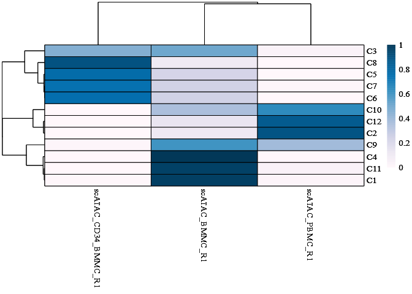

There are times where the relative location of cells within the 2-dimensional embedding does not agree perfectly with the identified clusters. More explicitly, cells from a single cluster may appear in multiple different areas of the embedding. In these contexts, it may be appropriate to adjust the clustering parameters or embedding parameters until there is agreement between the two.


### 1. Understanding the Heatmap (The Confusion Matrix)
It shows a **normalized Confusion Matrix** visualized as a heatmap. It tells us exactly how our biological samples are distributed across the identified clusters.

* **Normalization:** The code `cM / Matrix::rowSums(cM)` is crucial. It ensures that the color intensity represents the **proportion** of each cluster's cells found in a given sample, rather than the raw count.
* **Reading the Blocks:**
    * **The CD34+ Progenitor Group:** Clusters **C3, C8, C5, C7, and C6** are almost exclusively found in the `scATAC_CD34_BMMC_R1` sample (the dark blue blocks on the left). This confirms these are progenitor-specific cell types.
    * **The BMMC Group:** Clusters **C4, C11, and C1** are specific to the `scATAC_BMMC_R1` sample.
    * **The PBMC Group:** Clusters **C10, C12, and C2** are dominant in the `scATAC_PBMC_R1` sample.
* **The "Shared" Clusters:** Notice **C9**. It has lighter blue across multiple columns, indicating it contains a mixture of cells from different samples—likely a common mature cell type present in both bone marrow and peripheral blood.


---

### 2. The Logic: Why Use Graph-Based Clustering?
ArchR uses the **Seurat** engine because graph-based clustering is "community-driven" rather than distance-driven.
1.  **SNN Graph:** It creates a web of connections where "friendships" (edges) are stronger if cells share many of the same neighbors.
2.  **Louvain Algorithm:** It identifies "neighborhoods" where cells are more connected to each other than to the rest of the map.
3.  **Determinism:** This process is **deterministic**—unlike some older methods, running this with the same settings will always yield the exact same cluster IDs.

---

### 3. Resolving Discrepancies: Clusters vs. Embeddings
The final paragraph of your text addresses a common frustration: **"Why does my UMAP look different than my Clusters?"**

* **30D vs. 2D:** Clustering happens in the high-dimensional LSI space (e.g., 30 dimensions). A UMAP is a **projection** into 2D. In 30 dimensions, two groups might be clearly separate, but the 2D "shadow" (UMAP) might make them look like they overlap.
* **Disconnected Clusters:** Sometimes, cells in Cluster 1 might appear in two different "islands" on your UMAP. 
    * **The Interpretation:** Usually, the high-dimensional clustering is more mathematically accurate than the 2D visualization.
* **How to Fix It:** If the disagreement is severe, you have two options:
    1.  **Adjust Clustering:** Change the `resolution` (lower it to merge split groups, raise it to separate them).
    2.  **Adjust Embedding:** Tweak UMAP parameters like `nNeighbors` or `minDist` to better represent the high-dimensional structure.

---

### Summary 

| Feature                     | Observation                                           | Action                                            |
| :-------------------------- | :---------------------------------------------------- | :------------------------------------------------ |
| **High Resolution (0.8)**   | Leads to more, smaller clusters.                      | Lower to 0.4 if clusters look too fragmented.     |
| **Sample-Specific Cluster** | Cluster appears in only one sample in the heatmap.    | Verify if this is real biology or a batch effect. |
| **Split Clusters on UMAP**  | One cluster ID is found in two separate UMAP islands. | Re-evaluate LSI dimensions or UMAP settings.      |


**Pro-Tip:** Always trust your Confusion Matrix over your UMAP. The heatmap tells you the truth about the data's structure, while the UMAP is just a "pretty picture" summary that can sometimes be misleading.

__IMPORTANT__: Clustering and Visualization are two different things! They use the same input but use completely different algorithms. 

# 8.0 Single-cell Embeddings

Embeddings take the high-dimensional results from IterativeLSI and project them onto a 2D plane. This is the stage where your data finally "looks" like a single-cell experiment. We call these “embeddings” because they are strictly used to visualize the clusters and are not used to identify clusters which is done in an LSI sub-space as mentioned in previous chapters.

### 8.1 Uniform Manifold Approximation and Projection (UMAP)

UMAP is the preferred embedding in ArchR because of its speed and ability to preserve both local and global relationships between cells.

#### Implementation Code

```r
# Calculate UMAP based on the IterativeLSI results
projHeme2 <- addUMAP(
  ArchRProj = projHeme2, 
  reducedDims = "IterativeLSI", 
  name = "UMAP", 
  nNeighbors = 30, # Local vs Global: Higher values create a more "global" view; lower values focus on very local similarities.
  minDist = 0.5, #Tightness: Controls ho wtightly packed the points are. Lower values (e.g., 0.1) result in tighter, denser clusters.
  metric = "cosine", #The distance math used. "cosine" is typically better for sparse scATAC-seq data than "euclidean".        
  force = TRUE
)
```

You can list the available embeddings objects in an ArchRProject using the slot extraction opperator @:

`projHeme2@embeddings`

To plot the UMAP results, we use the `plotEmbedding()` function and pass the name of the UMAP embedding we just generated (“UMAP”). We can tell ArchR how to color the cells by using a combination of `colorBy` which tells ArchR which matrix to use to find the specified metadata column provided to `name`.
```r
p1 <- plotEmbedding(ArchRProj = projHeme2, colorBy = "cellColData", name = "Sample", embedding = "UMAP")
```
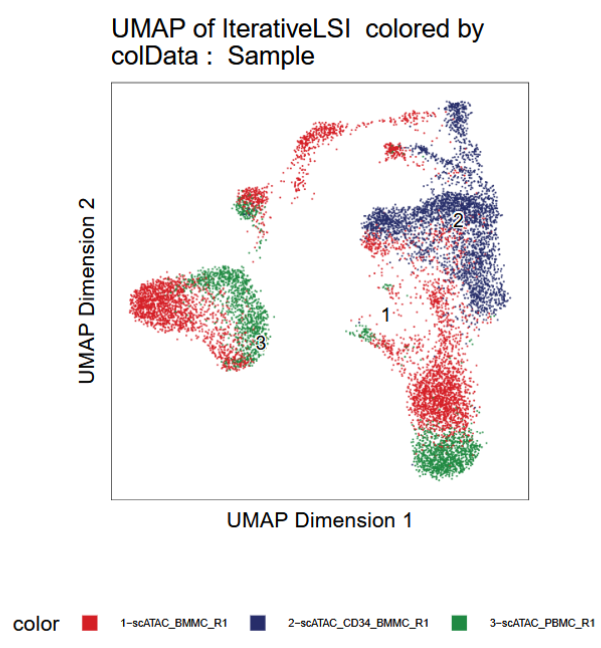
---
* Instead of coloring by “Sample” as above, we can color by “Clusters” which were identified in a previous chapter.
```r 
p2 <- plotEmbedding(ArchRProj = projHeme2, colorBy = "cellColData", name = "Clusters", embedding = "UMAP")
```
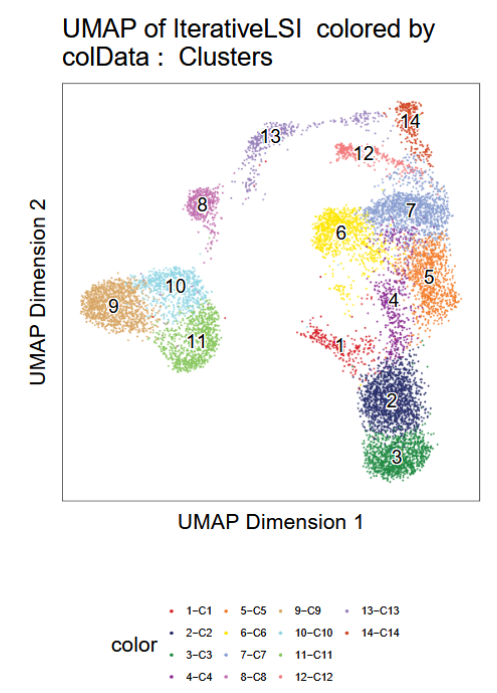
---
* We can visualize these two plots side by side using the ggAlignPlots() function, specifying a horizontal orientation using type = "h"
```r
ggAlignPlots(p1, p2, type = "h")
```
---
To save an editable vectorized version of this plot, we use `plotPDF()`
```r
plotPDF(p1,p2, name = "Plot-UMAP-Sample-Clusters.pdf", ArchRProj = projHeme2, addDOC = FALSE, width = 5, height = 5)
```
### Interpreting Single-Cell UMAPs

The UMAP (Uniform Manifold Approximation and Projection) is a 2D map where each dot represents a single cell. Cells that are plotted close together have highly similar chromatin accessibility profiles (and are therefore likely the same cell type), while cells located far apart are biologically distinct. 

Visualizing the UMAP by different metadata columns is crucial for validating both the technical quality and the biological reality of your dataset.

#### 1. Plot 1: UMAP Colored by Sample (Validating Integration)

This plot serves as your primary **Batch Effect Check**. It shows the contribution of each individual sample to the overall map:
* **Red (`scATAC_BMMC_R1`):** Bone Marrow Mononuclear Cells.
* **Blue (`scATAC_CD34_BMMC_R1`):** CD34+ enriched Bone Marrow Cells (Stem/Progenitor cells).
* **Green (`scATAC_PBMC_R1`):** Peripheral Blood Mononuclear Cells.

**What does this tell us?**
* **Biological Integration:** The Red (BMMC) and Green (PBMC) cells overlap heavily in the bottom-left "island" (Clusters 9, 10, 11) and the bottom-right tail (Cluster 3). This is an excellent result. It demonstrates that mature immune cells found in both the bone marrow and the blood (such as T-cells or B-cells) have nearly identical chromatin profiles, regardless of their extraction site.
* **Biological Distinctness:** The top right section of the UMAP (Clusters 6, 7, 14) is dominated by the Blue (CD34+) and Red (BMMC) samples, with almost no Green (PBMC) cells. This aligns perfectly with known biology: CD34+ progenitor cells reside in the bone marrow and are rarely found in circulating peripheral blood.
* **Conclusion:** Because the overlap aligns with biological expectations rather than segregating purely by sample origin, **we do not have a severe batch effect.** The integration is successful, and we can proceed without running Harmony batch correction.

#### 2. Plot 2: UMAP Colored by Clusters (Validating Structure)

This plot displays the result of the Seurat-based clustering algorithm. ArchR has mathematically partitioned the cells into 14 distinct populations based on their LSI coordinates.

**What does this tell us?**
* **Discrete Populations (The "Islands"):** The large, detached group on the left side of the UMAP (Clusters 9, 10, 11) represents a cell lineage that is highly distinct from the rest of the cells. In blood and bone marrow datasets, an isolated island like this is very often the Lymphoid lineage (T-cells, B-cells, NK cells).
* **Continuous Populations (The "Continuum"):** The large, interconnected mass on the right side of the plot (Clusters 1 through 7, 12, 14) represents a developmental continuum. Notice the lack of hard visual breaks between these clusters. This visualizes a biological trajectory—likely hematopoietic stem cells (top right) slowly differentiating into mature myeloid cells (bottom right) through various intermediate, transitional states.
* **Cluster Density:** Cluster 2 (dark blue, bottom right) is very dense and tightly packed, meaning those cells are highly homogenous. In contrast, Cluster 13 (light purple, top center) is much more diffuse, indicating greater biological variability and a broader gradient of cell states within that specific grouping.

> **Thesis Tip:** When presenting these UMAPs in your results chapter, always show the "Sample" and "Cluster" plots side-by-side. This immediately answers the two most common questions from reviewers: "Did the samples integrate properly across different biological replicates?" and "How many biologically distinct populations did the algorithm successfully identify?"
>


## 8.2 t-Stocastic Neighbor Embedding (t-SNE)

https://www.archrproject.com/bookdown/t-stocastic-neighbor-embedding-t-sne.html

## 8.3 Dimensionality Reduction After Harmony

If your initial UMAP colored by `Sample` showed significant technical separation—meaning cells of the same biological type were segregated purely by which sequencing run they belonged to—you need to apply **Batch Correction**. 

ArchR natively integrates with **Harmony**, an algorithm designed to align single-cell data across different batches while preserving true biological variation.

### Running Harmony
Harmony works directly on the LSI coordinates. It pulls similar cells from different batches together in high-dimensional space. 

```r
# Apply Harmony batch correction to the LSI dimensions
projHeme2 <- addHarmony(
    ArchRProj = projHeme2,
    reducedDims = "IterativeLSI",
    name = "Harmony",
    groupBy = "Sample", # The metadata column causing the batch effect
    force = TRUE
)
```

### Calculate a new UMAP using the Harmony-corrected dimensions
```r
projHeme2 <- addUMAP(
    ArchRProj = projHeme2, 
    reducedDims = "Harmony", # CRITICAL: Point to the corrected data!
    name = "UMAPHarmony",    # Give it a unique name so you don't overwrite the old UMAP
    nNeighbors = 30, 
    minDist = 0.5, 
    metric = "cosine",
    force = TRUE
)
```

### Plot the new Harmony UMAP colored by Sample
```r
p3 <- plotEmbedding(
    ArchRProj = projHeme2, 
    colorBy = "cellColData", 
    name = "Sample", 
    embedding = "UMAPHarmony"
)
```
### Plot the new Harmony UMAP colored by Clusters
```r 
p4 <- plotEmbedding(
    ArchRProj = projHeme2, 
    colorBy = "cellColData", 
    name = "Clusters", 
    embedding = "UMAPHarmony"
)
```

### Display or save
```r
plotPDF(p3, p4, name = "Plot-UMAP-Harmony-Sample-Clusters.pdf", ArchRProj = projHeme2, addDOC = FALSE)
```

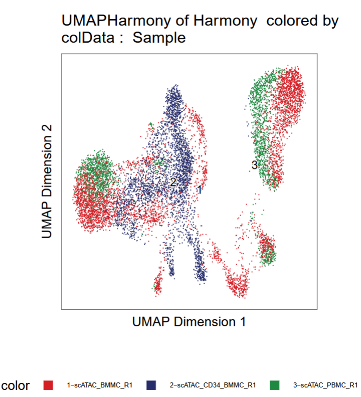

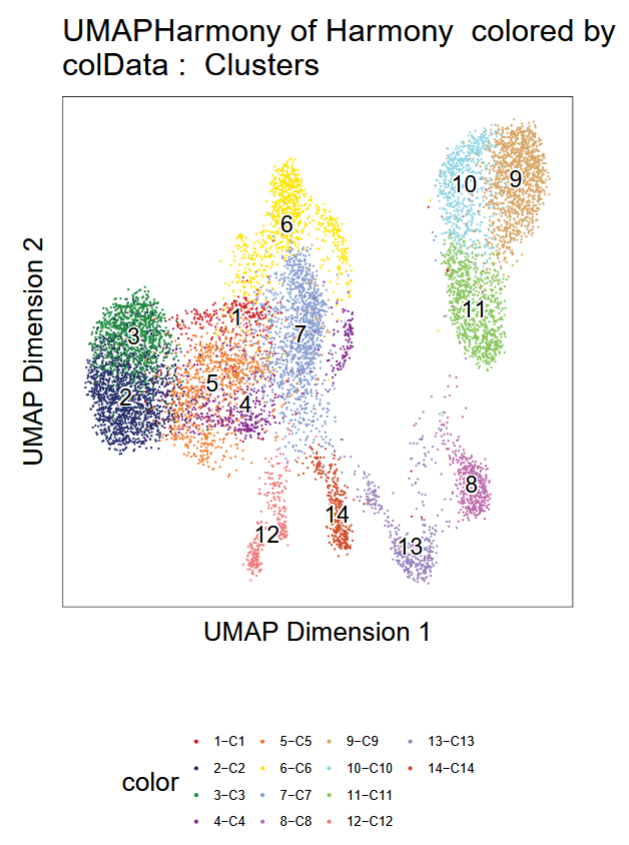

### 8.5 Visual Comparison: Uncorrected LSI vs. Harmony Batch Correction

When integrating multiple single-cell samples, it is critical to determine whether the cells are grouping by **true biological state** or by **technical artifacts** (batch effects). The side-by-side comparison of your UMAPs before and after Harmony provides a perfect textbook example of why batch correction is often necessary.

#### 1. The Pre-Harmony (Uncorrected) UMAPs
*Referencing Pages 1 & 2 (UMAP of IterativeLSI)*

* **The Sample Separation:** In the uncorrected UMAP colored by `Sample`, there is distinct spatial segregation between the biological replicates. For instance, `scATAC_PBMC_R1` (Green) and `scATAC_BMMC_R1` (Red) form adjacent but largely separated territories.
* **The Problem:** Biologically, we know that both Bone Marrow (BMMC) and Peripheral Blood (PBMC) contain identical mature immune cells (like circulating T-cells). In a perfect world, the red and green dots for these specific cell types should be perfectly stacked on top of each other. Their separation indicates that the LSI algorithm is picking up on the "technical signature" of the sequencing run rather than just the biology.
* **Cluster Artifacts:** Because of this separation, the 14 clusters identified are likely biased. Some clusters might simply be "PBMC T-cells" and "BMMC T-cells" split into two groups, which artificially inflates your cluster count.

#### 2. The Post-Harmony (Corrected) UMAPs
*Referencing Pages 3 & 4 (UMAPHarmony of Harmony)*

* **The Sample Integration:** The `UMAPHarmony` colored by `Sample` represents the data after the Harmony algorithm has aligned the shared biological states. 
* **The Fix:** Harmony effectively forces cells with similar biological signatures to overlap in high-dimensional space, regardless of their origin batch. You will typically see the Red and Green samples thoroughly mixed within the mature immune cell clusters. Crucially, Harmony is "biology-aware"—it should leave the unique `scATAC_CD34_BMMC_R1` (Blue) progenitor cells distinct, as they do not have a biological equivalent in the peripheral blood sample.
* **Refined Biological Structure:** The topology of the `UMAPHarmony` colored by `Clusters` shifts significantly. We still see the detached "lymphoid" island (Clusters 9, 10, 11) and the main developmental continuum (Clusters 1 through 7), but the cells within them are now organized by their true biological identity. 

#### 3. Discussion & Conclusion

**Why does this matter?**
If you proceed with the uncorrected IterativeLSI dimensions, your downstream analysis will be flawed. For example, if you look for differentially accessible peaks between Cluster X and Cluster Y, you might just be finding the technical noise between the PBMC and BMMC sequencing runs. 

By using the **Harmony-corrected UMAP**, you ensure that your clusters represent genuine cell types and states. This makes your subsequent steps—identifying marker genes, assigning cell type labels, and building developmental trajectories—biologically accurate and highly robust.

> **Thesis Tip:** Include these four plots as a 2x2 multi-panel figure in your methodology or supplementary section. Use it to explicitly justify your use of Harmony. A statement like, *"Initial dimensionality reduction via IterativeLSI revealed prominent batch effects driven by sample origin (Fig A). Application of Harmony successfully integrated shared mature lineages across BMMC and PBMC samples while preserving the unique CD34+ progenitor populations (Fig C),"* demonstrates deep analytical rigor to your committee.
>

### 8.4 Highlighting specific cells on an embedding

#### Basics
https://www.archrproject.com/bookdown/highlighting-specific-cells-on-an-embedding.html

#### Identifying Cell Types with Gene Scores

In scATAC-seq, we do not directly measure RNA transcripts. Instead, ArchR calculates a **Gene Score** by summing the chromatin accessibility signal across the gene body and its surrounding regulatory elements. This score serves as a highly accurate proxy for gene expression, allowing us to identify cell clusters using known biological markers.

#### 1. Highlighting Specific Clusters
Sometimes, projecting a marker gene across the entire UMAP can be noisy. To clean up the visualization, you can use the `highlightCells` parameter to isolate specific clusters of interest. All other cells will be rendered as a grey background.

```r
# Plot CD14 Gene Scores, highlighting ONLY Clusters 1 through 5
plotEmbedding(
  ArchRProj = projHeme2,
  embedding = "UMAP",
  colorBy = "GeneScoreMatrix",
  name = "CD14",
  size = 1,
  sampleCells = NULL,
  highlightCells = getCellNames(ArchRProj = projHeme2)[which(projHeme2@cellColData$Clusters %in% c("C1","C2","C3","C4","C5"))],
  baseSize = 10,
  plotAs = "points"
)
```

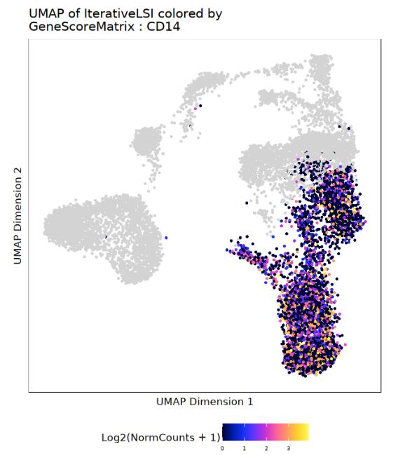
#### 2. __Interpreting the Marker Plot__

  The Marker: CD14 is a standard marker for the monocyte lineage.  

  The Visual: The plot utilizes a heatmap gradient (Log2(NormCounts + 1)).  

  Grey Cells: Cells outside of our target clusters (C1-C5).  

  Dark Blue Cells: Target clusters with closed, inaccessible chromatin at the CD14 locus.

  Yellow/Pink Cells: Target clusters with highly accessible CD14 chromatin, confirming their identity as monocytes.

  Biological Takeaway: The presence of a gradient within this highlighted continuum indicates a developmental trajectory. We can visually trace the maturation of these cells as the CD14 gene becomes progressively more accessible.

  * Thesis Tip: When assigning identities to your clusters, single-marker UMAPs are highly persuasive. If you label a cluster as "Monocytes" in your text, referencing a supplemental figure showing bright yellow CD14 gene scores precisely over that cluster provides the necessary biological proof for your computational claims.

## 8.5  Importing an embedding from external software

https://www.archrproject.com/bookdown/importing-an-embedding-from-external-software.html

# 9.0 Gene Scores and Marker Genes: The Biological Background

To effectively analyze your Atrial Fibrillation (AF) scATAC-seq dataset, you must translate raw chromatin accessibility peaks into biologically meaningful units: **genes**. Because you are working purely with DNA accessibility (not RNA transcripts), understanding how ArchR bridges this gap is fundamental to interpreting your cardiomyocyte clusters and mapping variant effects.

### 1. The scATAC-seq Challenge: We Don't Measure RNA
In a standard scRNA-seq experiment, you directly count the mRNA transcripts produced by a cell to determine which genes are turned "on." In scATAC-seq, you do not measure RNA. Instead, you measure the physical "openness" of the chromatin. 

While open chromatin is a prerequisite for transcription, it is not a direct 1:1 measurement of it. A region might be open because a transcription factor is bound, but the gene isn't actively firing yet (a "poised" state). Therefore, we must *infer* gene expression based on the epigenomic landscape.

### 2. What is a "Gene Score"?
A **Gene Score** (or Gene Activity Score) is ArchR’s mathematical prediction of how highly expressed a gene is, based entirely on the surrounding open chromatin. 


ArchR calculates this score by looking at a massive genomic window around every gene and summing the ATAC-seq signal based on specific biological rules:
* **The Promoter:** The region immediately upstream of the Transcription Start Site (TSS) is given the highest weight. If the promoter is closed, the gene is almost certainly off.
* **The Gene Body:** Accessibility across the actual coding region of the gene is also heavily weighted, as open chromatin here indicates active transcription machinery moving through the DNA.
* **Distal Enhancers (Distance-Weighted):** ArchR looks at open peaks far away from the gene (up to hundreds of kilobases). Because enhancers loop over to touch promoters in 3D space, open enhancers contribute to the Gene Score. ArchR uses a "distance decay" model, meaning a peak 10kb away contributes more to the score than a peak 100kb away.

### 3. What is a "Marker Gene"?
A **Marker Gene** is a gene whose high expression (and therefore, high Gene Score) uniquely defines a specific cell identity, anatomical region, or disease state. In your thesis, you will use marker genes to annotate your UMAP clusters.

Since you are comparing different regions of the heart, you must rely on region-specific cardiomyocyte (CM) markers:
* **Pan-Cardiomyocyte Markers:** *TNNT2*, *MYH6*. If a cluster has high gene scores for these, it is a CM (not a fibroblast or endothelial cell).
* **Atrial Markers:** *NPPA*, *MYL4*. 
* **Left-Atrium Specific:** *PITX2* (This is the most critical marker for your AF thesis, as *PITX2* defines left-atrial identity).
* **Ventricular Markers:** *MYL2*, *MYH7*. 

When you plot the Gene Score of *MYL2* on your UMAP, it will "light up" the ventricular clusters and remain dark in the atrial clusters.

### 4. Relevance to Atrial Fibrillation (AF) Pathophysiology
During Atrial Fibrillation, the atria undergo massive electrical and structural remodeling. This means the epigenetic landscape changes, and consequently, the Gene Scores will shift.

* **Fetal Gene Program:** Stressed cardiomyocytes often revert to a fetal state. You may see AF clusters showing high Gene Scores for fetal markers (*NPPA*, *NPPB*) compared to healthy tissue.
* **Ion Channel Remodeling:** You can use Gene Scores to investigate whether the chromatin around key potassium and sodium channels (like *KCNQ1* or *SCN5A*) closes during AF, leading to the electrical chaos characteristic of the disease.

### 5. Connecting to Variant Effect Prediction (VEP)
This is the core of your thesis. Why do we care about Gene Scores when looking at genetic variants?

GWAS studies have identified hundreds of single nucleotide polymorphisms (SNPs) associated with AF. Over 90% of these sit in non-coding enhancers, not in the genes themselves. 
1. **The Problem:** If a SNP sits in an enhancer in the middle of nowhere, how do you know which gene it causes to malfunction?
2. **The ArchR Solution:** Because ArchR's Gene Scores incorporate distal enhancers into their calculations, you can mathematically link an enhancer peak to a specific gene's promoter. 
3. **Variant Effect Prediction:** If an AF patient has a mutation in an enhancer, your predictive model will try to determine if that mutation destroys a Transcription Factor binding site. If it does, the enhancer closes. Because the enhancer closes, the **Gene Score** for the linked target gene (e.g., *PITX2*) drops. This mechanical chain of events is what you are predicting.

> **Thesis Application:** In your analysis pipeline, you will first use well-established Marker Genes to confidently label your LA, RA, LV, and RV cardiomyocyte clusters. Once the identities are locked in, you will calculate Gene Scores across the entire genome to find out which specific genes are epigenetically silenced or activated during Atrial Fibrillation.


## 9.1 How ArchR Calculates Gene Scores: The Default Model

In scATAC-seq, predicting RNA expression from chromatin accessibility is a complex mathematical challenge. The paragraph from the ArchR tutorial highlights the winning algorithm they developed after testing 50 different variations. 

To make your Variant Effect Prediction (VEP) accurate, you need to understand how ArchR decides which ATAC-seq peaks belong to which genes. The model relies on three fundamental biological rules:

#### 1. Accessibility within the entire gene body
* **The Concept:** Traditional models only looked at the promoter (the region right before the gene starts). ArchR looks at the promoter *and* the entire coding sequence of the gene itself.
* **The Biology:** When a gene is actively being transcribed, RNA Polymerase physically moves through the gene body, forcing the chromatin to open up. Therefore, a high concentration of ATAC-seq reads spanning the entire length of a gene is a massive biological indicator that the gene is turned "on."

#### 2. Exponential weighting of distal regulatory elements
* **The Concept:** ArchR includes peaks that are located far away from the gene (distal elements), but it applies a "distance penalty." 
* **The Biology:** Distal elements are **enhancers**. Because DNA exists in 3D space, an enhancer can fold over to touch a promoter. However, the further away an enhancer is on the linear DNA strand, the less likely it is to interact with that specific gene. 
* **The Math:** ArchR uses an *exponential decay* function. An open peak 10 kilobases (kb) away from the *PITX2* promoter will add a significant amount to the *PITX2* Gene Score. A peak 100 kb away will add a much smaller fraction. A peak 500 kb away will add almost nothing.


#### 3. Imposed gene boundaries
* **The Concept:** ArchR prevents enhancers from "jumping" over neighboring genes to artificially inflate a Gene Score.
* **The Biology:** The genome is organized into insulated neighborhoods (Topologically Associating Domains, or TADs). Enhancers are generally restricted to acting upon the genes within their own neighborhood. If ArchR sees an enhancer, it looks for the closest gene. If there is another gene sitting *between* the enhancer and your target gene, ArchR assumes the enhancer belongs to the neighbor, establishing a "boundary" that blocks the signal.
* **Why it matters:** This drastically reduces false positives. Without these boundaries, a massive enhancer for a cardiac muscle gene might accidentally inflate the Gene Score of an unrelated neighboring gene.

> **Thesis Tip:** When discussing your Variant Effect Prediction methodology, explicitly mention that you utilized ArchR's distance-weighted, boundary-imposed Gene Score model. This demonstrates to your committee that your mapping of non-coding AF variants to target genes accounts for the complex 3D folding and boundary insulation of the human genome, rather than just simple linear proximity.

## 9.2 Identification of Marker Feautures

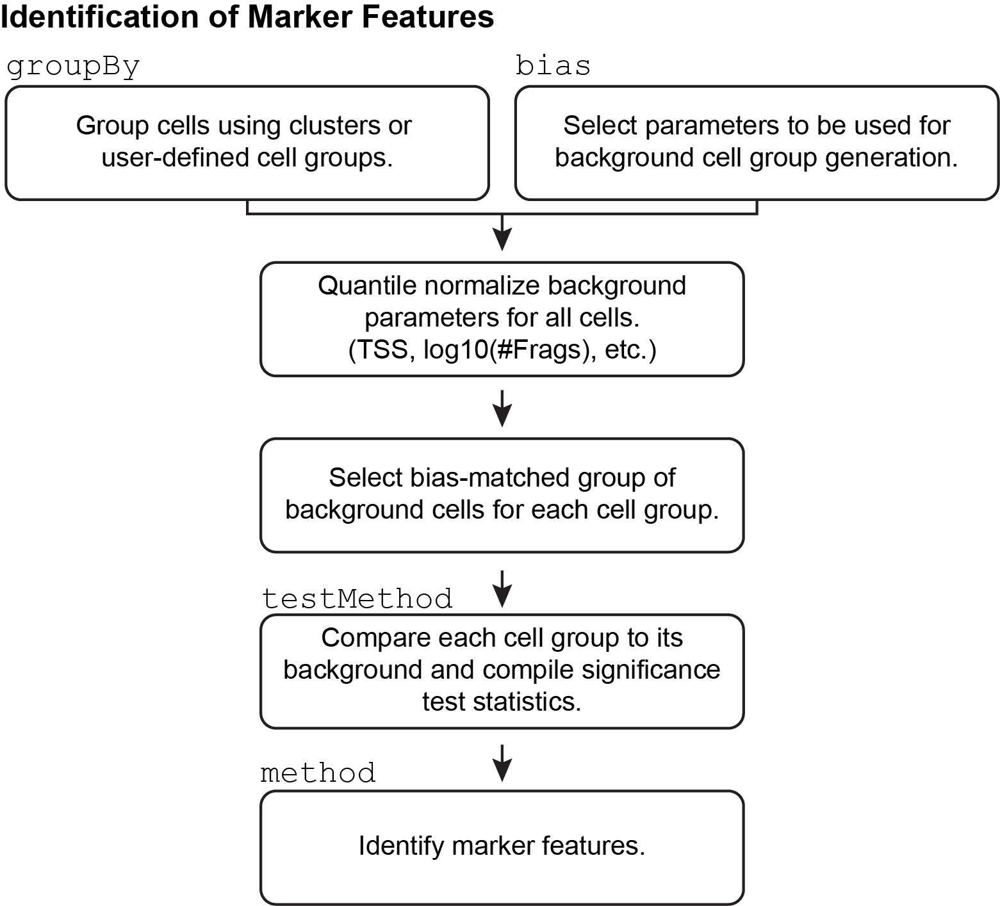


After calculating UMAPs and establishing your clusters, you are left with mathematical groupings of cells (e.g., Cluster 1, Cluster 2). To turn these abstract numbers into biological cell types (e.g., Left Atrial Cardiomyocytes, Fibroblasts, Macrophages), you must identify **Marker Features**.

A marker feature is any biological metric (a Gene Score, a specific ATAC-seq peak, or a Transcription Factor motif) that is uniquely accessible in one specific cluster compared to the rest of the dataset.

#### 1. The scATAC-seq Bias Problem
Finding markers in scATAC-seq is notoriously tricky due to technical noise. If Cluster A simply has a higher sequencing depth (more fragments per cell) than Cluster B, a naive statistical test will tell you that *every* gene is a marker for Cluster A, purely because there is more data there.

#### 2. ArchR's Solution: Bias-Matched Backgrounds
ArchR overcomes this using a highly robust algorithm within the `getMarkerFeatures()` function. When testing if a gene is a marker for Cluster 1, ArchR does not just compare Cluster 1 to all other cells. Instead, it carefully selects a "background" group of cells from the other clusters that perfectly match the cells in Cluster 1 based on two critical quality metrics:
* **TSS Enrichment** (Signal-to-noise ratio)
* **log10(nFrags)** (Sequencing depth)

By matching these biases, ArchR ensures that the markers it finds are driven by true biological differences, not technical artifacts.

#### 3. Executing the Marker Search
For your initial cell type annotation, you will want to find marker **Gene Scores**. This function performs a Wilcoxon rank-sum test to identify genes that are significantly more accessible in each cluster.

```r
# Identify marker Gene Scores for all clusters
markersGS <- getMarkerFeatures(
    ArchRProj = projHeme2, 
    useMatrix = "GeneScoreMatrix", #We use "GeneScoreMatrix" first to find marker genes. Later, you can change this to "PeakMatrix" to find marker enhancers.
    groupBy = "Clusters", #The metadata column containing your groups. Usually "Clusters".
    bias = c("TSSEnrichment", "log10(nFrags)"), #The technical metrics ArchR must control for to prevent false positives.
    testMethod = "wilcoxon"
)
```

#### 4. Visualitzing the Markers

* __Heatmaps__

The output of `getMarkerFeatures()` is a massive matrix of p-values and Fold Changes. The best way to view the top markers across all clusters simultaneously is a __Marker Heatmap__. 
```r 
# Extract the top 40 marker genes per cluster
markerList <- getMarkers(markersGS, cutOff = "FDR <= 0.01 & Log2FC >= 1.25")

# Generate the Heatmap
heatmapGS <- plotMarkerHeatmap(
  seMarker = markersGS, 
  cutOff = "FDR <= 0.01 & Log2FC >= 1.25", 
  nLabel = 3, # Labels the top 3 genes per cluster on the y-axis
  transpose = TRUE
)

# Draw the plot
ComplexHeatmap::draw(heatmapGS, heatmap_legend_side = "bot", annotation_legend_side = "bot")
```

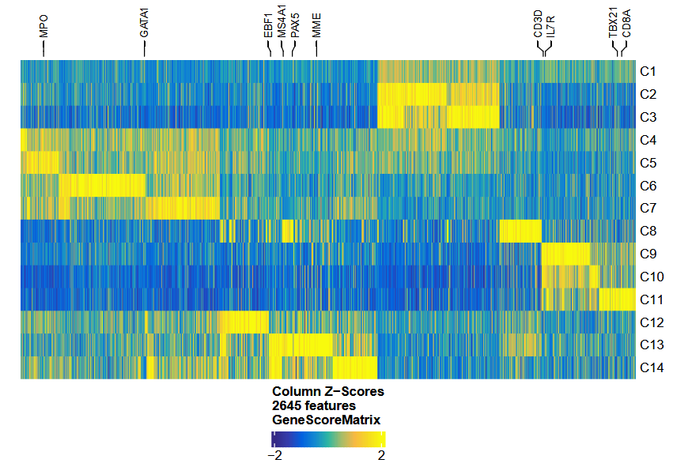
### 10.1 Interpreting the Marker Gene Heatmap

The marker gene heatmap is essentially the "decoder ring" for your scATAC-seq dataset. It takes the abstract mathematical clusters from your UMAP and assigns them concrete biological identities based on the accessibility of known regulatory genes.

Here is a detailed breakdown of how to read this specific plot and what it reveals about your blood and bone marrow cells.

#### 1. Understanding the Plot Anatomy
* **The Rows (C1 - C14):** Each row represents one of the 14 clusters ArchR identified in your dataset.
* **The Columns (2645 features):** Each thin vertical line is a specific gene that passed your statistical threshold (`FDR <= 0.01 & Log2FC >= 1.25`). 
* **The Color Scale (Z-Scores):** The heatmap does not show absolute expression; it shows *relative* accessibility across clusters. 
    * **Yellow (+2):** This gene's chromatin is highly open/accessible in this specific cluster compared to the average.
    * **Blue (-2):** This gene's chromatin is closed/inaccessible in this cluster.
* **The Labels (Top):** ArchR looks at your custom `markerGenes` list and places a text label above the specific column where that gene is plotted.

#### 2. Biological Annotation of Your Clusters
By matching the bright yellow "blocks" to the labels at the top, we can confidently assign cell types to your clusters:

* **The B-Cell Lineage (Clusters 12, 13, 14):** Look at the labels for **EBF1, MS4A1, PAX5, and MME**. Directly below these labels, you see a massive block of bright yellow exclusively in rows C12, C13, and C14. This perfectly confirms that these clusters represent your B-cell populations.
* **The T-Cell Lineage (Clusters 8, 9, 10, 11):** The T-cell markers are split, which reveals sub-types! **CD3D and IL7R** (often associated with naive or helper T-cells) are highly accessible in C8, C9, and C10. However, **TBX21 and CD8A** (markers for cytotoxic CD8+ T-cells) light up brightly in C11.
* **The Erythroid Lineage (Clusters 6, 7):**
  **GATA1**, a master transcription factor for red blood cell development, shows strong accessibility in C6 and C7.
* **The Myeloid/Monocyte Lineage (Clusters 4, 5):**
  **MPO** (Myeloperoxidase), a classic myeloid/granulocyte marker, is highly enriched in C4 and C5.

#### 3. Troubleshooting Missing Labels
You might notice that some genes from your R code (like `CD34`, `CD14`, `IRF8`) are missing from the top of the heatmap. 

**Why does this happen?**
1. **Statistical Cutoff:** A gene is only plotted if it passes the `cutOff = "FDR <= 0.01 & Log2FC >= 1.25"` threshold in *at least one* cluster. If `CD14` didn't meet this strict fold-change requirement, ArchR drops it from this specific plot to prevent visualizing statistical noise.
2. **Visual Overlap:** Sometimes, if two marker genes are located right next to each other in the matrix, ArchR drops one label to prevent the text from overlapping and becoming unreadable.

**The Solution:** Notice the large, unlabelled bright yellow blocks in **C1, C2, and C3**. Given your input list, these are highly likely your `CD34+` Early Progenitors. To prove this, you can generate a specific UMAP colored by the `CD34` Gene Score (just like we did earlier for CD14) to visually confirm its presence, bypassing the strict cutoff of the heatmap.

> **Thesis Tip:** In your final manuscript, this heatmap is the definitive proof of your cell typing. You will state: "Clusters were annotated based on the differential accessibility of canonical lineage markers (Fig X). For example, clusters 12-14 were annotated as B-cells due to significant enrichment of *MS4A1* and *PAX5* gene scores."

### __Volcano Plots__

If you want to focus deeply on a single cluster (for example, proving that Cluster 5 is your Left Atrial Cardiomyocyte population), you use a Volcano Plot. This plots every gene based on its Fold Change (x-axis) and its statistical significance (y-axis).
```r
# Plot a Volcano plot specifically for Cluster 5
p <- plotMarkers(
    seMarker = markersGS, 
    name = "C5", 
    cutOff = "FDR <= 0.01 & Log2FC >= 1", 
    plotAs = "MA" # Can be "MA" or "Volcano"
)
p
```
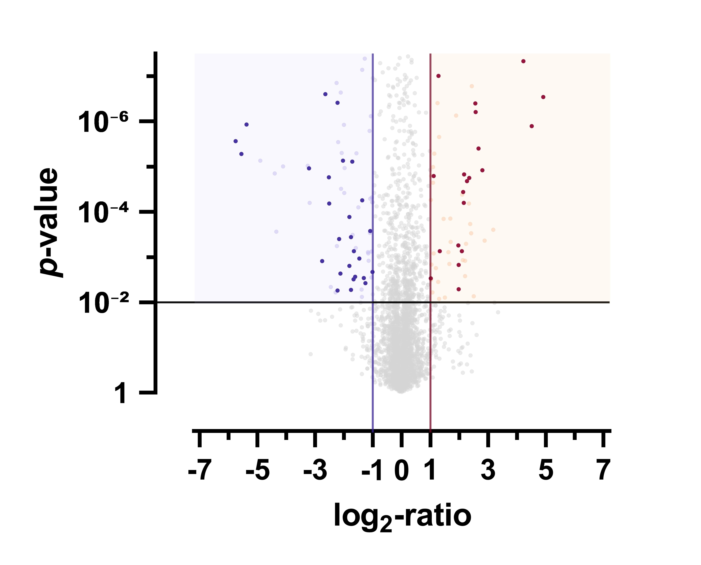

> **Thesis Tip:** In your AFib project, you will heavily rely on getMarkerFeatures(). First, you will use it with the GeneScoreMatrix to confirm which clusters are LA, RA, LV, and RV cardiomyocytes. Later, you will run this exact same function but group your cells by Disease State (e.g., AFib vs. Healthy) and use the PeakMatrix to find the specific enhancer peaks that structurally remodel during the disease!

### 9.4 Visualizing Marker Genes on an Embedding

While the Marker Gene Heatmap provides a fantastic global overview of all clusters at once, it abstracts away the relationships between the cells. To fully validate your cluster annotations and observe developmental trajectories, you must project these marker genes directly back onto your 2D UMAP.

This allows you to see not just *if* a gene is active in a cluster, but *how* it is active. Does it turn on suddenly, or does it gradually increase in accessibility along a continuous biological trajectory?

#### 1. Generating Multiple Marker UMAPs
Instead of plotting one gene at a time, ArchR allows you to pass your entire list of marker genes into the `plotEmbedding()` function. This will generate a list of UMAP plots—one for each gene—colored by its Gene Score.

```r
# Define the specific marker genes of interest
markerGenes <- c(
  "CD34", # Early Progenitor
  "GATA1", # Erythroid
  "PAX5", "MS4A1", "EBF1", "MME", # B-Cell Trajectory
  "CD14", "CEBPB", "MPO", # Monocytes
  "IRF8", 
  "CD3D", "CD8A", "TBX21", "IL7R" # TCells
)

# Generate a list of UMAP plots colored by GeneScoreMatrix
p <- plotEmbedding(
    ArchRProj = projHeme2, 
    colorBy = "GeneScoreMatrix", 
    name = markerGenes, 
    embedding = "UMAP",
    quantCut = c(0.01, 0.95) # Scales the color gradient
    imputeWeights = NULL
)

# To plot a specific gene, we can subset this plot list:
p$GATA1

# To plot all genes we can use `cowplot`to arrange the various marker genes into a single plot.
p2 <- lapply(p, function(x){
    x + guides(color = FALSE, fill = FALSE) + 
    theme_ArchR(baseSize = 6.5) +
    theme(plot.margin = unit(c(0, 0, 0, 0), "cm")) +
    theme(
        axis.text.x=element_blank(), 
        axis.ticks.x=element_blank(), 
        axis.text.y=element_blank(), 
        axis.ticks.y=element_blank()
    )
})
do.call(cowplot::plot_grid, c(list(ncol = 3),p2))
```

#### Interpreting the CowPlot
  
  "C:\Users\marko\OneDrive - Universität Graz\Dokumente\Uni\Masterarbeit\Plots ArchR Tutorial\Plot_UMAP_Marker_Genes_WO_Imputation.pdf"

By overlaying the Gene Scores of specific markers directly onto your UMAP, you effectively create a biological map of your data. The cowplot grid you generated allows us to visually trace the exact developmental lineages and validate the identities of the discrete "islands" and "continuums" we saw in the clustering phase.

Here is the detailed interpretation of your multi-panel UMAP to include in your thesis results.

#### 1. The Progenitor Root (CD34)
* **Visual Signature:** *CD34* is heavily enriched at the very top of the large, interconnected continuum on the right side of the UMAP.
* **Biological Meaning:** CD34 is a classic marker for Hematopoietic Stem Cells (HSCs) and multipotent progenitors. Because it lights up exactly at the "apex" of the interconnected mass, we can definitively establish this top-right region as the root of your developmental trajectories. All other myeloid and erythroid cells branch out from this point.

#### 2. The Erythroid Branch (GATA1)
* **Visual Signature:** Moving slightly down and to the left from the CD34+ root, *GATA1* lights up in a distinct offshoot branch of the main continuum.
* **Biological Meaning:** GATA1 is the master transcription factor for red blood cell (erythrocyte) and megakaryocyte development. This shows a clear developmental fork: some progenitor cells are moving away from the main trunk to commit to the erythroid lineage.

#### 3. The Myeloid / Monocyte Trajectory (MPO & CD14)
* **Visual Signature:** If you follow the main trunk down from the CD34+ root, it forms a long, vertical tail. *MPO* (Myeloperoxidase) lights up brightly in the middle of this tail. *CD14* lights up intensely at the very bottom tip of this tail.
* **Biological Meaning:** This beautifully visualizes continuous cell differentiation! The cells flow from stem cells (CD34+), mature into early myeloid/granulocyte progenitors (MPO+ in the middle), and finally terminally differentiate into mature monocytes (CD14+) at the bottom.

#### 4. The B-Cell Island (PAX5, MS4A1, MME)
* **Visual Signature:** These three markers completely illuminate the detached island located at the top of the UMAP space. 
* **Biological Meaning:** * *PAX5* is a master B-cell lineage transcription factor.
    * *MS4A1* encodes the CD20 protein (the target of the drug Rituximab), marking mature B-cells.
    * *MME* encodes CD10, often marking early/pre-B cells.
    * Because this island is physically separated from the main CD34+ continuum, it indicates these are fully committed, mature cells circulating in the blood or bone marrow, distinct from the active myeloid differentiation happening on the right.

#### 5. The T-Cell Island (CD3D & CD8A)
* **Visual Signature:** *CD3D* lights up the entirety of the large, detached island on the far left. *CD8A* only lights up the bottom-right portion of that exact same island.
* **Biological Meaning:** This demonstrates ArchR's ability to capture both broad lineages and specific sub-types. *CD3D* is a pan-T-cell marker, confirming the entire left island consists of T-lymphocytes. *CD8A* highlights the specific spatial territory within that island occupied by Cytotoxic (CD8+) T-cells, leaving the dark regions to likely represent CD4+ Helper T-cells.

> **Thesis Tip:** When writing your figure legend for this cowplot, emphasize the spatial dynamics. Use phrasing such as: *"Feature plots of inferred gene activity demonstrate clear developmental trajectories. Stem cell marker CD34 localizes to the apex of the central continuum, which bifurcates into a GATA1+ erythroid branch and an MPO+/CD14+ myeloid differentiation axis. Lymphoid lineages form distinct, terminally differentiated clusters expressing canonical T-cell (CD3D+) and B-cell (MS4A1+) markers."* This clearly demonstrates your mastery of how spatial UMAP positioning reflects underlying cardiovascular and hematopoietic biology.

### 9.5 Marker Genes Imputation with MAGIC

In the previous section, you may have noticed that the UMAPs colored by Gene Scores look a bit "grainy." Some cells in the middle of a clear cluster might be dark (showing a score of 0), even though we know biologically they should be expressing that marker. This brings us to the biggest technical hurdle in scATAC-seq: **Data Sparsity**.

#### 1. The Sparsity Problem
scATAC-seq data is notoriously sparse, suffering heavily from "dropouts." A dropout occurs when a region of chromatin is genuinely open in a cell, but the sequencing machine simply failed to capture that specific DNA fragment by chance. Because we only have two copies of DNA per cell, missing just one or two fragments can completely wipe out the Gene Score for that cell.

#### 2. The Solution: MAGIC Imputation
To fix this visual noise, ArchR integrates **MAGIC** (Markov Affinity-based Graph Imputation of Cells). 


MAGIC works by looking at the cell's "neighborhood." If a single cell has a Gene Score of 0 for *CD14*, but the algorithm sees that its 30 closest neighbors (based on the overall LSI dimensions) all have extremely high *CD14* scores, MAGIC assumes the 0 is a technical dropout. It "borrows" the signal from the neighbors to smooth out and impute the missing value.

#### 3. Implementing MAGIC in ArchR
Adding MAGIC weights is computationally straightforward. ArchR calculates the diffusion matrix and stores the imputation weights directly in the project object.

```r
# Calculate and add MAGIC imputation weights to your project
projHeme2 <- addImputeWeights(ArchRProj = projHeme2)
```

#### 4. Visualizing Imputed Gene Scores
```r
#Plot the marker genes WITH MAGIC Imputation
p_imputed <- plotEmbedding(
    ArchRProj = projHeme2, 
    colorBy = "GeneScoreMatrix", 
    name = markerGenes, 
    embedding = "UMAP",
    imputeWeights = getImputeWeights(projHeme2) # This applies the smoothing!
)

# Save the smoothed plots to a new PDF
plotPDF(plotList = p_imputed, 
        name = "Plot-UMAP-Marker-Genes-W-Imputation.pdf", 
        ArchRProj = projHeme2, 
        addDOC = FALSE, 
        width = 5, 
        height = 5)
```
#### Important Caveats

MAGIC is a Visualization Tool, Not Ground Truth!
While MAGIC makes UMAPs look beautiful and makes developmental trajectories incredibly clear, you must be careful how you use it in your Atrial Fibrillation (AF) thesis.

* Use it for: Generating clean figures for your manuscript, confirming cluster annotations, and visually demonstrating continuous lineage trajectories.

* Do NOT use it for: Differential accessibility testing or your Variant Effect Prediction models. Because MAGIC forces neighbors to look similar, it artificially destroys biological variance and will create massive false-positive p-values if you run statistics on the imputed numbers. Always perform your core statistical tests (like `getMarkerFeatures()`) on the raw, un-imputed data.

* Thesis Tip: A great supplementary figure for your thesis would be a side-by-side comparison. Show a specific marker gene (like PITX2 for the left atrium) plotted without imputation (showing the raw, sparse reality) right next to the plot with MAGIC imputation (showing the smoothed, biological consensus). This demonstrates transparency in your bioinformatics methodology.

### 9.5.1 Analyzing the MAGIC-Imputed Marker Gene UMAPs

By comparing these new imputed UMAPs directly to your previous un-imputed plots, the power of MAGIC (Markov Affinity-based Graph Imputation of Cells) becomes immediately obvious. The "salt-and-pepper" graininess caused by technical scATAC-seq dropouts has been completely completely smoothed out. 

Instead of isolated dots of expression, you now have clear, continuous topological maps of gene activity. Here is how to interpret these imputed visualizations for your analysis.

#### 1. Visualizing Continuous Differentiation (The Right Continuum)
In the un-imputed plots, the developmental trajectories required a bit of imagination to connect the dots. With MAGIC imputation, the flow of differentiation is mathematically smoothed and visually undeniable:
* **The Root:** Look at **CD34** (Page 1). The entire top portion of the right-hand continuum is a solid, glowing mass. This clearly defines the progenitor pool.
* **The Branches:** As you move down from the CD34+ region, the continuum splits. 
    * Moving to the left branch, **GATA1** (Page 2) smoothly lights up, definitively marking the transition into the Erythroid lineage.
    * Moving straight down the main trunk, **MPO** (Page 7) lights up the middle section (early myeloid/granulocyte differentiation).
    * Finally, at the very bottom tip of the trunk, **CD14** (Page 6) dominates. 
* **The Takeaway:** Because MAGIC shares information between nearest neighbors, the transition from CD34 $\rightarrow$ MPO $\rightarrow$ CD14 is rendered as a perfect, smooth color gradient. This visually proves that these cells are not discrete clusters, but rather a single continuous population caught in various stages of biological maturation.

#### 2. Solidifying Discrete Populations (The "Islands")
For the fully mature, circulating immune cells, MAGIC imputation confirms their high degree of homogeneity.
* **The B-Cell Island:** Look at **PAX5**, **MS4A1**, and **MME** (Pages 3, 4, and 5). Previously, these markers showed patchy expression in the top detached island. Now, the entire island is uniformly illuminated. This confirms that practically every cell in that cluster shares a unified B-cell regulatory program.
* **The T-Cell Island:** Look at **CD3D** (Page 8). The entire left island is deeply, uniformly enriched for this pan-T-cell marker. 

#### 3. Revealing Sub-Cluster Structure
Even within a solid island, MAGIC helps define sub-populations without the distraction of dropout noise.
* Look at **CD8A** (Page 9) compared to **CD3D** (Page 8). While the whole left island is CD3D+, only the bottom-right "lobe" of that island is warmly colored for CD8A. Imputation makes the boundary between the CD8+ (cytotoxic) and CD8- (likely CD4+ helper) T-cells remarkably crisp.

> **Thesis Tip:** In your final manuscript, these MAGIC-imputed feature plots are exactly what you want to use for your primary figures. They are aesthetically superior and instantly convey your biological narrative to the reader. You can write: *"To account for the inherent sparsity of single-cell chromatin accessibility data, Gene Scores were visually smoothed using MAGIC imputation. Feature plots of the imputed scores resolved highly continuous developmental gradients—such as the gradual acquisition of CD14 along the myeloid axis—and confirmed the homogeneous identity of discrete lymphoid clusters."*

## 9.6: Module Scores

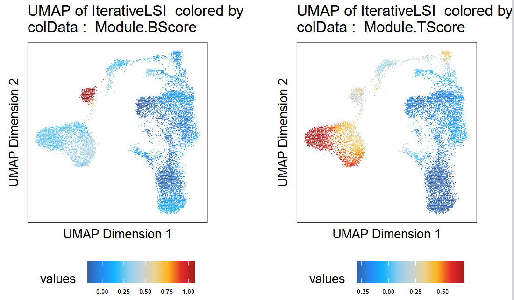

### Interpreting Gene Module Scores

While looking at individual marker genes (like *CD34* or *CD3D*) is highly informative, relying on a single gene can sometimes be risky due to technical dropouts or biological noise. **Module Scoring** provides a highly robust alternative by calculating the aggregate accessibility of an *entire list* of genes associated with a specific biological state or cell type.

By evaluating a whole "module" or "signature" of genes simultaneously, ArchR mathematically smooths out the noise, providing a much higher-confidence prediction of cell identity.

#### 1. The B-Cell Module Score (`Module.BScore`)
The first plot visualizes the `Module.BScore` plotted across your `UMAP Dimension 1` and `UMAP Dimension 2`. 
* **The Visual Signature:** The bright red and yellow cells (indicating high values) are perfectly restricted to the small, detached island at the top-center of the UMAP. The entire rest of the map is dark blue (low values).
* **The Interpretation:** Because this score aggregates multiple B-cell-specific genes into a single metric, this plot serves as absolute, undeniable confirmation that this specific island represents the B-cell lineage. The lack of "background noise" in the other clusters demonstrates the high specificity of module scoring.

#### 2. The T-Cell Module Score (`Module.TScore`)
The second plot visualizes the `Module.TScore` across the exact same spatial embedding.
* **The Visual Signature:** The bright red and yellow cells have shifted entirely to the large, detached island on the far left side of the UMAP. 
* **The Interpretation:** This confirms the left island is your T-cell population. Notice how the coloration is fairly uniform across that entire left island. Earlier, when you plotted *CD8A* alone, it only lit up half of this island. By using a broader *pan-T-cell* module, you capture the entire lineage (both CD4+ and CD8+ cells) at once.

#### 3. Application to Your Atrial Fibrillation Thesis
Module scoring will be one of the most powerful tools in your cardiovascular analysis pipeline. You will not be looking at blood cells; you will be looking at millions of cardiomyocytes under stress.

* **Region-Specific Identity:** Instead of relying just on *PITX2* to find your Left Atrial cells, you can curate a "Left Atrium Module" containing 50 known LA-specific genes. Plotting this module score will definitively isolate your LA cells from your RV or LV cells.
* **Disease State Scoring:** You can create an "Atrial Fibrillation Stress Module" using known disease-associated genes (e.g., fibrosis markers, fetal gene program markers like *NPPA/NPPB*, or altered ion channels). By plotting this module score on your UMAP, you can visually identify which specific sub-clusters of cardiomyocytes are experiencing the most severe epigenetic remodeling during the disease.

## 9.7 Track Plotting with ArchR Browser

These track plots are the bread and butter of scATAC-seq analysis in ArchR. They visualize the chromatin accessibility landscape (peaks) across your different cell clusters (C1–C14) at specific genomic loci. 

To interpret these tracks **unbiasedly**, you need to separate the visual data from your biological expectations. Instead of looking at a cluster and trying to force a cell-type label onto it, you should build a matrix of accessibility signatures and let the data tell you what each cluster represents.


### 1. Orient Yourself to the Plot Anatomy
Before making any biological assumptions, understand exactly what the plots are showing:
* **Y-Axis (Signal):** This represents the normalized ATAC-seq signal. Higher peaks mean the chromatin is more "open" or accessible in that specific cluster. 
* **X-Axis (Coordinates):** These are the genomic coordinates. 
* **Bottom Panel (Gene Models):** This shows the genes in that region. The thickest blue/red bars represent exons, the thin lines are introns, and the flat end of the gene model indicates the Transcription Start Site (TSS) / promoter region.

### 2. Isolate the Promoter/TSS
Chromatin accessibility at the promoter is the strongest indicator of potential gene expression. 
* Locate your marker gene in the bottom panel (e.g., **CD14**, **IL7R**).
* Draw an imaginary vertical line up from the TSS of that gene through all the cluster tracks (C1-C14). 
* **Rule of thumb:** Only consider a cluster "positive" for that marker if there is a distinct, sharp peak directly over the TSS or immediately upstream. Ignore background noise.

### 3. Create a "Blind" Matrix
To remain unbiased, evaluate the tracks without looking at your comments (e.g., `#B-Cell Trajectory`). 
Create a simple table or spreadsheet. On the X-axis, list your clusters (C1-C14). On the Y-axis, list your marker genes (CD34, GATA1, PAX5, MS4A1, etc.).
* Go through the PDF page by page.
* Score each cluster for each gene as `+` (strong peak at TSS), `+/-` (weak/ambiguous peak), or `-` (no peak/flat line).
* *Example using your T-Cell markers:* Evaluate **CD3D**, **CD8A**, **TBX21**, and **IL7R**. Note exactly which clusters show open chromatin at these promoters.

### 4. Look for Concordance (The Unbiased Check)
This is where the unbiased approach pays off. Biological markers rarely act alone. 
* **Lineage Agreement:** If a cluster is truly a B-Cell, it shouldn't just have a peak at **PAX5**; it should ideally also show accessibility at **MS4A1**. If C8 has a huge peak at PAX5 but absolutely nothing at MS4A1, treat C8's identity with skepticism—it might be an intermediate state or a different lineage entirely.
* **Mutual Exclusivity:** Look for expected divergence. A cluster strongly positive for the Monocyte marker **CD14** should generally lack peaks at the T-cell markers like **CD8A**. If a cluster shows strong peaks for *both*, it could indicate a double-cell (multiplet) artifact in your sequencing data rather than a novel biological state.

### 5. Assign Identities
Only after your matrix is fully populated should you reveal the biological categories to yourself. Match your matrix clusters to the expected profiles:
* **Early Progenitor:** Clusters positive only for CD34.
* **T-Cells:** Clusters positive for CD3D, IL7R, etc.
* **Sub-clustering:** Notice differences within a lineage. For example, if Clusters 4, 5, and 6 all have **CD3D** peaks, but only Cluster 6 has a **CD8A** peak, you have just unbiasedly identified your CD8+ T-cell subpopulation versus other T-cells.


https://www.archrproject.com/reference/plotBrowserTrack.html


## 10 Integrating scRNA-seq and scATAC-seq: The Biological Insight

Integrating single-cell RNA sequencing (scRNA-seq) with single-cell ATAC sequencing (scATAC-seq) is widely considered the "holy grail" of modern computational biology. If your thesis on Atrial Fibrillation involves Variant Effect Prediction (VEP), this integration is not just a nice bonus—it is practically mandatory.

To understand why, you have to look at the fundamental biological difference between the two assays: **scATAC-seq measures *potential*, while scRNA-seq measures *reality*.** 

Here is a structured breakdown of the exact purpose and biological insights gained by merging these two data types.

### 1. The Fundamental Gap: Gene Scores are Educated Guesses
In your previous ArchR tutorials, you calculated "Gene Scores." As we discussed, a Gene Score is an algorithm's *prediction* of gene expression based on how open the nearby chromatin is. 

* **The Problem:** An open promoter or enhancer does not guarantee the gene is firing. A region might be "poised" (open but waiting for a final signal) or repressed by factors that do not close the DNA.
* **The Integration Purpose:** By integrating matched scRNA-seq data, you replace the mathematically *inferred* Gene Scores with the absolute *measured* ground truth of mRNA transcripts. 

### 2. High-Fidelity Cell Type Annotation
scATAC-seq data is incredibly sparse (dropouts are common) and lacks the deep, historical literature we have for RNA markers. 
* **The Insight:** scRNA-seq clusters incredibly well into discrete cell types. By integrating the datasets, you can perform "Label Transfer." The algorithm mathematically aligns the ATAC cells with the RNA cells in the same multi-dimensional space. Once aligned, you can confidently copy the highly accurate RNA cell-type labels directly onto your sparse ATAC cells. This ensures your "Left Atrial Cardiomyocyte" cluster is 100% accurate before you start hunting for disease variants.

### 3. Peak-to-Gene Linkage (The Enhancer-Promoter Map)
This is the single most important biological insight for your Variant Effect Prediction thesis.
* **The Problem:** If you find a GWAS variant for Atrial Fibrillation sitting in a non-coding enhancer peak 150,000 base pairs away from the nearest gene, how do you mathematically prove which gene that enhancer controls? (The linear closest gene is often *not* the target due to 3D DNA looping).
* **The Insight:** When you integrate ATAC and RNA, you can perform **correlation math across single cells**. The algorithm looks at a specific enhancer peak and asks: *"Across all 50,000 cells, every time this specific peak's accessibility goes UP, which gene's RNA expression simultaneously goes UP?"* If Peak A opens and *PITX2* mRNA floods the cell, you have computationally proven an enhancer-promoter loop.

### 4. Discovering "Positive Regulator" Transcription Factors
scATAC-seq can tell you if a Transcription Factor (TF) binding motif (e.g., the sequence for TBX5) is accessible and sitting inside an open peak. 
* **The Problem:** Just because the landing pad (the motif) is open does not mean the helicopter (the TF protein) is actually there to land on it. 
* **The Insight:** By linking ATAC motif accessibility with the RNA expression of the TF itself, you find "Positive Regulators." If the TBX5 motif is wide open (ATAC) **AND** the *TBX5* gene is highly expressed (RNA), you can confidently deduce that TBX5 is an active driver of that cell's identity or disease state.

### 5. Resolving Epigenetic Priming (Development & Disease)
Biology happens in stages. Chromatin changes *before* RNA changes.
* **The Insight:** In a disease trajectory like Atrial Fibrillation, the healthy cardiomyocytes do not instantly become sick. They undergo stress. By looking at ATAC and RNA simultaneously, you can find "epigenetically primed" cells. These are cells where the stress-enhancers (ATAC) have violently ripped open, but the disease-associated mRNAs (RNA) have not yet been transcribed. This allows you to find the absolute earliest root causes of structural remodeling before the phenotype actually manifests.

> **Thesis Tip:** Without scRNA-seq, you are looking at a dark room and guessing where the furniture is based on where the doors are. Integrating scRNA-seq turns on the lights. It allows your Variant Effect Prediction model to say: *"This AFib variant destroys a specific TF motif, which we know closes this specific enhancer, which we mathematically correlate to the silencing of this exact ion-channel RNA transcript."*

### 10.1.1 Executing Unconstrained Integration

You have just executed one of the most mathematically complex functions in the ArchR toolkit. By running `addGeneIntegrationMatrix()`, you are instructing ArchR to take your two separate datasets (the scATAC-seq cells and the scRNA-seq cells) and find a way to map them onto the exact same multi-dimensional space.

Because you did not provide ArchR with a "dictionary" to tell it which ATAC clusters should correspond to which RNA clusters, this is an **Unconstrained Integration**. ArchR is relying entirely on the raw data to find the matches.

Here is a breakdown of what exactly this code just did to your `projHeme2` object.

#### 1. The Core Mechanism
Under the hood, ArchR uses the functionality of the Seurat package to perform Canonical Correlation Analysis (CCA) or a similar mathematical alignment. 
* It looks at a specific ATAC cell's "Gene Score" profile.
* It compares it to the actual mRNA expression profiles of the cells in your `seRNA` object.
* It finds the nearest "neighbor" in the RNA dataset and mathematically links them.

#### 2. Key Parameter Breakdown
* **`addToArrow = FALSE`:** This is the most crucial parameter in this block. Integration is computationally heavy and generates a massive matrix. Because this is a "preliminary" run, you are telling ArchR to keep the results entirely in your computer's RAM rather than permanently writing it to the physical `.arrow` files on your hard drive. 
* **`useMatrix = "GeneScoreMatrix"`:** This tells ArchR what metric to use for the alignment. It is matching the predicted ATAC gene scores to the measured RNA gene expression.
* **The `_Un` Suffixes:** You defined `nameCell`, `nameGroup`, and `nameScore` with a `_Un` suffix. This stands for "Unconstrained." When you inevitably run a *Constrained* integration later, you will use `_Con` suffixes so you can directly compare which method performed better.

#### 3. What You Gained
Even though you didn't save the matrix to the Arrow files, ArchR saved the *metadata* of the match into your project (`projHeme2@cellColData`). Every single ATAC cell now has three new pieces of information:
1. **`predictedCell_Un`:** The exact barcode of the RNA cell it matched with.
2. **`predictedGroup_Un`:** The biological cell type of that matched RNA cell (e.g., "B-Cell" or "Monocyte").
3. **`predictedScore_Un`:** A confidence score (from 0 to 1) indicating how good the match was.

***

### Assessing Integration Quality: Trusting the Math

Before you can use this newly integrated data, you have to prove to yourself (and eventually your thesis committee) that the mathematical alignment actually worked. ArchR provides two distinct ways to audit the "quality" of the integration.

#### 1. Visual Assessment: The Joint CCA Subspace UMAP
When you set `plotUMAP = TRUE` inside the integration function, ArchR attempts to visualize the alignment. 
* **The Concept:** It projects both your scATAC-seq cells and your scRNA-seq cells onto the exact same 2D plot.
* **What a GOOD integration looks like:** The two datasets should perfectly intermingle. If you colored ATAC cells blue and RNA cells red, a perfect integration would look like a uniformly purple cloud. It means the algorithms successfully forced the two modalities into a shared biological reality.


* **What a BAD integration looks like:** You will see distinct "islands" of pure red or pure blue. This means the algorithm failed to find common ground, usually because one dataset has a cell type that the other dataset completely lacks (e.g., your RNA dataset has fibroblasts, but your ATAC dataset only has cardiomyocytes).
* **The Caveat:** As the text notes, these plots can be notoriously difficult to interpret if your cells are very similar to each other (low intercellular heterogeneity), which is often the case when looking at sub-types of cardiomyocytes.

#### 2. Quantitative Assessment: The Integration Score (`predictedScore_Un`)
Because the visual UMAP can be ambiguous, ArchR provides a hard mathematical metric. This is the `nameScore` (which we named `predictedScore_Un` in the previous step).

* **The Concept:** Every single ATAC cell gets a score between 0 and 1. 
* **The Meaning:** If an ATAC cell gets a score of `0.95`, Seurat's transfer algorithm is 95% confident that it found the exact correct RNA match for that specific cell. If it gets a score of `0.40`, the algorithm is essentially guessing because the cell's chromatin profile doesn't look like *any* of the RNA profiles.

> **Thesis Tip:** In your bioinformatics pipeline, the `predictedScore_Un` is your ultimate quality control filter. Before you begin your Variant Effect Prediction, you should strictly filter out any ATAC cells with an integration score below a certain threshold (e.g., `< 0.5`). If the algorithm isn't confident about what kind of cell it is, you absolutely cannot trust it to tell you how a disease variant is behaving!

### 10.1.2 Executing Constrained Integration

While unconstrained integration is a fantastic starting point, it relies entirely on the algorithm finding mathematically similar cells blindly. This can sometimes lead to biologically impossible alignments. For example, a rare, highly stressed cardiomyocyte in your ATAC data might mathematically look similar to a fibroblast in your RNA data, leading to an incorrect prediction.

To prevent this, you perform a **Constrained Integration**. You use the preliminary results to draw "fences" around broad biological lineages. You tell the algorithm: *"I know these cells are some type of T-Cell. You are only allowed to align them with T-Cells from the RNA dataset. Do not even consider matching them to a B-Cell."*

Here is exactly how the code you executed built those fences.

#### 1. Building the Confusion Matrix
The first step was building a matrix that counted how many times each scATAC-seq cluster (C1-C12) was mapped to a specific scRNA-seq cell type during the unconstrained run.
```r
cM <- as.matrix(confusionMatrix(projHeme2$Clusters, projHeme2$predictedGroup_Un))
```

By finding the highest number in each row `(which.max)`, ArchR identifies the dominant RNA identity for every ATAC cluster. For example, the code revealed that ATAC Cluster 11 (C11) was predominantly mapped to the RNA cell type `25_NK`.

Because we have multiple clusters that all represent the "T-Cell / NK-Cell" lineage, we cannot just tell ArchR to look for one cluster. We need to tell it to look for a whole list of them simultaneously. 

Here is exactly how you write the code to create that string, and why the math works.

#### Building the TNK String
We know from the output that T and NK cells are contained in clusters 19 through 25. We use the `paste0()` function in R to stitch these numbers together into a single text string.
```r
# Create the string for T cells and NK cells
cTNK <- paste0(paste0(19:25), collapse="|")

# View the string
cTNK
# Output: "19|20|21|22|23|24|25"
```

We can then take all of the other clusters and create a string-based representation of all “Non-T cell, Non-NK cell” clusters (i.e. Cluster 1 - 18).
```r
cNonTNK <- paste0(c(paste0("0", 1:9), 10:13, 15:18), collapse="|")
cNonTNK
## [1] "01|02|03|04|05|06|07|08|09|10|11|12|13|15|16|17|18"
```

### The Engine of Integration: Using `grep` to Subset Clusters

You have perfectly highlighted the exact "engine" that drives the logic of constrained integration. The text you pasted explains how we transition from a giant matrix of numbers (the confusion matrix) into a clean list of specific cells.

Here is a deeper look into the mechanics of that specific R code and why it is such an elegant way to handle bioinformatics data.

#### 1. The Anatomy of the Code
Let's look at the exact line of code the tutorial uses to execute the logic you just described:
```r
clustTNK <- rownames(cM)[grep(cTNK, preClust)]
```

If we break this down from the inside out:

    cTNK: This is your string ("19|20|21|22|23|24|25").

    preClust: This is a vector containing the "winning" RNA label for every single ATAC cluster.

    grep(cTNK, preClust): This is the search engine. It scans every item in preClust. If it sees "19" OR "20" OR "21", etc., it flags that row's index number (e.g., "Row 2, Row 8, Row 10 are matches").

    rownames(cM)[...]: Finally, it takes those flagged row numbers and extracts the actual ATAC cluster names (e.g., "C11", "C12", "C10") from the side of the confusion matrix.

For Non-T cells and Non-NK cells, this identifies the remaining scATAC-seq clusters:
```r
clustNonTNK <- rownames(cM)[grep(cNonTNK, preClust)]
clustNonTNK
```

We then perform a similar opperation to identify the scRNA-seq cells that correspond to these same cell types. First, we identify the T cell and NK cells in the scRNA-seq data

```r
rnaTNK <- colnames(seRNA)[grep(cTNK, colData(seRNA)$BioClassification)]
head(rnaTNK)
```

Then, we identify the Non-T cell Non-NK cell cells in the scRNA-seq data.
```r 
rnaNonTNK <- colnames(seRNA)[grep(cNonTNK, colData(seRNA)$BioClassification)]
head(rnaNonTNK)
```

### Building the Biological "Fences": The `groupList` Object

Up until this point, we have used R code to identify which clusters belong to the T-Cell/NK-Cell lineage and which belong to everything else. Now, we have to package that information into a format that the ArchR integration algorithm can actually understand and obey. 

That is exactly what the `groupList` code block does. It builds absolute, impenetrable mathematical walls based on your biological knowledge.

Here is the complete line-by-line breakdown of the code.

#### The Code Deconstructed
```r
groupList <- SimpleList(
    TNK = SimpleList(
        ATAC = projHeme2$cellNames[projHeme2$Clusters %in% clustTNK],
        RNA = rnaTNK
    ),
    NonTNK = SimpleList(
        ATAC = projHeme2$cellNames[projHeme2$Clusters %in% clustNonTNK],
        RNA = rnaNonTNK
    )
)
```
### Constrained Integration: The `groupList` Parameters Explained

| Code Element / Parameter             | Technical Description                                                                                                                                           | Biological Purpose                                                                                                       |
| :----------------------------------- | :-------------------------------------------------------------------------------------------------------------------------------------------------------------- | :----------------------------------------------------------------------------------------------------------------------- |
| `groupList`                          | The final nested list object being created. This will be passed directly into the `addGeneIntegrationMatrix()` function.                                        | Acts as the master "rulebook" or "fence" that the mathematical integration algorithm is forced to obey.                  |
| `SimpleList(...)`                    | A Bioconductor-specific function that creates an S4 list. It is used instead of a standard R `list()` for better memory efficiency with large genomic datasets. | Packages the constraints into a specific format that the ArchR architecture requires to run its background calculations. |
| `TNK` / `NonTNK`                     | Arbitrary names given to the top-level items in the list. You can name these whatever you want (e.g., `Myocytes`, `Fibroblasts`).                               | Represents the broad, fundamental biological lineages you are trying to isolate from one another.                        |
| `ATAC = ...`                         | A required key inside each sub-list. It must contain a vector of exact cell barcodes from the scATAC-seq dataset.                                               | Tells the algorithm exactly which chromatin profiles belong inside this specific biological fence.                       |
| `projHeme2$cellNames`                | Accesses the master list of every single ATAC cell barcode currently stored in your ArchR project.                                                              | Provides the raw inventory of cells before filtering them into their specific groups.                                    |
| `[projHeme2$Clusters %in% clustTNK]` | A logical subsetting command. It scans the master list and only keeps the cells whose cluster number matches the ones you stored in the `clustTNK` variable.    | Dynamically isolates only the ATAC cells that display the specific epigenetic signatures of T or NK cells.               |
| `RNA = ...`                          | A required key inside each sub-list. It must contain a vector of exact cell barcodes from the scRNA-seq dataset.                                                | Tells the algorithm exactly which mRNA transcript profiles belong inside this specific biological fence.                 |
| `rnaTNK` / `rnaNonTNK`               | Variables you created earlier using `grep` that hold the specific character strings of the RNA cell barcodes.                                                   | Provides the ground-truth RNA targets that the ATAC cells in this specific group are allowed to align with.              |

### Executing the Constrained Integration Engine

You have successfully built your biological rulebook (the `groupList`), and now you are feeding it directly into the main integration engine. 

By running `addGeneIntegrationMatrix()` again with this new parameter, you are executing the exact same mathematical alignment as before, but this time, the algorithm is wearing blinders. It is strictly forced to obey your biological fences.

Here is the breakdown of what is happening in this specific code block and why it matters for your workflow.

```R 
projHeme2 <- addGeneIntegrationMatrix(
    ArchRProj = projHeme2, 
    useMatrix = "GeneScoreMatrix",
    matrixName = "GeneIntegrationMatrix",
    reducedDims = "IterativeLSI",
    seRNA = seRNA,
    addToArrow = FALSE, 
    groupList = groupList,
    groupRNA = "BioClassification",
    nameCell = "predictedCell_Co",
    nameGroup = "predictedGroup_Co",
    nameScore = "predictedScore_Co"
)
``` 
#### 1. The Key Parameter Changes
Notice that this code is almost identical to your Unconstrained run, but with two massive differences:

*   **`groupList = groupList`**: This is the magic key. By passing your nested list into this parameter, ArchR intercepts the algorithm before it makes a match and says: *"Check the rulebook. If this ATAC cell is in the TNK list, you may only look at the RNA cells in the TNK list."*
*   **The `_Co` Suffixes**: You changed `nameGroup`, `nameCell`, and `nameScore` to end in `_Co` (Constrained). This is a critical data science practice. By using a new suffix, you create *new* columns in your metadata rather than overwriting your `_Un` (Unconstrained) columns. You now have both predictions saved side-by-side.

#### 2. Why `addToArrow = FALSE` is Still Active
The tutorial explicitly notes that we are *still* not saving this to the Arrow files on your hard drive. 

Even though you added biological constraints, things can still go wrong. Perhaps you accidentally put a Monocyte cluster into your TNK regex string, poisoning the fence. By keeping `addToArrow = FALSE`, you are holding the massive integration matrix in your computer's temporary RAM. 

You should only ever change this to `TRUE` when you are absolutely certain the integration is flawless, because writing this matrix to your Arrow files permanently alters the file structure and takes up significant hard drive space.

#### 3. Application to your Atrial Fibrillation Thesis
When you run this on your cardiac dataset, this step is where your biological expertise shines. 

The machine learning algorithms inside Seurat and ArchR know nothing about the heart. They don't know that a Fibroblast and a Cardiomyocyte come from entirely different developmental trajectories. By feeding your cardiac `groupList` into this function, you are successfully bridging the gap between raw statistical math and actual cardiovascular biology. 

Once this function finishes running, every single cell in your project will have a highly accurate, biologically-constrained identity, setting the perfect foundation for your downstream Variant Effect Prediction.

### Comparing Unconstrained and Constrained Integrations

Now that you have run both the Unconstrained and Constrained integrations, you need a way to visually compare them side-by-side. To do this accurately, you must ensure that a "T-cell" is the exact same color on both UMAPs. 

This step introduces the concept of generating a standardized, discrete color palette using ArchR's `paletteDiscrete()` function.

#### 1. The Biological and Analytical "Why"
Why can't we just let R pick random colors when we plot? 
* **The Visual Cortex over Statistics:** You are trying to figure out if your `groupList` constraints actually fixed misaligned cells. While you could look at tables of numbers, human eyes are vastly superior at spotting spatial patterns. 
* **The Need for Consistency:** If a cluster of cells is colored red (Fibroblast) in the unconstrained plot, but jumps to a completely different location and is colored blue in the constrained plot, you need to know if the *biology* changed, or if just the *color scheme* changed. By creating one master palette tied directly to the original RNA labels, you lock the colors in place. A Fibroblast will be red forever, across every plot you make.

#### 2. The Code Deconstructed
```r
pal <- paletteDiscrete(values = colData(seRNA)$BioClassification)
```
| Code Element / Parameter | Technical Description                                                                                                          | Purpose in the Pipeline                                                                                 |
| :----------------------- | :----------------------------------------------------------------------------------------------------------------------------- | :------------------------------------------------------------------------------------------------------ |
| `pal`                    | The variable storing the output. In R, this becomes a "Named Vector" (e.g., `"17_B" = "#D51F26"`).                             | Acts as your master paint palette. You will pass this variable into your plotting functions later.      |
| `paletteDiscrete()`      | An ArchR utility function designed to create distinct categorical colors (as opposed to a continuous gradient like a heatmap). | Ensures maximum visual contrast between different cell clusters on your UMAP.                           |
| `values = ...`           | The parameter that tells the function how many colors to generate and what to name them.                                       | Maps the generated hex codes exactly to your specific dataset's labels.                                 |
| `colData(seRNA)`         | Accesses the master metadata table of your original scRNA-seq object.                                                          | Pulls directly from the "ground truth" dataset rather than your newly predicted ATAC dataset.           |
| `$BioClassification`     | The specific column in the RNA metadata containing the official cell type names (e.g., `"17_B"`, `"25_NK"`).                   | Ensures every possible RNA cell type gets an assigned color, even if it wasn't mapped in the ATAC data. |


We can now visualize the integration by overlaying the scRNA-seq cell types on our scATAC-seq data based on the unconstrained integration.
```r
p1 <- plotEmbedding(
    projHeme2, 
    colorBy = "cellColData", 
    name = "predictedGroup_Un", 
    pal = pal
)

p1
```
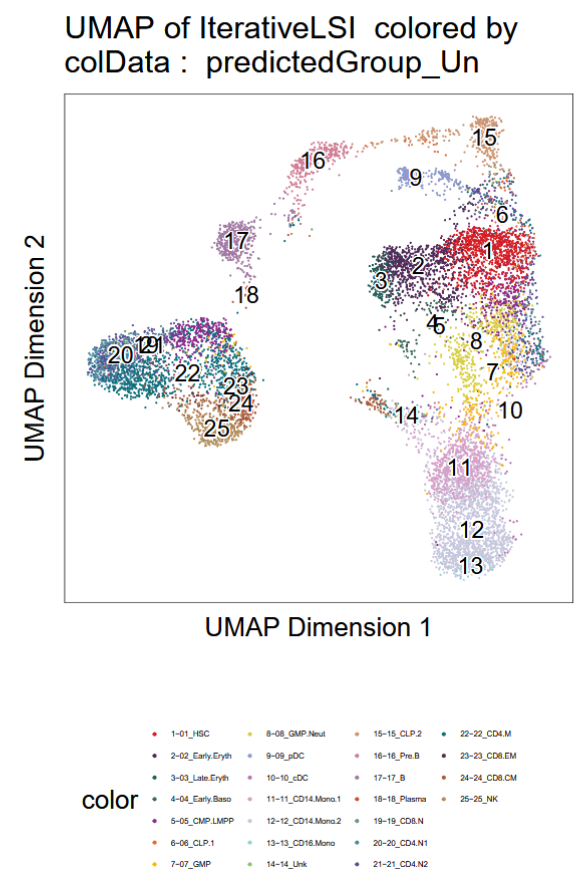

---------------------------
Similarly, we can visualize the integration by overlaying the scRNA-seq cell types on our scATAC-seq data based on the constrained integration.
```r 
p2 <- plotEmbedding(
    projHeme2, 
    colorBy = "cellColData", 
    name = "predictedGroup_Co", 
    pal = pal
)

p2
```
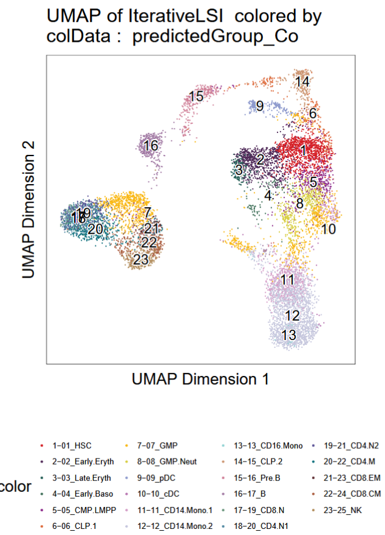
------------------------


### 11.10 Visual Comparison: Unconstrained vs. Constrained Integration

By comparing the two UMAP plots (Unconstrained vs. Constrained), the power of providing the algorithm with a biological rulebook becomes visually obvious. The most striking difference occurs in the large island on the far left of the UMAP (clusters 19-25), which corresponds to the T cell and NK cell lineages.


#### 1. Plot 1: Unconstrained Integration (`predictedGroup_Un`)
In the first plot, the algorithm was allowed to match any ATAC cell to *any* RNA cell without restrictions.

*   **The Visual:** The left-most island looks like confetti. The colors (representing different T cell and NK cell sub-types, plus misidentified cells) are heavily intermingled, chaotic, and lack distinct geographic boundaries.
*   **The Biological Problem:** Because the unconstrained algorithm relies purely on raw mathematical correlation, it gets confused by shared biological states. For example, a CD4+ T cell and a completely unrelated Monocyte might both be undergoing cellular stress, causing them to express similar stress-response gene modules. The unconstrained math gets distracted by this shared stress signature and incorrectly assigns the T cell a Monocyte label. 

#### 2. Plot 2: Constrained Integration (`predictedGroup_Co`)
In the second plot, the algorithm was forced to obey the `groupList` rulebook you created. It was mathematically forbidden from comparing the cells in that left-most island to anything other than the known T and NK cells from the RNA dataset.

*   **The Visual:** The "confetti" effect is largely eliminated. The left island has organized into distinct, contiguous geographic territories (solid blocks of specific colors).
*   **The Biological Reality:** Because the algorithm was no longer distracted by false matches from other cell lineages (like Monocytes or B cells), it could dedicate all of its computational power to finding the subtle, true differences between the specific T cell sub-types. As a result, the CD8+ Memory cells, CD4+ Naive cells, and NK cells neatly separate into their own distinct biological neighborhoods.

> **Thesis Takeaway:** This visual comparison is the exact proof you need to confidently proceed with the constrained data for your Atrial Fibrillation analysis. By drawing biological "fences" around broad lineages (like Myocytes vs. Non-Myocytes), you prevent the algorithm from making mathematically plausible but biologically impossible mistakes. This results in a highly accurate, high-fidelity map of your cells—the perfect foundation for downstream Variant Effect Prediction.


*** The differences between these the unconstrained and constrained integration is very subtle in this example, largely because the cell types of interest are already very distinct. However, you should notice differences, especially in the T cell clusters (Clusters 17-22).*** 


##  Adding Pseudo-scRNA-seq profiles for each scATAC-seq cell

You have reached the final, most crucial step of the integration pipeline. You verified that your unconstrained integration was messy, and you proved visually that your constrained `groupList` fixed those biological errors. 

Because you are finally satisfied with the alignment, it is time to stop doing "practice runs" in your computer's RAM and permanently write this data to your hard drive. 

Here is the exact breakdown of what this code does and the massive biological implications for your project.

#### 1. The Concept of "Pseudo-scRNA-seq Profiles"
Until now, ArchR only saved *metadata* (e.g., "ATAC Cell A matched with RNA Cell B"). It did not save the actual gene expression numbers.

By running this final block, you are instructing ArchR to look up the exact RNA cell that was matched, grab its entire measured mRNA expression profile (counts for all ~20,000 genes), and permanently attach that profile to the ATAC cell. 

You are essentially "faking" a multi-omic experiment. You are treating the data as if you measured both chromatin accessibility and RNA expression inside the exact same physical cell at the exact same time. This is called a **Pseudo-scRNA-seq profile**.

```r 
projHeme3 <- addGeneIntegrationMatrix(
    ArchRProj = projHeme2, 
    useMatrix = "GeneScoreMatrix",
    matrixName = "GeneIntegrationMatrix",
    reducedDims = "IterativeLSI",
    seRNA = seRNA,
    addToArrow = TRUE,
    force= TRUE,
    groupList = groupList,
    groupRNA = "BioClassification",
    nameCell = "predictedCell",
    nameGroup = "predictedGroup",
    nameScore = "predictedScore"
)
```
#### 2. The Code Breakdown

Notice that this is the exact same constrained integration code you ran previously, but with three critical changes:

| Code Element        | Technical Description                                                                                                           | Purpose in the Pipeline                                                                                                                                                                                                         |
| :------------------ | :------------------------------------------------------------------------------------------------------------------------------ | :------------------------------------------------------------------------------------------------------------------------------------------------------------------------------------------------------------------------------ |
| `addToArrow = TRUE` | Changes the storage destination from temporary RAM to the physical `.arrow` files on your hard drive.                           | Permanently saves the massive new `GeneIntegrationMatrix` so you don't have to re-run this 5-minute mathematical calculation every time you open R.                                                                             |
| `force = TRUE`      | Instructs ArchR to overwrite any existing matrix with the name `GeneIntegrationMatrix` if it already exists in the Arrow files. | Prevents the function from crashing if you accidentally ran a previous test and left a corrupted matrix in the files.                                                                                                           |
| Removing Suffixes   | `nameCell`, `nameGroup`, and `nameScore` no longer have `_Un` or `_Co` at the end of them.                                      | Since this is the final, validated run, you are creating the "official" columns. From `projHeme3` onward, if you want a cell's identity, you just ask for `predictedGroup` without worrying about which algorithm generated it. |

#### 3. Application to your Atrial Fibrillation Thesis
This specific block of code is the gateway to your Variant Effect Prediction. 

By saving the `GeneIntegrationMatrix` permanently into your `.arrow` files, you now have two matrices sitting side-by-side on your hard drive for every single Left Atrial Cardiomyocyte:
1. **The Peak Matrix:** Telling you exactly which DNA enhancers are physically open.
2. **The Gene Integration Matrix:** Telling you exactly which mRNA transcripts are actively being produced.

In your later chapters, ArchR will use these two matrices to perform **Peak-to-Gene Linkage**. It will scan across 50,000 cells and calculate: *"Every time this specific AFib-associated enhancer peak opens, does the mRNA expression of PITX2 go up?"* That calculation is mathematically impossible unless you successfully execute this `addToArrow = TRUE` step!


#### Verifying the Arrow File Matrix Addition

After running the computationally heavy constrained integration with `addToArrow = TRUE`, the very first thing you must do is verify that the data actually saved correctly to your hard drive. 

#### The Code Deconstructed
```r
getAvailableMatrices(projHeme3)
## [1] "GeneIntegrationMatrix" "GeneScoreMatrix"       "TileMatrix"
``` 

By seeing "GeneIntegrationMatrix" pop up in the output alongside your original "GeneScoreMatrix", you have confirmed a massive milestone in your pipeline: Every single ATAC cell now has two distinct gene profiles permanently attached to it.

    GeneScoreMatrix: The inferred expression (What the ATAC chromatin accessibility predicts is happening).

    GeneIntegrationMatrix: The measured expression (The pseudo-scRNA-seq profile mapped from the actual RNA dataset).

Having both of these matrices side-by-side allows you to compare the biological potential (ATAC) directly against the biological reality (RNA).

#### Adding impute weights (MAGIC)
```r
projHeme3 <- addImputeWeights(projHeme3)
```
__The Biological "Why": The Dropout Problem__

Single-cell sequencing is incredibly powerful, but it is also inefficient. During the chemical reactions, the machine often fails to capture every single piece of DNA or RNA in a cell. This results in "technical dropouts"—the data shows a 0 for a gene, not because the gene was biologically turned off, but simply because the machine missed it.

If you plot raw data on a UMAP, it will look highly pixelated and noisy because of these dropouts.

__How Imputation Works:__
The `addImputeWeights()` function solves this using the MAGIC algorithm. It looks at a specific cell and says: "I see you have a score of 0 for the PITX2 gene. But let me look at your 50 closest biological neighbors. Ah, all 50 of your neighbors have massive PITX2 expression. Therefore, your 0 is almost certainly a technical machine error."

The algorithm then "smooths" or "imputes" the data by borrowing expression values from surrounding cells.

** Thesis Application: When you are looking for rare Atrial Fibrillation sub-populations in your UMAP, imputation is critical. It transforms noisy, sparse, pixelated data into clean, biological gradients. It ensures that when you see a cluster of cardiomyocytes lighting up for a disease-associated gene, you are looking at true biological expression, not just a technical artifact of the sequencing machine!**

###Visualizing Integrated Gene Expression on the UMAP
This step is where you finally get to see the payoff of all your hard mathematical work. You are taking the pseudo-scRNA-seq profiles (the `GeneIntegrationMatrix`) that you permanently linked to your ATAC cells and painting their expression levels directly onto your UMAP.

This allows you to visually prove that the clusters identified by chromatin accessibility actually express the correct mRNA transcripts for their assigned cell types.


#### 1. The Marker Genes Explained
```r
markerGenes  <- c(
    "CD34", # Early Progenitor
    "GATA1", # Erythroid
    "PAX5", "MS4A1", # B-Cell Trajectory
    "CD14", # Monocytes
    "CD3D", "CD8A", "TBX21", "IL7R" # TCells
)
```
__The Biological "Why":__ These are canonical (textbook) marker genes. They are universally accepted in immunology as absolute proof of a cell's identity.

* If a cell expresses __CD34__, it is mathematically and biologically impossible for it to be a mature T-Cell; it must be a stem cell/progenitor.

* If it expresses __CD8A__, it is a Cytotoxic T-Cell.

You are creating a curated list of these "ground truth" genes to test your UMAP. If the cluster you labeled as "B-Cells" earlier does not light up with PAX5 and MS4A1 expression, your integration failed.
#### Application to Your Atrial Fibrillation Thesis

When you reach this step in your thesis, your `markerGenes` list will completely change to reflect cardiovascular biology.

To prove your heart integration worked, you will use genes like:

+ MYH6, TNNT2: Universal Cardiomyocytes

+ NPPA, MYL4: Specifically Atrial Cardiomyocytes (crucial for AFib!)

+ MYL2: Specifically Ventricular Cardiomyocytes

+ COL1A1, POSTN: Fibroblasts (to monitor fibrosis)

+ PECAM1 (CD31): Endothelial cells

By plotting for example __NPPA__ using the GeneIntegrationMatrix, you will visually verify exactly which cluster represents your Left Atrium cells. 


```r
p1 <- plotEmbedding(
    ArchRProj = projHeme3, 
    colorBy = "GeneIntegrationMatrix", 
    name = markerGenes, 
    continuousSet = "horizonExtra",
    embedding = "UMAP",
    imputeWeights = getImputeWeights(projHeme3)
)
```

| Code Element / Parameter                | Technical Description                                                                                            | Biological Purpose                                                                                                                                           |
| :-------------------------------------- | :--------------------------------------------------------------------------------------------------------------- | :----------------------------------------------------------------------------------------------------------------------------------------------------------- |
| `p1`                                    | The variable storing the output. Because you passed 9 genes, this stores a list of 9 separate `ggplot2` objects. | Saves your generated UMAPs so you can arrange them into a single grid image for publication.                                                                 |
| `plotEmbedding()`                       | ArchR's function for projecting data onto 2D space.                                                              | Translates your multidimensional single-cell data into a visual plot.                                                                                        |
| `colorBy = "GeneIntegrationMatrix"`     | Tells the function which "drawer" of data to open.                                                               | **CRITICAL:** Forces the plot to use the *measured* mRNA transcripts from the constrained integration, NOT the inferred predictions from the ATAC data.      |
| `name = markerGenes`                    | The specific items to pull from the matrix.                                                                      | Instructs the algorithm to ignore the other 20,000 genes and only color the map based on your specific validation list.                                      |
| `continuousSet = "horizonExtra"`        | A built-in ArchR color palette designed specifically for numeric gradients.                                      | Gene expression is continuous, not categorical. This palette visually maps expression from zero (light) to high (dark).                                      |
| `embedding = "UMAP"`                    | Tells the function which spatial coordinates to use.                                                             | Projects the RNA expression onto the exact same ATAC UMAP structure you generated earlier.                                                                   |
| `imputeWeights = getImputeWeights(...)` | Retrieves and applies the MAGIC imputation matrix you calculated in the previous step.                           | **The De-Noiser:** Smooths out technical machine dropouts. It creates clean, biological gradients of expression across the clusters instead of noisy pixels. |

#### Comparing "Potential" vs. "Reality": Visualizing Gene Scores

Now that you have plotted the integrated RNA data, you are running almost the exact same command but switching the data source to the `GeneScoreMatrix`. This allows you to perform the ultimate biological comparison: **Chromatin Accessibility (Potential) vs. mRNA Transcription (Reality).**

#### 1. The Biological "Why": The Validity Check
In your previous plot (`p1`), you used the `GeneIntegrationMatrix`, which is essentially "borrowed" data from the scRNA-seq experiment. In this plot (`p2`), you are using the `GeneScoreMatrix`, which is calculated purely from the ATAC-seq data itself based on how open the DNA is around those genes.


By comparing these two side-by-side, you can answer critical biological questions:
*   **Is the integration accurate?** If *CD3D* lights up in the same T-cell cluster in both plots, you have two independent lines of evidence confirming that cluster's identity.
*   **Is there "Epigenetic Priming"?** If you see a gene that is wide open in the `GeneScoreMatrix` but has zero signal in the `GeneIntegrationMatrix`, you have found a gene that is "poised"—the cell has opened the DNA door, but hasn't started walking through it (transcribing) yet.

#### 2. `plotEmbedding` Parameters: GeneScore Edition

Here is the breakdown of the parameters for your guide:

| Code Element / Parameter      | Technical Description                                                                    | Biological Purpose                                                                                                                                                                        |
| :---------------------------- | :--------------------------------------------------------------------------------------- | :---------------------------------------------------------------------------------------------------------------------------------------------------------------------------------------- |
| `p2`                          | The variable storing the list of UMAP plots for the gene scores.                         | Allows you to keep these "ATAC-only" plots separate from your integrated RNA plots for comparison.                                                                                        |
| `colorBy = "GeneScoreMatrix"` | Directs ArchR to use the inferred gene activity calculated from chromatin accessibility. | **The "Potential":** Visualizes what the cell is epigenetically *capable* of doing based on open DNA.                                                                                     |
| `name = markerGenes`          | Uses the same list of canonical markers (CD34, GATA1, etc.).                             | Ensures you are comparing "apples to apples" when looking at the RNA-integrated plots.                                                                                                    |
| `imputeWeights = ...`         | Applies the same MAGIC imputation weights used in the previous step.                     | **Essential Smoothing:** ATAC-seq data is even sparser than RNA. Without imputation, gene score plots often look like a few random dots; imputation reveals the true biological clusters. |

-----------------------------------------
To plot all marker genes we can use cowplot. First, lets organize our plots.
```r
p1c <- lapply(p1, function(x){
    x + guides(color = FALSE, fill = FALSE) + 
    theme_ArchR(baseSize = 6.5) +
    theme(plot.margin = unit(c(0, 0, 0, 0), "cm")) +
    theme(
        axis.text.x=element_blank(), 
        axis.ticks.x=element_blank(), 
        axis.text.y=element_blank(), 
        axis.ticks.y=element_blank()
    )
})

p2c <- lapply(p2, function(x){
    x + guides(color = FALSE, fill = FALSE) + 
    theme_ArchR(baseSize = 6.5) +
    theme(plot.margin = unit(c(0, 0, 0, 0), "cm")) +
    theme(
        axis.text.x=element_blank(), 
        axis.ticks.x=element_blank(), 
        axis.text.y=element_blank(), 
        axis.ticks.y=element_blank()
    )
})
```

When presenting results in a thesis, clarity is paramount. This code uses a "batch processing" approach to strip away non-essential visual elements, ensuring that the biological data—the gene expression on the UMAP—is the primary focus.

| Code Element                  | Technical Action                                                                                         | Biological & Aesthetic Purpose                                                                                                                                                                                       |
| :---------------------------- | :------------------------------------------------------------------------------------------------------- | :------------------------------------------------------------------------------------------------------------------------------------------------------------------------------------------------------------------- |
| `p1c <- lapply(p1, ...)`      | **Batch Processing:** Applies a custom cleanup function to every plot object stored in the list `p1`.    | Efficiently standardizes the look of all 9+ marker gene plots at once, ensuring perfect visual consistency across your figure.                                                                                       |
| `function(x){ ... }`          | **Anonymous Function:** `x` represents a single plot being passed through the "cleanup machine."         | Allows for complex, multi-step modifications to be applied to each gene plot in a single line of code.                                                                                                               |
| `guides(color = F, fill = F)` | **Legend Removal:** Disables the color-scale and fill legends on every individual plot.                  | Legends take up significant space. Removing them allows the actual UMAP clusters to be plotted much larger and sit closer together in a grid.                                                                        |
| `theme_ArchR(baseSize = 6.5)` | **Global Scaling:** Sets the base font size for all text (like gene titles) to 6.5 points.               | Ensures that when the plots are shrunk down to fit a 3x3 or 4x4 grid, the titles remain legible without being overwhelmingly large.                                                                                  |
| `plot.margin = unit(...)`     | **Margin Elimination:** Sets the white space around the edges of every plot to exactly zero centimeters. | Removes the "dead space" between plots, allowing them to sit "shoulder-to-shoulder" for a high-density, professional publication look.                                                                               |
| `element_blank()`             | **Axis Stripping:** Removes all numerical text and tick marks from the X and Y axes.                     | **The "UMAP Logic":** In UMAPs, the absolute coordinates (e.g., -10 to +10) are arbitrary and carry no biological meaning. Stripping them cleans the visual field so the reader focuses purely on the cell clusters. |


By the end of this operation, your plots are no longer individual graphs; they are **figure panels**. 

By removing the "chart junk" (legends and axes), you make it significantly easier for your thesis committee to see the spatial correlation between different genes. You can now place the **Gene Score** plot (Potential) directly next to the **Gene Integration** plot (Reality) for the same marker, making the biological comparison instantaneous and intuitive.

Visualize the __gene expression__ plots with this function 
```r
do.call(cowplot::plot_grid, c(list(ncol = 3), p1c))
```


and for the __gene score__: 
```r
do.call(cowplot::plot_grid, c(list(ncol = 3), p2c))
``` 

### Interpretin the differences between "Gene expression"(RNA-seq-derived) and "Gene score"(ATAC-seq-derived)

| Biological Scenario     | Visual Pattern                                 | Interpretation                                                                                                                                                                                  |
| :---------------------- | :--------------------------------------------- | :---------------------------------------------------------------------------------------------------------------------------------------------------------------------------------------------- |
| **High Correlation**    | High Gene Score **AND** High RNA expression.   | **Active State:** The gene is in a steady state. The chromatin is open, and the transcription machinery is actively producing mRNA.                                                             |
| **Epigenetic Priming**  | High Gene Score **BUT** Low/No RNA expression. | **Poised State:** The cell has "unlocked" the DNA, but has not yet started transcribing. This often occurs in early disease stages where a cell is prepared to react but hasn't been triggered. |
| **Transcriptional Lag** | Low Gene Score **BUT** High RNA expression.    | **Closing Window:** The chromatin may have begun to close or compact, but the mRNA transcripts produced earlier remain in the cytoplasm due to their longer half-life.                          |
| **Technical Sparsity**  | No signal in either, or "patchy" signal.       | **Dropout:** Since both assays are sparse, some low-abundance genes may be missed by the sequencing machine in one or both assays, even with imputation.                                        |

## 10.3 Labeling scATAC-seq clusters with scRNA-seq information

Now that we are confident in the alignment of our scATAC-seq and scRNA-seq, we can label our scATAC-seq clusters with the cell types from our scRNA-seq data.

First, we will create a confusion matrix between our scATAC-seq clusters and the `predictedGroup` obtained from our integration analysis.

```r 
cM <- confusionMatrix(projHeme3$Clusters, projHeme3$predictedGroup)
labelOld <- rownames(cM)
labelOld
```
| Code Element               | Technical Description                                                              | Purpose in the Pipeline                                                                                                    |
| :------------------------- | :--------------------------------------------------------------------------------- | :------------------------------------------------------------------------------------------------------------------------- |
| `cM`                       | The output object, which is a contingency table (matrix) of frequencies.           | Provides the raw data needed to decide which biological label belongs to which ATAC cluster.                               |
| `confusionMatrix()`        | An ArchR function that cross-tabulates two different sets of categorical labels.   | Quantifies the overlap between your chromatin-defined groups and your gene-expression-defined groups.                      |
| `projHeme3$Clusters`       | The metadata column containing the original ATAC-seq cluster assignments.          | These are the "Old Labels" (e.g., C1, C2) that you are preparing to replace.                                               |
| `projHeme3$predictedGroup` | The metadata column containing the cell-type labels transferred from the RNA data. | These are the "New Labels" that will provide the biological meaning for your clusters.                                     |
| `labelOld`                 | A character vector extracted from the row names of the confusion matrix.           | Captures the names of your ATAC clusters (e.g., "C1", "C2") so you can use them as a reference list for the renaming step. |

__Then, for each of our scATAC-seq clusters, we identify the cell type from predictedGroup which best defines that cluster.__

```r
labelNew <- colnames(cM)[apply(cM, 1, which.max)]
labelNew
```

| Code Element        | Technical Description                                                                  | Purpose in the Pipeline                                                                                       |
| :------------------ | :------------------------------------------------------------------------------------- | :------------------------------------------------------------------------------------------------------------ |
| `labelNew`          | A character vector containing the "majority" biological labels for every ATAC cluster. | Serves as the final mapping key to rename your clusters from numbers to biological identities.                |
| `colnames(cM)`      | Retrieves the names of all the scRNA-seq cell types present in the integration.        | Provides the biological vocabulary (e.g., "Monocyte", "T-Cell") used to label the clusters.                   |
| `apply(cM, 1, ...)` | Iterates through the confusion matrix row by row (dimension 1).                        | Ensures that every single ATAC cluster is evaluated individually for its best match.                          |
| `which.max`         | Finds the position of the highest value in a given row.                                | Implements the "Majority Rules" logic; the RNA identity with the most cells in that cluster "wins" the label. |

Further here: https://www.archrproject.com/bookdown/labeling-scatac-seq-clusters-with-scrna-seq-information.html
--------------------------
## 11: Pseudo-bulk Replicates in ArchR

As you move deeper into your analysis, you will encounter a fundamental limitation of scATAC-seq: **the data is essentially binary**. In any individual cell, a specific genomic locus is either open (accessible) or closed (not accessible). To perform advanced statistical analyses—the kind required for a rigorous thesis—you must move beyond single-cell "yes/no" data and generate continuous signals with statistical replicates.

#### 1. The "Why" Behind Pseudo-bulking

| The Problem                                                                                                                                              | The Solution                                                                                                                                                                           |
| :------------------------------------------------------------------------------------------------------------------------------------------------------- | :------------------------------------------------------------------------------------------------------------------------------------------------------------------------------------- |
| **Binary Constraints:** Individual cell loci are essentially $1$ (accessible) or $0$ (not accessible), which limits many types of mathematical analysis. | **Pseudo-bulk Aggregation:** By combining data from many similar cells, ArchR creates a "pseudo-sample" that mimics the high-quality signal of a traditional bulk ATAC-seq experiment. |
| **Statistical Significance:** Robust science requires replicates to prove that an observation isn't just a random fluke.                                 | **Pseudo-bulk Replicates:** ArchR generates multiple pseudo-samples for each cell group, providing the replicates needed to calculate measurements of statistical significance.        |


#### 2. Core Concepts of the Process

*   **The Aggregation:** Data from individual single cells is combined into a single group.
*   **The Underlying Assumption:** The single cells grouped together are sufficiently similar that the differences between them are negligible compared to the shared signal of the group.
*   **The Grouping Strategy:** These cell groupings are almost always derived from your identified clusters or "supersets" of clusters that correspond to known cell types.

---

> **Thesis Application:** In your Atrial Fibrillation research, pseudo-bulking is the bridge to **Differential Accessibility Analysis**. If you want to prove that a specific enhancer is significantly "more open" in AFib cardiomyocytes compared to healthy ones, you cannot simply look at individual cells. You must create pseudo-bulk replicates for both groups. By having multiple pseudo-replicates for each condition, ArchR can calculate a **p-value**, allowing you to say with scientific certainty that the epigenetic changes you are seeing are statistically significant and not just background noise.


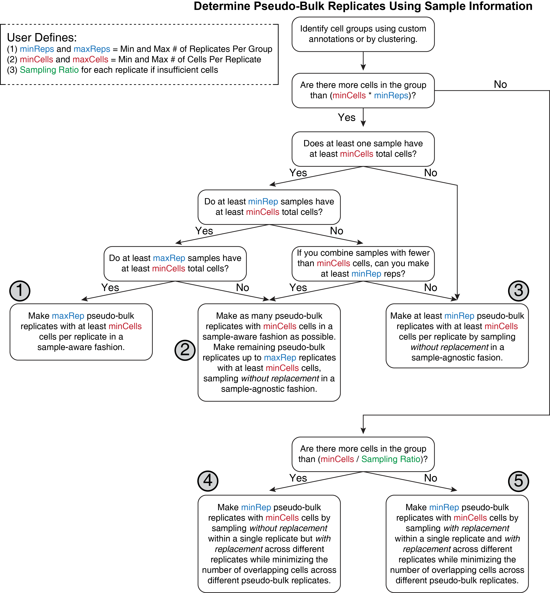

We outline some of the key considerations of this process in words here. First, the user identifies the cell groups to be used - this is often the clusters called by ArchR. Then for each cell grouping, ArchR attempts to create the desired pseudo-bulk replicates. The ideal pseudo-bulk replicate would consist of a sufficient number of cells from a single sample. This maintains sample diversity and biological variation between the replicates. This is what ArchR strives to obtain, but in reality there are 5 possible outcomes in this process, ranked below by preference in ArchR:

1) Enough different samples (at least the max # replicates) each have more than the minimum number of cells to create pseudo-bulk replicates in a sample-aware fashion, combining only cells from the same sample into a single replicate.
   
2) Some samples each have more than the minimum number of cells to create pseudo-bulk replicates in a sample-aware fashion. The remaining required replicates are created by combining cells without replacement from samples that are not already represented in the sample-aware pseudobulks.
3) No samples have more than the minimum number of cells to create a sample-aware pseudo-bulk replicate but there are more cells than `minCells * minReps`. All required replicates are created by combining cells without replacement from in a sample-agnostic fashion.
4) The total number of cells within a cell grouping is less than the minimum number of cells multiplied by the minimum number of replicates but greater than the minimum number of cells divided by the sampling ratio. Create the minimum number of replicates by sampling without replacement within a single replicate but with replacement across replicates while minimizing the number of cells present in multiple pseudo-bulk replicates.
5) The total number of cells within a cell grouping is less than the minimum number of cells divided by the sampling ratio. This means that we must make replicates by sampling with replacement within a single replicate and across different replicates. This is the worst case scenario and users should be cautious about using these pseudo-bulk replicates downstream. This can be controlled in various other ArchR functions using the `minCells` parameter.

Examples for this can be found on this page: https://www.archrproject.com/bookdown/how-does-archr-make-pseudo-bulk-replicates.html 


### 11.2 Making Pseudo-bulk Replicates

The transition from sparse, binary single-cell data to a continuous, high-signal profile is handled by the `addGroupCoverages()` function. This step is one of the most computationally intensive parts of the pipeline because it physically reorganizes the read data into grouped coverage files.

#### 1. The Code Breakdown
```r
projHeme4 <- addGroupCoverages(
    ArchRProj = projHeme3, 
    groupBy = "Clusters2"
)
```
| Parameter       | Technical Description                                                         | Purpose in the Pipeline                                                                                                                |
| :-------------- | :---------------------------------------------------------------------------- | :------------------------------------------------------------------------------------------------------------------------------------- |
| **`ArchRProj`** | Your active ArchR project object (`projHeme3`).                               | Provides the source data and cell metadata for the operation.                                                                          |
| **`groupBy`**   | The specific column in your `cellColData` used to define groupings.           | Tells ArchR which cells belong together (e.g., "all B-cells") to create the pseudo-bulk samples.                                       |
| **`Clusters2`** | The metadata column containing the biological labels you assigned previously. | Ensures that your pseudo-bulk replicates are biologically meaningful (based on cell types) rather than just arbitrary cluster numbers. |

#### 2. The Underlying Logic: How Replicates are Born

ArchR does not just lump all cells into one giant file. To allow for statistical testing later, it uses an internal sampling algorithm to create **Pseudo-bulk Replicates**:

*   **Minimum Cells**: It ensures each replicate has a minimum number of cells to be statistically robust.
*   **Maximum Cells**: It prevents any single replicate from becoming so large that it overwhelms the others.
*   **Sampling**: If a cluster has many cells, ArchR will split them into multiple replicates (usually 2 or 3). This gives you the "n" (sample size) required to calculate p-values.
  

### 11.2.3 Decoding the "Merge-Split-Merge" Logic

The description of `addGroupCoverages()` can sound a bit like a tongue-twister. It says it merges cells into replicates, then merges those replicates into a single file. Let’s break down exactly what is happening under the hood of your heart dataset.

#### 1. "Merge cells within each designated cell group"
*   **The Action:** ArchR looks at your `groupBy` column (e.g., "Atrial Cardiomyocytes"). 
*   **The Logic:** It gathers all the individual Tn5 insertion sites (the "fragments") from every single cell that carries that label. You are essentially saying: "Stop looking at these as 5,000 individual cells and start looking at them as one big pool of data".

#### 2. "For the generation of pseudo-bulk replicates"
*   **The Action:** ArchR doesn't just make one giant pool. It randomly assigns those 5,000 cells into 2 or 3 smaller pools (replicates).
*   **The Logic:** If you have 3 replicates for "Healthy" and 3 for "AFib," you can do actual statistics (like calculating a t-test or ANOVA). Without replicates, you have a "sample size of 1," which no thesis committee will accept.

#### 3. "Merge these replicates into a single insertion coverage file"
*   **The Action:** This is the part that sounds counterintuitive. After splitting them into replicates, ArchR saves them into a single specialized file format (often stored in the `GroupCoverages` folder of your project).
*   **The Logic:** This is for **file management efficiency**. Rather than having hundreds of tiny files cluttering your hard drive, ArchR stores the coverage data for all your cell types in one organized "library". When you want to see the "Atrial Replicate 1" track, ArchR just goes to that specific "chapter" in the single file.


---

### Why this matters for your Atrial Fibrillation Research

| Process Phase           | Why it’s Essential                                                                                                                                                       |
| :---------------------- | :----------------------------------------------------------------------------------------------------------------------------------------------------------------------- |
| **Cell Merging**        | Overcomes "Sparsity." It turns a few random dots into a visible "peak" at an important AFib gene like *NPPA*.                                                            |
| **Replicate Splitting** | Provides "Statistical Power." It allows you to say: "The difference in this enhancer isn't just a fluke in one sample; it’s consistent across all my pseudo-replicates". |
| **Single File Storage** | Enables "Computational Speed." It allows ArchR to quickly pull up the data for any cell type without opening and closing hundreds of different files.                    |

---

> **The "Bottom Line" Interpretation:** 
> Think of `addGroupCoverages()` as an automated librarian. It takes a messy pile of thousands of individual pages (single cells), sorts them into chapters by topic (cell types), creates multiple copies of each chapter to check for errors (replicates), and then binds them all into one thick, organized book (the insertion coverage file).

## 12.2 Understanding the Iterative Overlap Peak Calling (MACS2)

This "iterative overlap" procedure is ArchR's way of ensuring your peak set isn't just a random collection of noise. It uses a two-stage filter to make sure the peaks you analyze for your heart research are statistically robust and comparable across different cell types.

---

#### Stage 1: Group-Specific Reproducibility
In this first step, ArchR looks at each cell group (e.g., your "Atrial Cardiomyocytes") individually:

*   **Replicate Verification**: ArchR uses the pseudobulk replicates (created in the previous step) to identify peaks that appear consistently across the replicates for that specific group.
*   **Quantile Normalization**: It calculates a `replicateScoreQuantile`. This acts as a "leveling tool" to account for differences in the number of fragments or cells per group, ensuring a group with more data doesn't unfairly dominate the results.
*   **File Storage**: These group-specific peak sets are saved as **GRanges** objects in the `PeakCalls` directory. The exact "summits" for each replicate are stored in the `ReplicateCalls` folder.

---

#### Stage 2: The "Union" Peak Set
Once it has the winners for every group, ArchR merges them into one master list so you can compare "Apples to Apples" across your whole project:

*   **Merging**: All group-specific peak sets are merged into a single **Union Peak Set**.
*   **Final Ranking**: A `groupScoreQuantile` is assigned to show the peak's strength across the whole project.
*   **The "Origin" Label**: Each peak gets a `GroupReplicate` annotation.
*   **Important Caveat**: This label simply identifies which group had the **highest normalized significance** for that peak. It does *not* mean the peak is exclusive to that group; it just means that group "won" the ranking during the merging process.

---

#### Managing Your Peak Sets
ArchR projects are designed to be streamlined, which leads to one strict rule: **An ArchRProject can only hold one peak set at a time**.

If you want to experiment with different peak-calling strategies, you have two options:

| Option        | Method                                                                     | Use Case                                                                                              |
| :------------ | :------------------------------------------------------------------------- | :---------------------------------------------------------------------------------------------------- |
| **Option #1** | Use `saveArchRProject()` to create copies.                        | Best for keeping entirely different analysis branches separate.                              |
| **Option #2** | Store sets as `GenomicRanges` and swap them using `addPeakSet()`. | Best for testing how different peak lists change your downstream results within one project. |

---

> **Peer Tip (The "Talent Show" Analogy):** 
> Think of Stage 1 as local auditions where each cell type finds its best "talent" (peaks). Stage 2 is the national final where everyone is put into one big "supergroup" (the Union Set). The `GroupReplicate` tag is just a note of who the "star" was for that particular peak, even if other groups are "singing along" at that same genomic location.


### 12.1.15 Breaking Down Your Master Peak Set

The output of `getPeakSet(projHeme4)` is the "Holy Grail" of your current analysis. It is a **GRanges** object containing the final **Union Peak Set**—the filtered, normalized, and annotated list of all 145,956 genomic regions that ArchR deemed reliable across your heart data.

---

#### 1. The Core Coordinates
*   **`seqnames`, `ranges`, `strand`**: These are the physical addresses of the peaks (e.g., `chr1:752514-753014`). Note that all peaks in ArchR are standardized to a fixed width (usually **500 bp**) centered on the peak summit to make statistical comparisons easier.


#### 2. Statistical Metadata (The "Iterative Overlap" Results)
These columns tell you how a peak survived the "Genomic Talent Show" we discussed earlier:

| Column Name                  | What it Represents                                                                                                        |
| :--------------------------- | :------------------------------------------------------------------------------------------------------------------------ |
| **`score`**                  | The raw statistical significance from MACS2.                                                                     |
| **`replicateScoreQuantile`** | How strong this peak was compared to others in its original **pseudobulk replicate**.                            |
| **`groupScoreQuantile`**     | How strong this peak was compared to others in its **cell group** (e.g., Mono, B).                               |
| **`Reproducibility`**        | The number of replicates in which this specific peak was found (e.g., `2` means it was seen in both replicates). |
| **`GroupReplicate`**         | The specific group and replicate that "won" the peak during merging because it had the highest significance.     |

#### 3. Biological Annotations
ArchR automatically links your peaks to the nearest genes to help you interpret the Atrial Fibrillation biology:

*   **`peakType`**: Classifies the peak's location relative to genes.
    *   **Promoter**: Right at the start of a gene (usually within 2kb of a TSS).
    *   **Intronic / Exonic**: Inside the gene body.
    *   **Distal**: Far away from any known gene; these are often the "enhancers" that act as switches.
*   **`nearestGene` / `nearestTSS`**: The symbol of the gene closest to this peak (e.g., *LINC01128* or *TMLHE*).
*   **`distToTSS`**: The physical distance (in base pairs) to the nearest Transcription Start Site.

---

#### 4. Technical Metrics
*   **`GC`**: The percentage of G and C nucleotides in the peak. This is important because GC-rich areas often sequence differently, and ArchR uses this to "correct" for technical bias later.
*   **`idx`**: The internal index number for that specific peak within its group.

---

> **The "Big Picture" for Your Thesis:**
> Look at the row labels (the very first column: `Mono`, `B`, `GMP`). These tell you which cell type "claims" that peak. For example, the peak at `chr1:762695-763195` was most significant in **B-cells**, is a **Promoter** peak, and is only 25 base pairs away from the gene ***LINC01128***. 

**Notice how some peaks are labeled "Distal"? Those are the ones we'll want to check for AFib-specific enhancers later. Do you want to see how to filter this list for only "Promoter" peaks?**

### 13.1.1 Understanding `getMarkers()`: DataFrame vs. GRanges

The primary difference between the two commands in your Jupyter notebook is the **data structure** returned by the `returnGR` parameter. While both commands identify "Marker Features"—peaks that are statistically unique to a specific cell group—they package that information differently for your next analysis steps.

---

### Command 1: The Standard Table (`returnGR = FALSE`)
In cell **[15]**, you are running the default version of the function.

*   **Output Type**: A `DataFrame` (essentially a standard R table or "DFrame").
*   **Structure**: The genomic coordinates (`seqnames`, `start`, `end`) are treated as regular columns alongside your statistics.
*   **Best Use Case**: Use this when you want to **manually inspect** the results, print them in your notebook (as seen in cell [16]), or export the list to a `.csv` or Excel file for a supplemental table in your thesis.

---

### Command 2: The Genomic Object (`returnGR = TRUE`)
In cell **[17]**, you have added the `returnGR = TRUE` argument.

*   **Output Type**: A `GRanges` object (Genomic Ranges).
*   **Structure**: The coordinates are "promoted" to the formal range component of the object, leaving only the statistics (`Log2FC`, `FDR`, `MeanDiff`) as metadata columns.
*   **Best Use Case**: This is the "power user" format. You **must** use this if you plan to do any of the following within R:
    *   **Overlapping**: Checking if these marker peaks overlap with specific GWAS variants for Atrial Fibrillation.
    *   **Annotation**: Finding the nearest genes or promoters using Bioconductor tools.
    *   **Visualization**: Plotting these peaks as "tracks" in a genome browser view.

---

### Comparison Summary

| Feature            | `returnGR = FALSE` (Default)           | `returnGR = TRUE`                       |
| :----------------- | :------------------------------------- | :-------------------------------------- |
| **Data Format**    | `DataFrame`                            | `GRanges`                               |
| **Spatial Info**   | Stored as text/numeric columns.        | Stored as a formal genomic coordinate.  |
| **Readability**    | High (looks like a spreadsheet).       | Moderate (standardized genomic format). |
| **Downstream Ops** | Limited to table manipulation.         | Full suite of genomic range operations. |
| **Thesis Value**   | Great for "Table 1" or Appendix lists. | Required for advanced spatial plotting. |

---

### How this relates to your marker identification
In both cases, ArchR is calculating which peaks are unique to your groupings, such as the **1,851 marker peaks** identified for the **Erythroid** cluster in your example. It is important to remember that these peaks aren't necessarily *only* found in Erythroid cells; rather, the Erythroid group showed the highest normalized significance for these specific regions during the "Iterative Overlap" process.

> **Tutorial Tip:** If you are just starting to explore your markers, stay with the `DataFrame` (Command 1) to get a feel for the genes involved. Once you are ready to make high-quality publication plots or look for Transcription Factor motifs, switch to the `GRanges` (Command 2).

Are you planning to export this list to a spreadsheet for manual review, or do you need to perform genomic overlaps with other datasets (like heart disease GWAS variants) next?

### 13.2.1 Visualizing Identity: The Marker Peak Heatmap

The `markerHeatmap()` function is designed to take the thousands of statistical results from your marker identification and turn them into a single, cohesive image that defines each cell type's regulatory signature.

---

### The Visualization Command
```r
# Generate the heatmap object
heatmapPeaks <- markerHeatmap(
  seMarker = markerPeaks, 
  cutOff = "FDR <= 0.1 & Log2FC >= 0.5", 
  transpose = TRUE
)

# Display the heatmap
draw(heatmapPeaks)
```

| Parameter       | Technical Function                                                                          | Practical Purpose                                                                                                    |
| :-------------- | :------------------------------------------------------------------------------------------ | :------------------------------------------------------------------------------------------------------------------- |
| **`seMarker`**  | Pass the `SummarizedExperiment` object created by `getMarkerFeatures()`.           | Provides the statistical matrix (accessibility counts) for the plot.                                        |
| **`cutOff`**    | Applies a specific statistical filter (e.g., $FDR \le 0.1$ and $Log_2FC \ge 0.5$). | Prevents the plot from becoming cluttered by only showing the most significant peaks.                       |
| **`transpose`** | Flips the $x$ and $y$ axes of the matrix.                                          | Changes the orientation; `TRUE` puts cell groups on one axis and peaks on the other for better readability. |


We can plot this heatmap using `draw()`.
```r
draw(heatmapPeaks, heatmap_legend_side = "bot", annotation_legend_side = "bot")
```

To save an editable vectorized version of this plot, we use the plotPDF() function.
```R
plotPDF(heatmapPeaks, name = "Peak-Marker-Heatmap", width = 8, height = 6, ArchRProj = projHeme5, addDOC = FALSE)
```
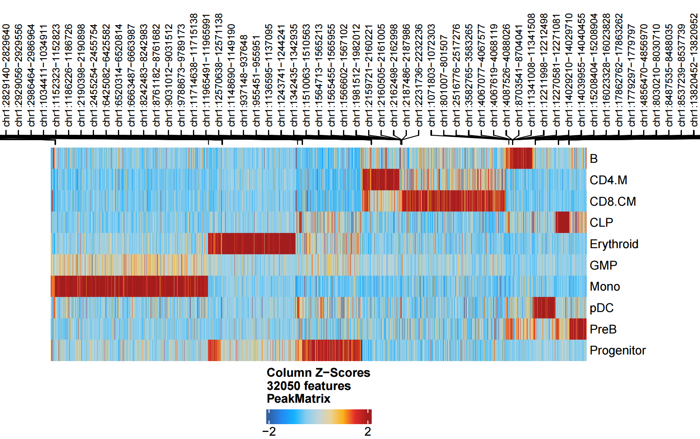


### 13.2.2 Interpreting Your Marker Peak Heatmap

The heatmap in **Peak-Marker-Heatmap.pdf** serves as the "visual proof" of your cluster identities. It transforms 32,050 complex genomic features into a clear, diagonal pattern that demonstrates exactly how each cell type is unique at the chromatin level.

---

#### 1. Breakdown of the Visual Components

| Component                 | What it Represents                                                                                                                                              |
| :------------------------ | :-------------------------------------------------------------------------------------------------------------------------------------------------------------- |
| **Rows (Y-Axis)**         | Your **10 cell clusters** (B, CD4.M, Mono, etc.). Because you used `transpose = TRUE`, these are listed vertically.                                    |
| **Columns (X-Axis)**      | The **32,050 marker peaks** identified across your project. These are the specific "regulatory switches" in the DNA.                                   |
| **Color Scale (Z-Score)** | Represents the **relative accessibility**. Red (2) indicates high accessibility compared to other groups, while Blue (-2) indicates low accessibility. |
| **The Diagonal Blocks**   | These bright red "stair-step" patterns represent the **unique signatures** of each group.                                                              |

---

#### 2. How to Interpret the "Fingerprint"

To interpret this heatmap for your research, look at the alignment between a cluster name and its corresponding red block:

*   **Cluster-Specific Accessibility**: The large red block for **Mono** indicates thousands of genomic regions that are wide open and active in Monocytes but tightly closed (blue) in almost every other cell type.
*   **Regulatory "Switching"**: Looking vertically down any single column (one specific peak) shows it "turning on" (red) for one cell type and "turning off" (blue) for others. This visualizes cell-type-specific gene regulation.
*   **Shared Lineages**: Groups like **CD4.M** and **CD8.CM** have blocks that look somewhat similar, which is biologically expected as they are both T-cell subtypes sharing similar open chromatin regions.

---

#### 3. Biological Significance for Your Thesis

Each of these 32,050 features is a potential candidate for explaining the biology of your heart samples. 

*   **Promoter vs. Distal**: While many peaks are near gene promoters, the most interesting ones for your Atrial Fibrillation study are often the **Distal** enhancers found in these blocks. 
*   **Identifying Drivers**: The specific red block for a "diseased" cluster likely contains the enhancers that drive the expression of genes involved in cardiac arrhythmia.
*   **Technical Quality**: The sharpness of the diagonal indicates a high-quality dataset; a blurry mess of colors would suggest poorly defined clusters or noisy peak calling.

---

> **Peer Tip**: Look closely at the **pDC** and **PreB** clusters at the bottom right of **Peak-Marker-Heatmap.pdf**. Their red blocks are very sharp and distinct, suggesting these cell types have a very unique regulatory program compared to the "Progenitor" cells right next to them.


### 13.2.3 Visualizing Markers: MA and Volcano Plots

Beyond heatmaps, ArchR allows you to focus on an individual cell group (like your **Erythroid** cluster) using MA and Volcano plots. These plots help you evaluate the statistical strength and the magnitude of change for your identified marker peaks.

---

#### 1. The MA Plot
The first plot represents the relationship between the intensity of the signal and the magnitude of the difference.

*   **X-Axis ($log_2 \text{ Mean}$)**: Represents the average accessibility of a peak across all samples.
*   **Y-Axis ($log_2 \text{ Fold Change}$)**: Represents how much more (or less) accessible a peak is in the target group compared to the background.
*   **Interpretation**: The red points (5,189 features in your plot) are the **Up-Regulated** peaks. These are regions that are significantly more open in this specific cell group.
*   **Observation**: In your results, 0% are down-regulated because marker detection typically focuses on enrichment—the "fingerprint" that defines what is unique to that cluster.
  
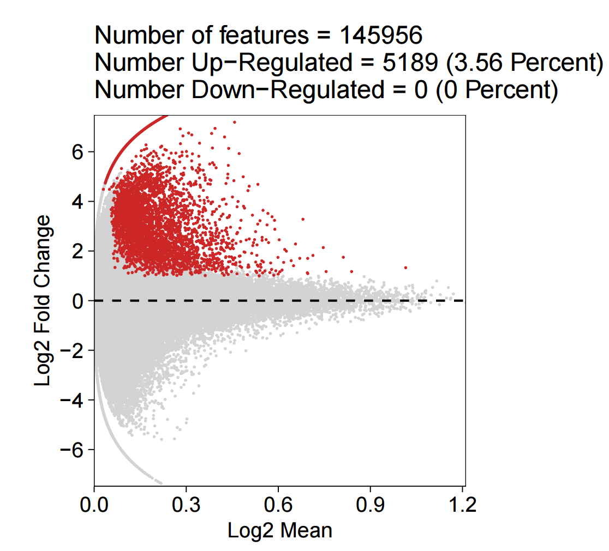

---

#### 2. The Volcano Plot
The second plot is used to identify peaks that are both statistically significant and have a large magnitude of change.

*   **X-Axis ($log_2 \text{ Fold Change}$)**: The magnitude of enrichment in the target group.
*   **Y-Axis ($-log_{10} \text{ FDR}$)**: The statistical significance. The higher the point, the more confident we are that the enrichment is not due to random noise.
*   **Interpretation**: The most "reliable" marker peaks for your heart research are found in the **top-right corner**—these have high significance and a high fold change.
*   **Filtering**: Points in red have passed your specific thresholds (e.g., $FDR \le 0.01$ and $log_2FC \ge 1$).

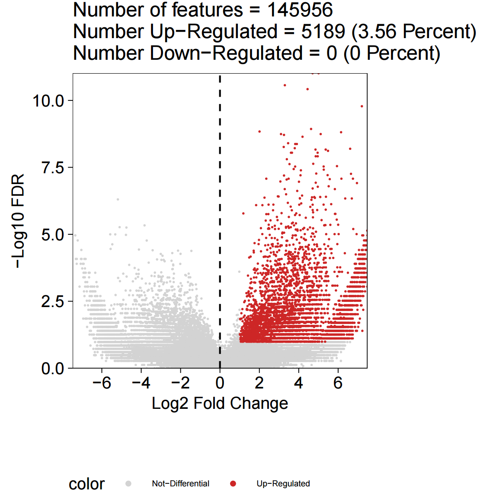

---

#### 3. Summary of Results (From Your Plots)

| Metric             | Value         | Meaning                                                                   |
| :----------------- | :------------ | :------------------------------------------------------------------------ |
| **Total Features** | 145,956       | The total number of peaks in your union peak set.                |
| **Up-Regulated**   | 5,189 (3.56%) | Peaks that are uniquely "open" for this cluster.                 |
| **Down-Regulated** | 0 (0%)        | No peaks were significantly "closed" relative to the background. |

---

> **Thesis Tip**: Use the **Volcano plot** to justify your choice of markers. If someone asks why you chose a specific enhancer near an Atrial Fibrillation gene, you can point to its position in the top-right of the volcano plot to prove it is both highly specific and statistically undeniable.

---
### 13.2.3 Visualizing Marker Peaks in Browser Tracks

While the MA and Volcano plots give you a global statistical view, the `plotBrowserTrack()` function allows you to zoom in on a specific gene to see exactly where those marker peaks live on the chromosome. This creates a "Genome Browser" style view that is essential for validating that your marker peaks are actually located near relevant genes.

```r
p <- plotBrowserTrack(
    ArchRProj = projHeme5, 
    groupBy = "Clusters2", 
    geneSymbol = c("GATA1"),
    features = getMarkers(markerPeaks, cutOff = "FDR <= 0.1 & Log2FC >= 1", returnGR = TRUE)["Erythroid"],
    upstream = 50000,
    downstream = 50000
)
```

| Argument                    | Technical Function                                                                  | Practical Purpose                                                                                          |
| :-------------------------- | :---------------------------------------------------------------------------------- | :--------------------------------------------------------------------------------------------------------- |
| **`geneSymbol`**            | Centers the plot on the **GATA1** gene.                                    | Focuses the view on a master regulator of Erythroid development.                                  |
| **`features`**              | Passes a `GRanges` object of the markers specifically for Erythroid cells. | Adds a specific highlight track at the bottom to show which peaks were statistically significant. |
| **`upstream / downstream`** | Sets the viewing window to **50,000 bp** (50kb) on either side.            | Provides context of the surrounding "genomic neighborhood" (100kb total).                         |
| **`returnGR = TRUE`**       | Ensures `getMarkers()` output is in a genomic format.                      | Allows the plotting function to physically align the peaks with the DNA sequence.                 |

### Interpreting the results

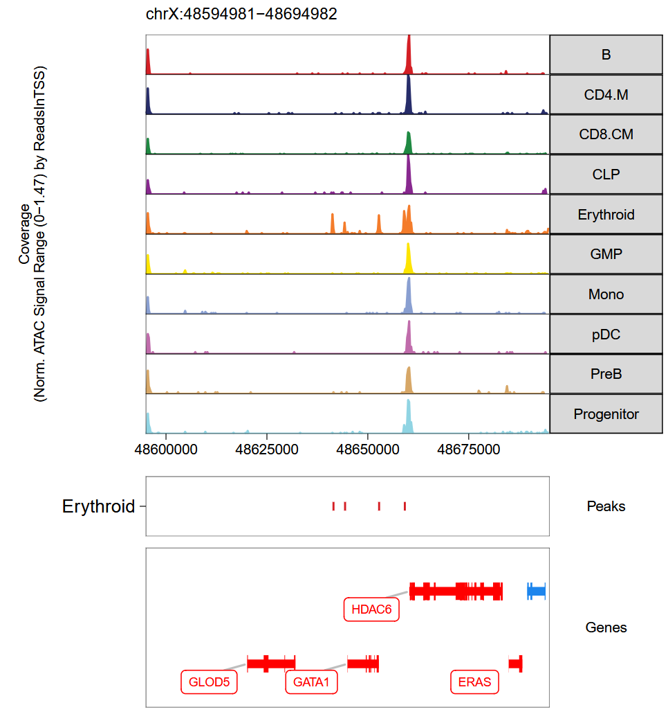


The visualization represents a 100kb window centered on the **GATA1** gene, a master regulator of red blood cell development. This plot provides the visual "smoking gun" that connects your statistical marker peak analysis to physical locations on the genome.

---

#### 1. The Coverage Tracks (Top Section)

*   **Normalized Signal**: Each track shows the accessibility (openness) of chromatin for that specific cell group, normalized by "ReadsInTSS" to allow fair comparison between clusters.
*   **Common Peaks**: You will notice a high peak near the end of the GATA1 gene that is present in all clusters. This usually indicates a constitutive element or a shared promoter.
*   **Erythroid Specificity**: In the orange track (**Erythroid**), there are several distinct "humps" of accessibility between the 48,625,000 and 48,650,000 coordinates that are almost entirely flat (blue/purple/green) in the other cell types.

---

#### 2. The Erythroid Peaks Track (Middle Section)

*   **Marker Identification**: The four red bars in this track indicate the physical locations of the marker peaks identified in Chapter 13.
*   **Statistical Alignment**: These bars align perfectly with the "humps" observed in the Erythroid coverage track. This proves that these regions are statistically unique to this cell group.
*   **Enhancer Candidates**: Because these four red bars are located upstream (to the left) of the GATA1 gene body, they are likely **distal enhancers**—the specific regulatory switches that turn on GATA1 only in Erythroid cells.

---

#### 3. The Genes Track (Bottom Section)

*   **Gene Models**: This section shows the structure of the genes in this neighborhood, including *GLOD5*, *GATA1*, *HDAC6*, and *ERAS*.
*   **Transcription Direction**: The arrows on the gene models indicate the direction in which the gene is "read" on the DNA strand.
*   **Gene Body**: The thick red blocks represent **exons**, which are the parts of the DNA that actually code for proteins.

---

#### Summary of the Biological Story

In the context of heart research, this plot demonstrates that while many cells might have the "switch" for the *GATA1* promoter open, only the **Erythroid** cells have these four specific distal enhancers flipped "on" (accessible). This explains why *GATA1* is likely expressed at high levels in these cells but not in others, such as Monocytes or B-cells.

---
### Example for Mono: CD14

```r
p <- plotBrowserTrack(
    ArchRProj = projHeme5, 
    groupBy = "Clusters2", 
    # Edit 1: Change to a Monocyte-relevant gene
    geneSymbol = c("CD14"), 
    # Edit 2: Index the markers for "Mono" instead of "Erythroid"
    features =  getMarkers(markerPeaks, cutOff = "FDR <= 0.1 & Log2FC >= 1", returnGR = TRUE)["Mono"],
    upstream = 50000,
    downstream = 50000
)
```
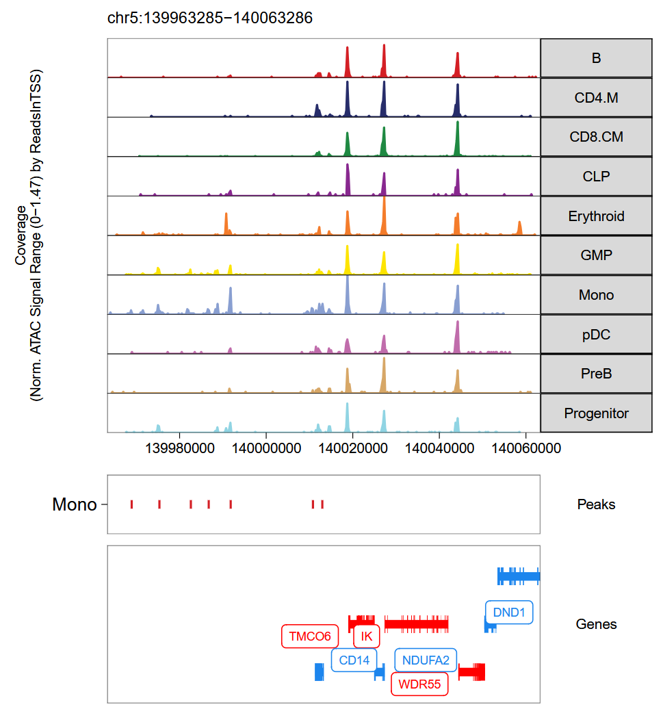

## Motif enrichment


### What we're trying to do

We want to look inside a **single specific peak** (the CEBPA promoter) and see which TF motifs are present within it. Think of it like asking: *"Of all the known TF binding patterns, which ones can be found in this stretch of DNA?"*

---

### Block 1: Extracting and naming the peak set

```r
pSet <- getPeakSet(ArchRProj = projHeme5)
pSet$name <- paste(seqnames(pSet), start(pSet), end(pSet), sep = "_")
```

- **`getPeakSet()`** retrieves all peaks stored in your ArchRProject as a `GRanges` object — essentially a table where every row is a genomic region with a chromosome, start, and end position
- **`seqnames()`**, **`start()`**, **`end()`** extract those three coordinates for each peak
- **`paste(..., sep = "_")`** glues them together into a unique string name like `chr19_33792929_33794030`

This gives every peak a **human-readable unique identifier**, since peaks don't come with built-in names.

---

### Block 2: Extracting the motif matches and aligning them

```r
matches <- getMatches(ArchRProj = projHeme5, name = "Motif")
rownames(matches) <- paste(seqnames(matches), start(matches), end(matches), sep = "_")
matches <- matches[pSet$name]
```

- **`getMatches()`** retrieves a `RangedSummarizedExperiment` (RSE) object — this is a matrix where:
  - Each **row** is a peak
  - Each **column** is a TF motif
  - Each **cell** contains `TRUE`/`FALSE` — whether that motif was found in that peak

- The **same naming trick** is applied to the rows of the matches object, again producing `chr19_33792929_33794030`-style names

- **`matches[pSet$name]`** reorders the matches object so its rows appear in the **exact same order** as the peaks in `pSet`

---

### Why does the ordering step matter?

These two objects — `pSet` and `matches` — were built separately and may not be sorted identically. If you try to cross-reference them without aligning their order, **row 500 in `pSet` might not correspond to row 500 in `matches`**, leading to completely wrong results. By giving both objects the same coordinate-based names and then reindexing, you guarantee they're perfectly synchronized.

---

### The big picture

After these two blocks, you have:
- `pSet` — all peaks, with coordinate-based names
- `matches` — a motif presence/absence matrix, **in the same row order** as `pSet`

You can now look up any peak by its coordinates and instantly know which motifs are present inside it — which is exactly what the next step (finding motifs in the CEBPA promoter peak) will do.

## Breaking Down This Code

### Block 1: Creating a GRanges object for the CEBPA promoter

```r
gr <- GRanges(seqnames = c("chr19"), ranges = IRanges(start = c(33792929), end = c(33794030)))
```

This simply packages the known coordinates of the CEBPA promoter into a `GRanges` object — the standard Bioconductor format for representing a genomic region. You're essentially creating a "search target" that says: *look at this specific window on chromosome 19.*

---

### Block 2: Finding which peaks overlap this region

```r
queryHits <- queryHits(findOverlaps(query = pSet, subject = gr, type = "within"))
```

- **`findOverlaps()`** compares two sets of genomic ranges and finds where they intersect
- **`query = pSet`** means we're asking *"which peaks..."*
- **`subject = gr`** means *"...fall within the CEBPA promoter region?"*
- **`type = "within"`** is the key constraint — it only returns peaks that are **entirely contained inside** the `gr` region, not just partially overlapping
- **`queryHits()`** extracts the **row indices** of `pSet` that passed this filter

The result is a vector of integers — the positions of peaks that sit inside the CEBPA promoter.

---

### Block 3: Getting the motifs present in that peak

```r
colnames(matches)[which(assay(matches[queryHits,]))]
```

Working from the inside out:

- **`matches[queryHits,]`** subsets the matches matrix to only the peak(s) overlapping CEBPA
- **`assay()`** extracts the actual TRUE/FALSE matrix from the RSE object
- **`which()`** returns the column indices where the value is `TRUE` — i.e., where a motif *was* found
- **`colnames(matches)[...]`** converts those indices back into the actual motif names

---

### Reading the output

```
"KLF5_175"   "CTCF_177"   "EGR1_195"   "SP1_267" ...
```

Each name follows the format **`TFNAME_ID`** where the ID is an internal database identifier. The 53 motifs listed are all TF binding patterns that were detected within the CEBPA promoter sequence — meaning these TFs *could* physically bind there if they are expressed in the cell.

Notable TFs in this list include well-known regulators like **SP1**, **CTCF**, **EGR1**, and **KLF** family members, which makes biological sense for an active gene promoter.

---

### The broader principle

The tutorial's closing note is important — this same coordinate-matching approach is reusable anywhere you have a set of peaks of interest, whether those peaks are:

- Linked to a gene via **peak-to-gene links**
- Co-accessible with another peak
- Differentially accessible in a cell type

In all cases, the logic is the same: identify peaks by coordinates → look up their rows in the motif matches matrix → read off which TFs have binding sites there.

## Breaking Down This Analysis

### The goal

We want to know: *among the peaks that are more open in Erythroid cells, are certain TF motifs showing up more often than you'd expect by chance?*

---

### Defining the peaks of interest

The cutoff `FDR <= 0.1 & Log2FC >= 0.5` filters for peaks that are:

- **Statistically significant** — FDR (false discovery rate) at most 10%, controlling for the fact that you're testing thousands of peaks simultaneously
- **Biologically meaningful** — Log2FC ≥ 0.5 means at least a ~1.4-fold increase in accessibility in Erythroid vs Progenitor cells

These two filters together give you a high-confidence set of "Erythroid-up" peaks to test.

---

### The enrichment test: `peakAnnoEnrichment()`

```r
motifsUp <- peakAnnoEnrichment(
    seMarker = markerTest,
    ArchRProj = projHeme5,
    peakAnnotation = "Motif",
    cutOff = "FDR <= 0.1 & Log2FC >= 0.5"
)
```

Under the hood this uses a **hypergeometric test**, which essentially asks:

> *Given that X% of all peaks contain motif Y, is motif Y appearing significantly more often in my Erythroid-up peaks than that background rate would predict?*

It's the genomics equivalent of asking whether a particular word appears suspiciously often in one chapter of a book compared to the whole book.

---

### The output structure

```
dim: 870 1
assays(10): mlog10Padj mlog10p ... CompareFrequency feature
rownames(870): TFAP2B_1 TFAP2D_2 ... TBX18_869 TBX22_870
colnames(1): Erythroid
```

- **870 rows** — one for each TF motif tested
- **1 column** — the Erythroid vs Progenitor comparison
- **10 assays** — different statistics stored for each motif, including corrected and uncorrected p-values, frequencies, etc.

---

### Preparing the data frame for plotting

```r
df <- data.frame(TF = rownames(motifsUp), mlog10Padj = assay(motifsUp)[,1])
df <- df[order(df$mlog10Padj, decreasing = TRUE),]
df$rank <- seq_len(nrow(df))
```

- Pulls out the motif names and their **-log10 adjusted p-values** (so larger = more significant)
- Sorts from most to least enriched
- Adds a **rank column** (1 = most enriched) which will be useful for making a ranked plot

---

### The biological result

```
GATA3_384   632.8
GATA1_383   624.3
GATA2_388   607.9
```

The -log10(p-adj) values in the hundreds are astronomically significant — these are not borderline findings. The GATA family dominates the top hits, which is a strong positive control. **GATA1** is one of the most well-characterized master regulators of red blood cell development, so recovering it as the top hit validates that the entire pipeline is working correctly. The fact that multiple GATA family members (GATA1–6) all rank in the top 6 further reinforces this, since they share very similar DNA binding motifs.

## Breaking Down This Section

### The plotting code for Erythroid-enriched motifs

```r
ggUp <- ggplot(df, aes(rank, mlog10Padj, color = mlog10Padj)) + 
  geom_point(size = 1) +
  ggrepel::geom_label_repel(
        data = df[rev(seq_len(30)), ], aes(x = rank, y = mlog10Padj, label = TF), 
        size = 1.5,
        nudge_x = 2,
        color = "black"
  ) + ...
```

A few things worth noting:

- **`aes(rank, mlog10Padj, color = mlog10Padj)`** — rank goes on the x-axis, significance on y-axis, and the same significance value also drives the color, so highly enriched points are both high up *and* brightly colored
- **`df[rev(seq_len(30)), ]`** — this selects only the top 30 motifs for labeling, and `rev()` reverses their order. This is a practical choice to reduce label crowding, which is why `ggrepel` still warns that 23 labels couldn't be placed without overlap
- **`geom_label_repel()`** automatically nudges labels away from each other and from the points so they remain readable — essential when many significant motifs cluster at the top of the plot

---

### The Progenitor-down analysis

The only meaningful change is the cutoff direction:

- Erythroid-up used **`Log2FC >= 0.5`** — peaks *more* open in Erythroid
- Progenitor-up uses **`Log2FC <= -0.5`** — peaks *less* open in Erythroid, meaning *more* open in Progenitor

Everything else — the hypergeometric test, the data frame preparation, the plotting code — is identical.

---

### The biological result for Progenitor cells

```
ELF2_326    105.9
TCF12_56     83.8
RUNX1_733    75.7
CBFB_801     64.6
SPI1_322     60.4
```

Again, these results are biologically coherent:

- **RUNX1** and **CBFB** form a heterodimer (the CBF complex) that is a master regulator of hematopoietic stem and progenitor cell identity
- **SPI1** (also known as PU.1) and **ELF2** are ETS family TFs critical for myeloid and lymphoid progenitor function
- The enrichment scores here (~60–106) are notably lower than the GATA scores (~270–630), suggesting the Erythroid signal is particularly clean and strong compared to the Progenitor signal

---

### The big picture of this two-sided analysis

By running enrichment in both directions you get a complete regulatory picture of the Erythroid vs Progenitor comparison:

| Direction               | Top motifs        | Biology                          |
| ----------------------- | ----------------- | -------------------------------- |
| More open in Erythroid  | GATA1/2/3         | Erythroid differentiation        |
| More open in Progenitor | RUNX1, CBFB, SPI1 | Progenitor/stem cell maintenance |

This kind of reciprocal result — where each cell type shows enrichment for its known master regulators — is exactly what gives you confidence that the differential accessibility analysis is capturing real biology.

## Interpreting the Two Plots

### Plot 1: Erythroid-enriched motifs 

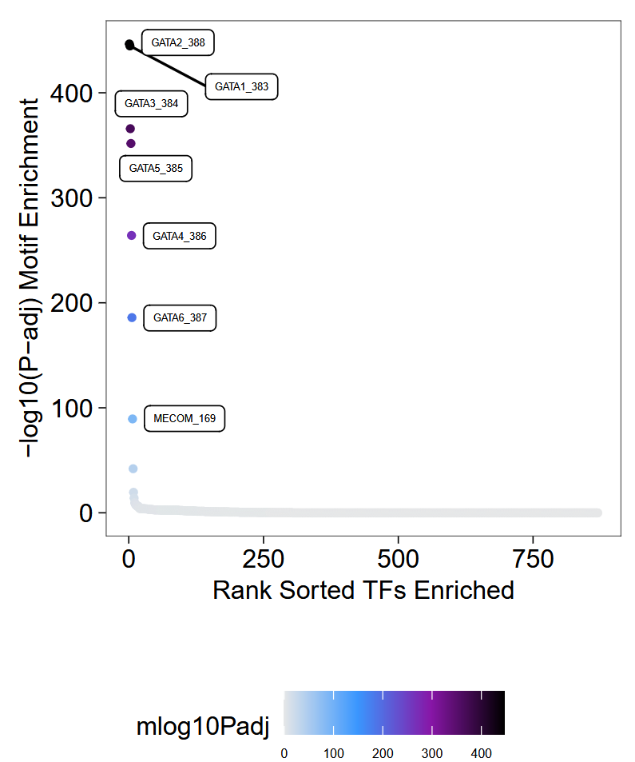

The shape of the curve tells a clear story. There is an extremely steep drop-off after the first ~7 motifs, with the vast majority of the 870 tested motifs clustering near zero. This "hockey stick" shape indicates that the signal is **highly specific** — only a handful of TFs stand out, and they do so dramatically.

The top hits are exclusively GATA family members (GATA1/2/3/4/5/6), with MECOM being the only non-GATA motif to separate itself from the background. The -log10(p-adj) values reaching ~450 are extraordinarily significant — these are not borderline results. The dark purple/black coloring of GATA1-3 versus the lighter blue of GATA6 and MECOM visually reinforces the tiered significance.

**How to present this:** The key message is *specificity and strength*. A small number of TFs are massively enriched, and they all belong to one family with a well-established role in erythropoiesis. This is essentially a positive control validating your entire analysis.

---

### Plot 2: Progenitor-enriched motifs (bottom)

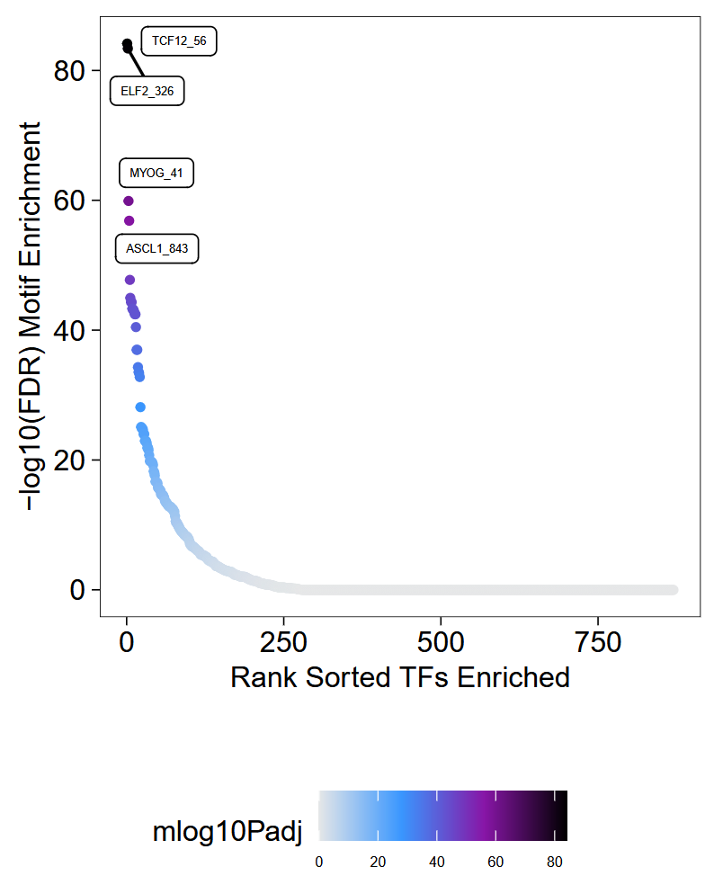

The curve here has a notably different shape — a **smoother, more gradual decline** rather than a sharp cliff. This tells you the Progenitor signal is more distributed across many TFs rather than concentrated in a single family. Many more motifs achieve meaningful significance before the curve flattens.

The labeled top hits — TCF12, ELF2, MYOG, ASCL1 — are also more heterogeneous than the GATA cluster. The maximum -log10(FDR) reaches only ~83 compared to ~450 in the Erythroid plot, meaning the Progenitor signal, while real and significant, is considerably weaker and broader.

**How to present this:** The message here is *regulatory complexity*. Progenitor cell identity appears to be maintained by a more diverse TF landscape rather than one dominant factor, which makes biological sense — progenitors must remain poised for multiple differentiation fates simultaneously.

---

### Comparing the two plots together

When presenting these side by side, there are three contrasts worth highlighting:

| Feature            | Erythroid                    | Progenitor               |
| ------------------ | ---------------------------- | ------------------------ |
| Signal strength    | ~450 max -log10(p)           | ~83 max -log10(p)        |
| Signal specificity | Extremely tight (one family) | Broad and distributed    |
| Curve shape        | Sharp cliff                  | Gradual decay            |
| Biology            | One master regulator (GATA1) | Multiple cooperative TFs |

The contrast itself is a finding — it suggests that erythroid differentiation involves a decisive commitment driven by a dominant TF program, while progenitor maintenance relies on combinatorial regulation.

## Differential Peaks vs. Marker Peaks

These two concepts are related but answer subtly different questions.

---

### Differential Peaks

Differential peaks come from a **pairwise comparison** between two specific groups — in the previous section, Erythroid vs. Progenitor. The question being asked is:

> *Which peaks are significantly more or less accessible when I directly compare group A to group B?*

Key characteristics:
- Requires you to **specify which two groups** to compare
- The Log2FC is calculated relative to that specific other group
- A peak being "up" means up *relative to that one comparison*
- Best used when you have a **specific biological contrast** in mind

---

### Marker Peaks

Marker peaks come from a **one-vs-all comparison** — a cell type is compared against all other cell types simultaneously. The question being asked is:

> *Which peaks are uniquely or preferentially accessible in this cell type compared to everything else?*

Key characteristics:
- Each cell type is tested **against the rest of the dataset** as a whole
- A peak being a "marker" means it stands out across the entire atlas, not just relative to one other group
- Better captures what makes a cell type **distinctively itself**
- More useful when you want to characterize cell type identity in an unbiased way

---

### A concrete analogy

Imagine you're trying to characterize different cuisines:

- **Differential** — "What ingredients does Italian food use more than French food?" You might find olive oil, but olive oil is also common in Spanish and Greek cuisine — it's just more common than in French.
- **Marker** — "What ingredients are uniquely characteristic of Italian food compared to all other cuisines?" You'd find things like basil and San Marzano tomatoes — ingredients that are specifically Italian regardless of what you compare it to.

---

### Why this matters for motif enrichment

When you run motif enrichment on **marker peaks**, you're asking what TFs define each cell type's regulatory identity in the context of the whole dataset. This is particularly powerful because:

- It avoids the arbitrariness of choosing a single comparison group
- It can be run for **every cell type simultaneously**
- The enriched motifs are more likely to reflect genuine cell-type-specific regulators rather than relative differences between two similar populations
